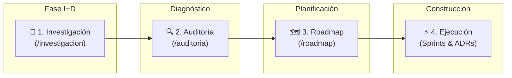

# 📚 Documentación Técnica — Bienestar APP

Bienvenido al centro de documentación técnica y de producto de **Bienestar APP**. Este repositorio reúne las especificaciones, modelos de datos, arquitectura del sistema, auditorías técnicas y roadmaps que guían el desarrollo de nuestra plataforma integral de fitness, entrenamiento y nutrición clínica.

---

## 🎯 Propósito del Directorio `/docs`

El objetivo principal de la carpeta `/docs` es servir como la **única fuente de verdad (Single Source of Truth - SSOT)** para todo el equipo de ingeniería, producto, diseño (UX/UI) y negocios.

Acá vas a encontrar:
* La visión estratégica y las decisiones de arquitectura de la plataforma.
* Los relevamientos de módulos existentes y análisis de gaps de funcionalidad.
* La deuda técnica identificada y el plan para saldarla de forma sostenible.
* El roadmap de ejecución organizado por trimestres (OKRs) y sprints intermedios.
* Los estándares de codificación, guías de diseño y Architecture Decision Records (ADRs).

---

## 📂 Estructura de Directorios

La documentación está organizada de forma modular según la fase del ciclo de vida del desarrollo:

| Directorio / Módulo | Descripción | Enlace |
| :--- | :--- | :--- |
| **`/arquitectura`** | Arquetipos de usuario, modelos de dominio, esquemas ERD, correlación bidireccional entrenamiento ↔ nutrición, y topología de API. | [Ir a Arquitectura](./arquitectura) |
| **`/investigacion`** | Investigaciones de I+D (R&D) por dominio: 42 temas en 8 dominios (disciplinas deportivas, nutrición clínica, telemetría, workflows). | [Ir a Investigación](./investigacion) |
| **`/auditoria`** | Estado actual del sistema, gaps críticos (17 identificados), deuda técnica (19 items), auditorías operativas y templates RCA. | [Ir a Auditoría](./auditoria) |
| **`/roadmap`** | Plan a 12 meses (Q3 2026 → Q2 2027), sprint backlog, migraciones de DB (5 planificadas) y guía de onboarding de equipo. | [Ir a Roadmap](./roadmap) |
| **`/relevamientos`** | Análisis funcional de 8 módulos: Programación, Calendario, Hábitos, Biblioteca, Sesiones, Onboarding, Viaje Entrenador, Nutrición Clínica. | [Ir a Relevamientos](./relevamientos) |
| **`/strategy`** | Manifiestos estratégicos, playbooks comerciales (PLG, Referral, Pricing), guidelines UX y motores biomecánicos/nutricionales. | [Ir a Estrategia](./strategy) |
| **`/business_context`** | Conocimiento de dominio por vertical: Ingeniería IA, PT/Gym, Nutrición Clínica, Mind/Psychology, Social Gaming. | [Ir a Business Context](./business_context) |
| **`/adr`** | Architecture Decision Records. Registro histórico de decisiones técnicas con contexto, alternativas y consecuencias. | [Ir a ADRs](./adr) |

---

## 🔄 Cómo Usar Esta Documentación (Flujo de Trabajo)

Para garantizar un proceso de ingeniería riguroso y libre de improvisaciones, seguimos un flujo iterativo estructurado en 4 etapas principales:

### 1. 🔬 Investigación (`/investigacion`)
Antes de implementar cualquier característica compleja (ej. cálculo metabólico en nutrición clínica o sugerencias de carga de entrenamiento), el equipo de R&D documenta el dominio funcional, papers científicos y requerimientos biológicos/deportivos.

### 2. 🔍 Auditoría (`/auditoria`)
Se evalúa la base de código actual para verificar qué partes del módulo se pueden reutilizar, qué deuda técnica existe y cuáles son los *gaps* críticos que bloquean la nueva funcionalidad.

### 3. 🗺️ Roadmap (`/roadmap`)
Los requerimientos auditados se transforman en *Epics* y *User Stories*. Se asignan a un hito trimestral (Q1-Q4) y se priorizan mediante el framework **WSJF** (*Weighted Shortest Job First*).

### 4. ⚡ Ejecución (`/sprint-backlog` y `/adr`)
Durante la construcción del código:
* Si surge un cambio significativo de diseño técnico, se redacta un nuevo **ADR** en `/adr`.
* El progreso diario se sincroniza contra la especificación en `/relevamientos` y `/arquitectura`.

---

## 🚀 Para Nuevos Miembros del Equipo

Si te estás sumando recién al equipo de desarrollo de Bienestar APP, te sugerimos seguir este camino de lectura ordenado para ponerte en tema rápidamente:

1. 📖 **[Visión del Producto e Historia](./strategy/norte%20bienestar%203.6.2026.md)**: Entendé qué problema resolvemos para entrenadores, nutricionistas y atletas.
2. 📐 **[Arquitectura, Arquetipos y Ciclos](./arquitectura/arquetipos-ciclos-y-correlacion.md)**: Conocé los 9 arquetipos, 18 ciclos de entrenamiento, 20 fases nutricionales y la estrategia de correlación.
3. 🔍 **[Estado Actual del Sistema](./auditoria/estado-actual-sistema.md)**: Entendé qué está implementado y qué falta.
4. 🗺️ **[Guía de Onboarding de Equipo](./roadmap/onboarding-equipo.md)**: Configurá tu entorno local, conocé el stack y las convenciones.
5. 📋 **[Sprint Backlog Activo](./roadmap/sprint-backlog.md)**: Revisá en qué tareas estamos trabajando y tomá tu primer ticket.

---

## ✍️ Convenciones de Documentación

Para mantener la claridad y coherencia en toda la documentación, todo el equipo debe respetar las siguientes normas:

### 1. Nomenclatura de Archivos
* Usar **kebab-case** minúsculo para nombres de archivos y carpetas (`estado-actual-sistema.md`, `gaps-criticos.md`).
* En archivos de índice de directorio, usar siempre `README.md` en mayúsculas.
* Prefijar archivos cronológicos de auditoría o reuniones con fecha ISO: `YYYY-MM-DD-nombre.md` (ej. `2026-06-15-auditoria-performance.md`).

### 2. Idioma y Dialecto
* Toda la documentación debe escribirse en **Español (Argentina)**.
* Usar voz clara, técnica y profesional, pero cercana (tuteo/voseo profesional estándar sin modismos informales excesivos).
* Mantener los términos técnicos de la industria en inglés cuando no tengan traducción idiomática natural (ej. *feature*, *backlog*, *endpoint*, *cross-over*, *polling*).

### 3. Formato y Recursos Visuales
* **Markdown estándar**: Utilizar encabezados jerárquicos estructurados (`#`, `##`, `###`).
* **Diagramas Mermaid**: Priorizar esquemas explicativos en formato text-based `mermaid` para diagramas de secuencia, flujos de datos y modelos ERD.
* **Alertas / Callouts**: Usar las alertas estándar de GitHub (`> [!NOTE]`, `> [!TIP]`, `> [!IMPORTANT]`, `> [!WARNING]`).
* **Tablas explicativas**: Organizar datos de comparación, matrices de riesgo y mapeos de campos en tablas markdown legibles.

---

> [!TIP]
> Si encontrás información desactualizada o tenés sugerencias para mejorar una especificación, abrí un *Pull Request* etiquetado con la categoría `docs: update`. ¡La documentación la construimos entre todos!
