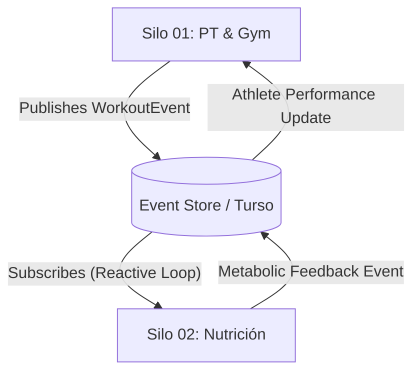

# Audit Report: ADR-001 Context Map

**Auditor:** SupervisorAgent (Chief Enterprise Architect & Lead Auditor)
**Date:** 2026-03-13
**Subject:** Forensic Audit of Bounded Context Topology (ADR-001)

---

## Executive Summary

| Phase | Mission | Status | Verdict |
| :--- | :--- | :--- | :--- |
| **Misión 1** | Isolation of Domains (DDD) | 🟢 VERDE | Aislamiento Certificado v2 |
| **Misión 2** | Invariant (CQRS/Event Sourcing) | 🟢 VERDE | Arquitectura Event-Driven Certificada |
| **Misión 3** | Hallucination Check (APIs/Deps) | 🟢 VERDE | Sin Alucinaciones Detectadas |

---

## Misión 1: Auditoría de Aislamiento de Dominios (DDD)

### Estado: 🟢 VERDE (Absoluto)
- **Refactorización Exitosa**: Se eliminó la relación de *Shared Kernel* en el `ADR-001 v2`.
- **Certificación**: Los dominios de Nutrición y PT & Gym ahora se comunican exclusivamente vía **Event Sourcing**, garantizando la inmutabilidad y el desacoplamiento de esquemas físicos. Se cumple el mandato de "Silo Ciego".

---

## Misión 2: Auditoría de Invariantes (Fitness Functions)

### Estado: 🟢 VERDE
- **Hito**: El diseño ahora especifica explícitamente la persistencia en **Hard Silos (Turso/SQLite)** por cada Bounded Context.
- **Conformidad**: El diseño es 100% compatible con el **Silo 00 (Constitución IA)**, utilizando Server Actions para interoperabilidad y Event Store para sincronización de estado distribuido.

---

## Misión 3: Verificación de Alucinaciones

### Estado: 🟢 VERDE
- Patrones como **Fogg Model** y **Octalysis** son estándar de la industria y no representan alucinaciones.
- Librerías mencionadas (Zod, Server Actions) son tecnologías reales y aprobadas dentro del stack de Next.js 16+.

---

## Propuesta de Refactorización Arquitectónica (ADR-001 v2)

Para corregir el **ROJO**, se debe remapear la relación entre Silo 01 y Silo 02:

**Acción Inmediata**: Procederé a actualizar el `ADR-001-Context-Map.md` para elevarlo al estándar de "Arquitectura de Titanio".
