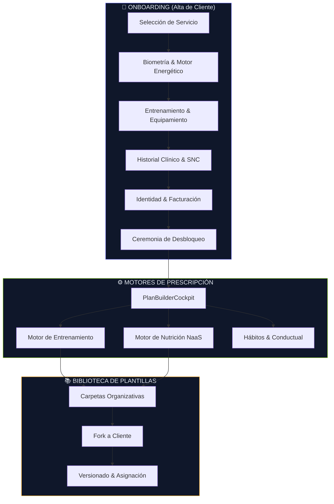
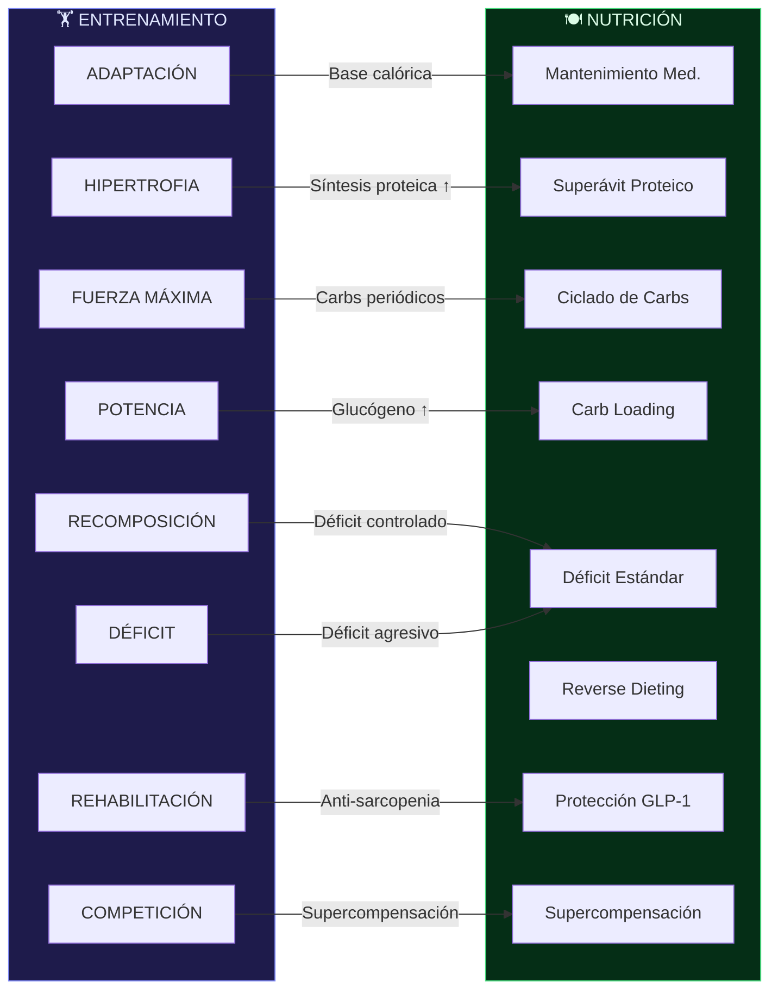
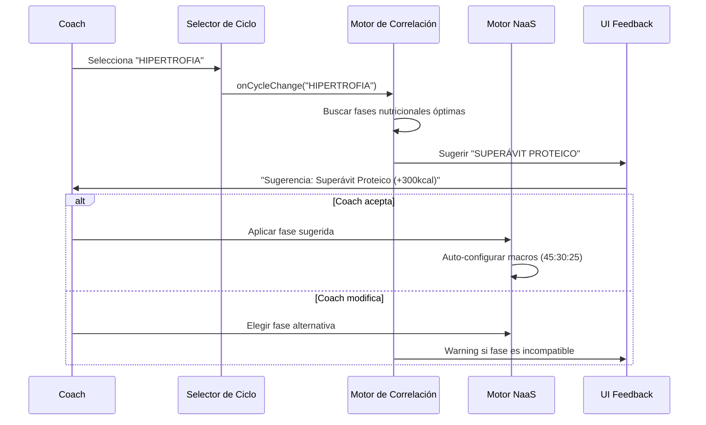
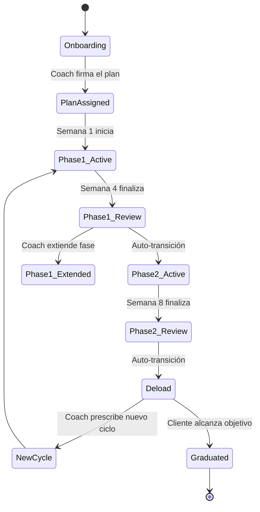

# 🧬 Bienestar APP — Arquetipos, Ciclos y Estrategia Correlativa

> Documento Estratégico de Arquitectura de Producto — v1.0  
> Última actualización: 25 de Julio 2026

---

## Tabla de Contenidos

1. [Visión General del Sistema](#1-visión-general-del-sistema)
2. [Arquetipos del Onboarding de Alta de Clientes](#2-arquetipos-del-onboarding-de-alta-de-clientes)
3. [Librería de Ciclos de Entrenamiento](#3-librería-de-ciclos-de-entrenamiento)
4. [Librería de Fases Nutricionales](#4-librería-de-fases-nutricionales)
5. [Matriz de Correlación Entrenamiento ↔ Nutrición](#5-matriz-de-correlación-entrenamiento--nutrición)
6. [Conceptos Fundamentales del Sistema](#6-conceptos-fundamentales-del-sistema)
7. [Estrategia de Re-vinculación Correlativa](#7-estrategia-de-re-vinculación-correlativa)
8. [Estrategias Avanzadas de Optimización de Workflows](#8-estrategias-avanzadas-de-optimización-de-workflows)
9. [Roadmap de Implementación](#9-roadmap-de-implementación)

---

## 1. Visión General del Sistema



> [!IMPORTANT]
> El sistema opera bajo un paradigma de **prescripción dual vinculada**: cada cliente tiene un plan de entrenamiento Y un plan nutricional que coexisten en el mismo store (Zustand), compartiendo biometría, telemetría de carga y objetivos clínicos.

---

## 2. Arquetipos del Onboarding de Alta de Clientes

### 2.1 Flujo de Onboarding Completo

```
┌─────────────────────────────────────────────────────────────────┐
│  BLOQUE 0 — Selección de Servicio                               │
│  ┌──────────┐  ┌──────────┐  ┌──────────┐  ┌──────────┐       │
│  │ Personal │  │   Gym    │  │ Nutrición│  │  Hybrid  │       │
│  │ Training │  │  (B2B)   │  │  (B2C)   │  │  Combo   │       │
│  └──────────┘  └──────────┘  └──────────┘  └──────────┘       │
├─────────────────────────────────────────────────────────────────┤
│  BLOQUE 1 — Motor Biométrico & Energético                      │
│  • Peso, Altura, Edad, Cintura, Género                         │
│  • TMB automático (Mifflin-St Jeor)                            │
│  • DER (Gasto Energético Diario Real)                          │
│  • Detección automática: Riesgo Metabólico (cintura >90/85)    │
├─────────────────────────────────────────────────────────────────┤
│  BLOQUE 2 — Perfil de Entrenamiento                            │
│  • Nivel de Experiencia (1-5)                                  │
│  • Días por semana disponibles                                 │
│  • Equipamiento disponible                                     │
│  • Preferencia de coaching (presencial/remoto)                 │
│  • Tags de objetivo (fuerza, hipertrofia, salud, etc.)         │
├─────────────────────────────────────────────────────────────────┤
│  BLOQUE 3 — Historial Clínico & SNC                           │
│  ├── HealthHistoryForm: Medicamentos, Dieta actual, Alcohol    │
│  ├── InjuryMatrix: Articulación + Zona + Dolor (1-5) + McGill │
│  └── BehavioralOnboarding: Sueño, Estrés, Turno Laboral       │
├─────────────────────────────────────────────────────────────────┤
│  BLOQUE 4 — Identidad & Facturación                           │
│  • Nombre, Apellido, Email                                     │
│  • Estado de Pago                                              │
├─────────────────────────────────────────────────────────────────┤
│  CEREMONIA DE DESBLOQUEO (Labor Illusion)                      │
│  1. Cálculo TMB en vivo                                        │
│  2. Evaluación de Riesgo Metabólico                            │
│  3. Escudos Clínicos (Low-FODMAP / GLP-1)                     │
│  4. Protección Biomecánica (McGill)                            │
│  5. Target ACWR de Recuperación                                │
│  6. POST /api/v1/athletes → ID del atleta creado               │
└─────────────────────────────────────────────────────────────────┘
```

### 2.2 Arquetipos de Cliente (Presets Automáticos)

| Código | Nombre | Descripción | Días/Sem | Perfil Ideal |
|--------|--------|-------------|----------|--------------|
| `ARQ_01_WELLNESS` | 🧘 Bienestar & Adherencia | Construcción suave de hábitos. Prioriza consistencia sobre intensidad. | 3 | Principiante, baja adherencia previa |
| `ARQ_03_PPL` | 💪 Fuerza & Masa Muscular | Push/Pull/Legs estructurado. Periodización clásica. | 4-6 | Intermedio-Avanzado, objetivo hipertrofia |
| `ARQ_07_TIME_CRUNCH_2X` | ⚡ Entrenamiento Rápido | Sesiones <30 min de alta eficiencia. Full body comprimido. | 2-3 | Profesionales ocupados |
| `ARQ_09_LONGEVITY_VITALITY` | 🫀 Longevidad & Prevención | Salud metabólica y prevención de enfermedades crónicas. | 3-4 | +40 años, foco salud |
| `ARQ_08_METABOLIC_FAT_LOSS` | 🔥 Pérdida de Grasa Metabólica | Circuitos metabólicos con déficit calórico controlado. | 4-5 | Recomposición corporal |
| `ARQ_02_UPPER_LOWER` | 🏋️ Upper/Lower Split | División torso-pierna clásica con progresión lineal. | 4 | Intermedio |
| `ARQ_01_HYPERTROPHY_PT` | 🟣 Hipertrofia PT | Protocolo de hipertrofia guiado por entrenador personal. | 5-6 | Avanzado con PT |
| `ARQ_05_ATHLETIC_40` | 🏃 Atlético +40 | Rendimiento deportivo adaptado a la edad. | 3-4 | Deportistas masters |
| `ARQ_CUSTOM` | ✏️ Personalizado | Reglas construidas desde cero por el coach. | Variable | Cualquier perfil |

> [!TIP]
> Los arquetipos son **presets inteligentes** que pre-configuran: cantidad de días, tipo de split, rango de RPE, volumen máximo por grupo muscular, y fase nutricional recomendada. El coach siempre puede modificarlos post-selección.

---

## 3. Librería de Ciclos de Entrenamiento

### 3.1 Taxonomía Completa de Modalidades (18 tipos)

#### 🏗️ Preparación General (Base Construction)

| ID | Icono | Modalidad | Color | Métricas Clave | Descripción |
|----|-------|-----------|-------|----------------|-------------|
| `ADAPTACION` | 🌱 | Adaptación Anatómica | Lime `#84cc16` | Peso, Series, Reps, RPE | Preparar tendones y articulaciones antes de entrenar fuerte. Fase obligatoria en principiantes. |
| `HIPERTROFIA` | 🟣 | Hipertrofia | Purple `#a855f7` | Peso, Series, Reps, RIR, Tempo | Aumento de masa muscular. Series y repeticiones medias/altas. Foco en TUT (Time Under Tension). |
| `AEROBICO_BASE` | 🍑 | Cardio Base / Piernas | Cyan `#06b6d4` | Duración, RPE, Descanso | Base aeróbica y foco en glúteos/piernas. El famoso "Día de Piernas" cardiovascular. |

#### ⚙️ Preparación Específica (Optimization)

| ID | Icono | Modalidad | Color | Métricas Clave | Descripción |
|----|-------|-----------|-------|----------------|-------------|
| `FUERZA` | 🔴 | Fuerza Máxima | Red `#ef4444` | Peso, %1RM, VBT, RPE | Levantar muy pesado para generar más fuerza. Pocas repeticiones, descansos largos. |
| `FUERZA_RESISTENCIA` | ⚙️ | Fuerza-Resistencia | Orange `#f97316` | Peso, Series, Reps, Descanso, RPE | Capacidad de aguantar el esfuerzo pesado por más tiempo. Umbral láctico. |
| `POTENCIA` | ⚡ | Potencia / Explosividad | Yellow `#eab308` | Peso, VBT, Series, Reps, RPE | Mover el peso lo más rápido posible. Saltar, lanzar, correr rápido. |
| `ANAEROBICO` | 🔥 | Cardio Anaeróbico / HIIT | Rose `#f43f5e` | Duración, Descanso, RPE, Series | Esfuerzos máximos cortos con poco descanso (HIIT, sprints). |

#### 🏆 Competitivas (Peak Performance)

| ID | Icono | Modalidad | Color | Métricas Clave | Descripción |
|----|-------|-----------|-------|----------------|-------------|
| `PUESTA_A_PUNTO` | 🎯 | Tapering | Blue `#3b82f6` | Peso, Series, Reps, RPE | Bajar el volumen para eliminar la fatiga antes del gran día. |
| `COMPETICION` | 🏆 | Competición | Blue-600 `#2563eb` | Peso, RPE, Bienestar | Fase del torneo o evento. Entrenar solo para mantenerse. |

#### 💎 Estética / Comercial

| ID | Icono | Modalidad | Color | Métricas Clave | Descripción |
|----|-------|-----------|-------|----------------|-------------|
| `RECOMPOSICION` | ⚖️ | Recomposición | Violet `#8b5cf6` | Peso, Series, Reps, RPE | Pérdida de grasa con preservación/ganancia muscular simultánea. |
| `DEFICIT` | 📉 | Definición / Déficit | Pink `#ec4899` | Peso, Series, Reps, RPE, Descanso | Entrenamiento optimizado para períodos de déficit calórico. |

#### 🧘 Wellness & Prevención

| ID | Icono | Modalidad | Color | Métricas Clave | Descripción |
|----|-------|-----------|-------|----------------|-------------|
| `TRANSICION` | 🏖️ | Descanso Activo | Teal `#14b8a6` | Duración, Bienestar, RPE | Descanso activo entre ciclos. Regeneración del SNC. |
| `FUNDAMENTOS_MOVIMIENTO` | 🧘 | Fundamentos | Teal-600 `#0d9488` | Duración, Bienestar | Control motor y postural. Activación muscular básica. |
| `FLOW_INTEGRATIVO` | 🌊 | Flow Integrativo | Emerald-600 `#059669` | Duración, Bienestar, RPE | Secuencias de movimiento fluido. Yoga, movilidad dinámica. |
| `REHABILITACION` | 🩹 | Rehabilitación Temprana | Indigo `#6366f1` | Dolor, Peso, Series, Reps | Recuperación temprana de lesión con cargas controladas. |
| `READAPTACION` | 🔄 | Readaptación Funcional | Indigo-600 `#4f46e5` | Dolor, Peso, Series, Reps, RPE | Corrección de asimetrías y retorno al deporte. |
| `ESTABILIZACION_CORE` | 🛡️ | Estabilización Core | Indigo-700 `#4338ca` | Duración, Series, RPE | Anti-movimiento. Protección espinal tipo McGill. |

### 3.2 Modelos de Periodización Disponibles

| Preset | Descripción | Caso de Uso |
|--------|-------------|-------------|
| `LINEAR` | Sobrecarga progresiva lineal en carga/volumen | Principiantes, progresión predecible |
| `UNDULATING` | Variación ondulante diaria o semanal | Intermedios, evitar mesetas |
| `DUP` | Daily Undulating Periodization (Hipertrofia → Fuerza → Potencia) | Avanzados, máxima adaptación |
| `BLOCK` | Periodización por bloques concentrados | Atletas competitivos |

---

## 4. Librería de Fases Nutricionales

### 4.1 Taxonomía Completa de Fases (20 módulos)

#### 🍽️ Estilo de Vida & Conductual

| ID | Icono | Fase | Duración | Descripción |
|----|-------|------|----------|-------------|
| `AYUNO_INTERMITENTE` | ⏱️ | Ayuno 16:8 / 14:10 | Continuo | Alimentación restringida en tiempo para control glucémico. |
| `RESET_CONDUCTUAL` | 🧠 | Whole30 | 30 días | Eliminación de ultraprocesados y control de cravings dopaminérgicos. |
| `TRANSICION_PLANT_BASED` | 🌱 | Plant-Based | 4-8 semanas | Adaptación enzimática a dietas vegetales. Transición gradual. |
| `DETOX_HEPATICA` | 🍃 | Detox Hepática | 7-14 días | Soporte de metilación y sulfatación hepática. |

#### 🔬 Metabolismo & Composición Corporal

| ID | Icono | Fase | Duración | Descripción |
|----|-------|------|----------|-------------|
| `RESET_INSULINICO` | 🥑 | Keto / VLCKD | 2-12 semanas | Cetosis nutricional para bajar insulina basal. Restricción de CHO neto. |
| `DEFICIT_ESTANDAR` | 📉 | Déficit Estándar | 8-16 semanas | Pérdida de grasa sostenida y controlada con preservación muscular. |
| `REVERSE_DIETING` | 🔄 | Reverse Dieting | 4-12 semanas | Recuperación del BMR post-déficit. Aumento gradual calórico. |
| `PROTECCION_GLP1` | 🛡️ | Protección GLP-1 | Variable | Protocolo anti-sarcopenia para pacientes con Ozempic/Wegovy/GLP-1. |
| `MANTENIMIENTO_MED` | 🥗 | Mantenimiento Mediterránea | Continuo | Sostenibilidad cardiovascular a largo plazo. |

#### 🦠 Salud Intestinal (GI)

| ID | Icono | Fase | Duración | Descripción |
|----|-------|------|----------|-------------|
| `GUT_RESET` | 🥣 | Gut Reset / Líquidos | 3-5 días | Descanso digestivo agudo. Dieta líquida/semi-líquida. |
| `LOW_FODMAP` | 🚫 | Eliminación Low-FODMAP | 4-6 semanas | Reducción de sustratos fermentables para IBS/SIBO. |
| `REINTRODUCCION_FODMAP` | 🔍 | Reintroducción FODMAP | 6-8 semanas | Testeo de umbral de tolerancia alimento por alimento. |
| `REPARACION_5R` | 🧱 | Reparación Mucosa 5R | 4-12 semanas | Protocolo de reparación intestinal (Remove, Replace, Reinoculate, Repair, Rebalance). |

#### 🌸 Salud Hormonal Femenina

| ID | Icono | Fase | Duración | Descripción |
|----|-------|------|----------|-------------|
| `SOPORTE_LUTEO` | 🌻 | Soporte Luteal / Seed Cycling | 14 días | Mitigación de PMS y soporte de progesterona. |
| `RESCATE_ANDROGENICO` | ⚖️ | Rescate Androgénico SOP | 8-12 semanas | Reducción de andrógenos libres vía control de insulina (SOP/PCOS). |
| `TRANSICION_MENOPAUSICA` | 🌸 | Transición Menopáusica | Variable | Mitigación de sofocos, protección ósea y muscular. |

#### 🏋️ Periodización Deportiva & Rendimiento

| ID | Icono | Fase | Duración | Descripción |
|----|-------|------|----------|-------------|
| `CICLADO_CARBOHIDRATOS` | 🚴 | Ciclado de Carbs | Variable | Carbohidratos ciclados según demanda de entrenamiento (High/Low/Rest). |
| `SUPERAVIT_PROTEICO` | 💪 | Lean Bulk | 12-24 semanas | Maximización de síntesis proteica para hipertrofia. Superávit controlado. |
| `CARB_LOADING` | 🔋 | Supercompensación Glucógeno | 2-4 días | Depleción + recarga de glucógeno para competición. |

#### 🏥 Clínico & Inmunológico

| ID | Icono | Fase | Duración | Descripción |
|----|-------|------|----------|-------------|
| `AIP_ELIMINACION` | 🩺 | AIP Autoinmune | 6-12 semanas | Supresión de reactividad inmune. Eliminación de disparadores autoinmunes. |
| `INMUNONUTRICION_PREOP` | 🛡️ | Inmunonutrición Preop | 10-14 días | Reducción de morbilidad infecciosa pre/post-cirugía. |
| `TRANSICION_ENTERAL` | 🏥 | Transición Enteral | 3-7 días | Reacondicionamiento del tracto GI post-operatorio. |

### 4.2 Firewalls Clínicos (Hard Stops)

> [!CAUTION]
> Los firewalls clínicos son **restricciones absolutas** que se aplican sobre CUALQUIER fase nutricional activa. No son negociables y anulan automáticamente sustitutos que violen la restricción.

| ID | Icono | Firewall | Efecto |
|----|-------|----------|--------|
| `CERO_LACTEOS` | 🥛 | Sin Lácteos | Reemplaza manteca/dairy con Ghee o alternativas vegetales |
| `SIN_GLUTEN` | 🌾 | Sin Gluten | Excluye trigo, cebada, centeno y derivados |
| `VEGANO` | 🌱 | Vegano | Excluye proteínas y grasas animales |
| `KETO` | 🥑 | Keto | Restringe CHO neto a <50g/día |
| `HIPERTENSION` | 💊 | Hipertensión | Reduce sodio y ajusta electrolitos |
| `metabolic_syndrome_risk` | ⚠️ | Riesgo Metabólico | Activado automáticamente por cintura >90cm (M) / >85cm (F) |
| `low_fodmap_active` | 🚫 | Low-FODMAP Activo | Filtra alimentos FODMAP en todos los swaps |
| `glp1_safety_mode` | 🛡️ | Modo GLP-1 | Protocolo anti-sarcopenia para pacientes con agonistas GLP-1 |

---

## 5. Matriz de Correlación Entrenamiento ↔ Nutrición

> [!IMPORTANT]
> Esta es la pieza central de la estrategia. Cada ciclo de entrenamiento tiene una o más fases nutricionales **óptimas** que maximizan resultados y minimizan riesgos.

### 5.1 Mapa de Vinculación Recomendada



### 5.2 Tabla Detallada de Correlaciones

| Ciclo Entrenamiento | Fase Nutricional Primaria | Fase Nutricional Secundaria | Ratio CHO:PRO:FAT | Ajuste Calórico |
|---------------------|--------------------------|----------------------------|-------------------|-----------------|
| `ADAPTACION` | `MANTENIMIENTO_MED` | `RESET_CONDUCTUAL` | 50:25:25 | Isocalórico (0) |
| `HIPERTROFIA` | `SUPERAVIT_PROTEICO` | `CICLADO_CARBOHIDRATOS` | 45:30:25 | +300 a +500 kcal |
| `FUERZA` | `CICLADO_CARBOHIDRATOS` | `MANTENIMIENTO_MED` | 40:30:30 | Isocalórico a +200 |
| `FUERZA_RESISTENCIA` | `CICLADO_CARBOHIDRATOS` | `SUPERAVIT_PROTEICO` | 45:30:25 | +100 a +300 kcal |
| `POTENCIA` | `CARB_LOADING` | `CICLADO_CARBOHIDRATOS` | 55:25:20 | +200 a +400 kcal |
| `RECOMPOSICION` | `DEFICIT_ESTANDAR` | `CICLADO_CARBOHIDRATOS` | 35:35:30 | -300 a -500 kcal |
| `DEFICIT` | `DEFICIT_ESTANDAR` | `RESET_INSULINICO` | 30:40:30 | -500 a -750 kcal |
| `ANAEROBICO` | `CICLADO_CARBOHIDRATOS` | `DEFICIT_ESTANDAR` | 45:30:25 | -200 a isocalórico |
| `PUESTA_A_PUNTO` | `CARB_LOADING` | `MANTENIMIENTO_MED` | 55:25:20 | Isocalórico a +200 |
| `COMPETICION` | `CARB_LOADING` | `SUPERAVIT_PROTEICO` | 55:25:20 | +200 a +400 kcal |
| `REHABILITACION` | `PROTECCION_GLP1` | `MANTENIMIENTO_MED` | 40:35:25 | Isocalórico |
| `READAPTACION` | `MANTENIMIENTO_MED` | `REVERSE_DIETING` | 45:30:25 | Isocalórico a +100 |
| `TRANSICION` | `REVERSE_DIETING` | `MANTENIMIENTO_MED` | 45:25:30 | Gradual +50/sem |

---

## 6. Conceptos Fundamentales del Sistema

### 6.1 Motor Energético: Mifflin-St Jeor

La **única** fórmula de verdad ancla para calcular el TMB (Tasa Metabólica Basal):

$$TMB_{hombre} = 10 \times peso_{kg} + 6.25 \times altura_{cm} - 5 \times edad - 161 + 166$$

$$TMB_{mujer} = 10 \times peso_{kg} + 6.25 \times altura_{cm} - 5 \times edad - 161$$

$$DER = TMB \times Factor_{actividad}$$

| Factor | Nivel | Multiplicador |
|--------|-------|---------------|
| Sedentario | Oficina, sin ejercicio | 1.20 |
| Ligero | 1-3 días/semana | 1.375 |
| Moderado | 3-5 días/semana | 1.55 |
| Activo | 6-7 días/semana | 1.725 |

### 6.2 NaaS (Nutrition as a Service) — Sistema de Bloques

| Bloque | Equivalencia | Uso |
|--------|-------------|-----|
| 1 CHO Block | 15g Carbohidratos | Cuantificación modular de ingestas |
| 1 PRO Block | 7g Proteína | Permite swaps bio-idénticos |
| 1 FAT Block | 5g Grasa | Mantiene paridad metabólica |

### 6.3 Regla PFF (Protein & Fiber First)

Secuencia de ingesta obligatoria: **Proteína → Fibra → Carbohidratos → Grasa**. Reduce picos glucémicos postprandiales en hasta un 40%.

### 6.4 Smart Swaps (Sustitutos Inteligentes)

Los intercambios de alimentos deben mantener **paridad metabólica** validada por SARA 2:
- `DIAAS > 1.0` (Digestible Indispensable Amino Acid Score)
- Variables: `<CHOAVLDF>`, `<PROCNT>`, `<FIBTG>`

### 6.5 ACWR (Acute:Chronic Workload Ratio)

$$ACWR = \frac{Carga_{semana\_actual}}{Promedio_{4\_semanas\_previas}}$$

| ACWR | Estado | Acción |
|------|--------|--------|
| < 0.80 | Infraentrenamiento | Aumentar volumen gradualmente |
| 0.80 - 1.30 | Zona Óptima ("Sweet Spot") | Mantener progresión |
| > 1.30 | Sobreentrenamiento | ⚠️ Reducir volumen + Reload nutricional |

### 6.6 Escudos Clínicos (Clinical Firewalls)

Sistema de **hard stops** que se activan automáticamente durante el onboarding:
- **Riesgo Metabólico**: Cintura >90cm (M) / >85cm (F) → Activa protocolos de resistencia insulínica
- **McGill Safety**: Lesiones de columna → Bloquea ejercicios de riesgo espinal
- **GLP-1 Mode**: Paciente con Ozempic/Wegovy → Activa protocolo anti-sarcopenia

---

## 7. Estrategia de Re-vinculación Correlativa

### 7.1 Problema Actual

Hoy, entrenamiento y nutrición se prescriben como **silos independientes** dentro del mismo store. El coach elige un ciclo de entrenamiento (ej. `HIPERTROFIA`) y por otro lado configura macros nutricionales manualmente, sin que el sistema sugiera ni valide la coherencia entre ambos.

### 7.2 Arquitectura Propuesta: Motor de Correlación Automática



### 7.3 Reglas de Vinculación Propuestas

#### Nivel 1 — Sugerencia Automática (Soft Link)
Cuando el coach selecciona un ciclo de entrenamiento, el sistema sugiere automáticamente la fase nutricional óptima con un banner dismissable:

```
┌─────────────────────────────────────────────────────────┐
│ 💡 Sugerencia Inteligente                               │
│                                                         │
│ Detectamos que seleccionaste HIPERTROFIA.               │
│ La fase nutricional óptima es SUPERÁVIT PROTEICO        │
│ con ratio 45:30:25 y ajuste +300 kcal.                  │
│                                                         │
│ [Aplicar Sugerencia]  [Elegir Otra]  [Ignorar]         │
└─────────────────────────────────────────────────────────┘
```

#### Nivel 2 — Validación de Coherencia (Guard Rails)
Si el coach combina ciclos incompatibles, el sistema muestra un warning no bloqueante:

| Combinación Riesgosa | Warning |
|---------------------|---------|
| `HIPERTROFIA` + `DEFICIT_ESTANDAR` | ⚠️ "Déficit calórico dificulta la síntesis proteica necesaria para hipertrofia" |
| `FUERZA` + `RESET_INSULINICO` (Keto) | ⚠️ "Cetosis limita la disponibilidad de glucógeno para cargas máximas" |
| `POTENCIA` + `AYUNO_INTERMITENTE` | ⚠️ "Ventana de alimentación reducida puede comprometer timing peri-workout" |
| `REHABILITACION` + `DEFICIT_ESTANDAR` | ⚠️ "Déficit calórico retrasa la reparación tisular" |

#### Nivel 3 — Ajuste Dinámico por Telemetría (Smart Link)
Basado en datos de sesión en tiempo real:

| Trigger de Telemetría | Ajuste Nutricional Automático |
|----------------------|-------------------------------|
| ACWR > 1.30 | Agregar +200 kcal en CHO post-workout |
| RPE promedio > 8.5 en la semana | Sugerir día de recarga glucogénica |
| 3 sesiones consecutivas sin completar | Sugerir `REVERSE_DIETING` |
| Peso corporal baja >1% en 1 semana | Alert: ¿Déficit demasiado agresivo? |

---

## 8. Estrategias Avanzadas de Optimización de Workflows

### 8.1 🧠 Auto-Prescription Engine (Motor de Prescripción Automática)

**Concepto**: Dado el arquetipo del cliente + sus datos biométricos + su historial, el sistema genera automáticamente un plan completo (entrenamiento + nutrición) en un solo click.

```
┌──────────────────────────────────────────────────────────┐
│                    AUTO-PRESCRIPTION                      │
│                                                          │
│  INPUT:                                                  │
│  ├── Arquetipo: ARQ_03_PPL                               │
│  ├── Nivel: Intermedio                                   │
│  ├── Días: 4/semana                                      │
│  ├── Objetivo: Hipertrofia                               │
│  ├── Lesiones: Hombro izq (dolor 2/5)                    │
│  ├── Firewalls: SIN_GLUTEN                               │
│  └── TMB: 2,150 kcal / DER: 3,332 kcal                  │
│                                                          │
│  OUTPUT GENERADO:                                        │
│  ├── 🏋️ Mesociclo: Hipertrofia 8 semanas                │
│  │   ├── Fase 1 (sem 1-4): Acumulación                   │
│  │   ├── Fase 2 (sem 5-7): Intensificación               │
│  │   └── Fase 3 (sem 8): Deload                          │
│  │                                                       │
│  ├── 🍽️ Plan Nutricional: Superávit Proteico             │
│  │   ├── Calorías: 3,632 kcal (+300)                     │
│  │   ├── Proteína: 272g (30%)                            │
│  │   ├── CHO: 408g (45%)                                 │
│  │   └── Grasas: 101g (25%)                              │
│  │                                                       │
│  └── 🧠 Hábitos: Sueño 7h, Hidratación 3L               │
│                                                          │
│  [🚀 Generar Plan Completo]  [✏️ Personalizar Primero]   │
└──────────────────────────────────────────────────────────┘
```

### 8.2 📊 Phase Timeline Unificado

**Concepto**: Una línea de tiempo visual donde se ve simultáneamente el ciclo de entrenamiento ARRIBA y la fase nutricional ABAJO, permitiendo arrastrar y alinear fases.

```
Semana:  1    2    3    4    5    6    7    8    9   10   11   12
         ├────┼────┼────┼────┼────┼────┼────┼────┼────┼────┼────┤
TRAINING │░░░░░░░░ ADAPTACIÓN ░░░░░░░│████ HIPERTROFIA █████████│
         ├────┼────┼────┼────┼────┼────┼────┼────┼────┼────┼────┤
NUTRITION│▓▓▓▓ MANTENIMIENTO ▓▓▓▓▓▓▓▓│▒▒▒ SUPERÁVIT PROTEICO ▒▒│
         ├────┼────┼────┼────┼────┼────┼────┼────┼────┼────┼────┤
COHERENCE│ ✅  ✅   ✅   ✅   ✅   ✅  │ ✅   ✅   ✅   ✅   ✅  │
```

**Beneficio**: El coach ve de un vistazo si las fases están alineadas y el sistema marca con ⚠️ las semanas donde hay incoherencia.

### 8.3 🔄 Template Composition (Composición de Plantillas)

**Concepto**: Crear plantillas que sean **composiciones** de sub-plantillas reutilizables:

```
PLANTILLA MAESTRA: "Programa Hipertrofia 12 Semanas"
├── BLOQUE A: "Acumulación" (Plantilla reutilizable, 4 semanas)
│   ├── Entrenamiento: HIPERTROFIA (RPE 7-8, 12-15 reps)
│   └── Nutrición: SUPERÁVIT PROTEICO (+300 kcal)
│
├── BLOQUE B: "Intensificación" (Plantilla reutilizable, 4 semanas)
│   ├── Entrenamiento: HIPERTROFIA → FUERZA (RPE 8-9, 6-10 reps)
│   └── Nutrición: CICLADO DE CARBS (High en días pesados)
│
├── BLOQUE C: "Realización" (Plantilla reutilizable, 3 semanas)
│   ├── Entrenamiento: FUERZA MÁXIMA (RPE 9-10, 1-5 reps)
│   └── Nutrición: CICLADO DE CARBS + CARB LOADING
│
└── BLOQUE D: "Deload" (Plantilla reutilizable, 1 semana)
    ├── Entrenamiento: TRANSICIÓN (RPE 5-6, 50% volumen)
    └── Nutrición: REVERSE DIETING (+100 kcal)
```

### 8.4 🎯 Client Journey Automático (Autopilot Mode)

**Concepto**: Una vez asignado un programa, el sistema avanza automáticamente al cliente por las fases según calendario, enviando notificaciones y ajustando métricas.



### 8.5 🧬 Metabolic Fingerprint (Huella Metabólica del Cliente)

**Concepto**: Un perfil acumulativo que aprende de cada ciclo completado por el cliente.

```
┌─────────────────────────────────────────────────────┐
│ 🧬 METABOLIC FINGERPRINT — Juan Pérez               │
│                                                     │
│ HISTORIAL DE CICLOS:                                │
│ ┌─────────────────────────────────────────────────┐ │
│ │ Ciclo 1: Adaptación (4 sem) → ✅ Completado     │ │
│ │ Ciclo 2: Hipertrofia (8 sem) → ✅ +2.3kg masa   │ │
│ │ Ciclo 3: Fuerza (6 sem) → ✅ +15% en 1RM        │ │
│ │ Ciclo 4: Déficit (8 sem) → ✅ -4.1kg grasa       │ │
│ │ Ciclo 5: Hipertrofia (en curso, sem 3/8)         │ │
│ └─────────────────────────────────────────────────┘ │
│                                                     │
│ INSIGHTS ACUMULADOS:                                │
│ • Responde mejor a volumen alto (>16 series/semana) │
│ • Punto de adherencia: pierde motivación semana 6   │
│ • Nutrición: tolera bien déficit -500, no más        │
│ • Sueño <6h = RPE sube 1.5 puntos en promedio      │
│ • Mejor progreso con DUP vs LINEAR                  │
│                                                     │
│ PREDICCIÓN PARA PRÓXIMO CICLO:                      │
│ → Sugerido: Fuerza-Resistencia (8 sem)              │
│ → Nutrición: Ciclado de Carbs                       │
│ → Riesgo de abandono en sem 6: Planificar estímulo  │
└─────────────────────────────────────────────────────┘
```

### 8.6 📱 Workflow de Asignación Express (1-Click Assignment)

**Concepto actual** (hoy se requieren ~12 pasos para asignar un plan):
```
Onboarding → Seleccionar ciclo → Nombrar plan → Agregar días →
Agregar ejercicios → Configurar series → Ir a nutrición →
Configurar macros → Agregar comidas → Agregar alimentos →
Firmar → Guardar
```

**Workflow optimizado propuesto** (3 pasos):
```
1. Seleccionar Arquetipo del Cliente → Auto-genera plan dual
2. Revisar & Ajustar (modo panorámico con training + nutrition side-by-side)
3. Firmar & Asignar (1 click)
```

### 8.7 🔗 Webhook de Transición Inteligente entre Fases

| Evento | Acción Automática |
|--------|------------------|
| Cliente completa semana 4 de Adaptación | Notificar coach: "¿Transicionar a Hipertrofia?" |
| ACWR baja a <0.70 por 2 semanas | Sugerir aumento de frecuencia o volumen |
| Cliente reporta dolor >3/5 en articulación | Auto-proponer transición a Rehabilitación |
| Peso estancado >3 semanas en Déficit | Sugerir Reverse Dieting o cambio de macros |
| Adherencia nutricional <60% | Sugerir simplificación (Reset Conductual) |
| Cliente en GLP-1 pierde >1kg/sem | Activar firewall Protección GLP-1 |

---

## 9. Roadmap de Implementación

### Fase 1 — Fundamentos (Sprint actual)
- [x] Tags de ciclo visibles en la biblioteca
- [x] Nombre obligatorio antes de guardar ("Guardar como..." estilo Windows)
- [x] Tags de sub-tipo (Hipertrofia, Déficit, etc.) en cada plantilla guardada
- [ ] Persistir `cycleTaxonomyId` + `nutritionPhaseId` en el template

### Fase 2 — Motor de Correlación (2-3 sprints)
- [ ] Crear `correlationMatrix.ts` con la tabla de vinculaciones
- [ ] Implementar banner de sugerencia automática al seleccionar ciclo
- [ ] Implementar warnings de incoherencia (combinaciones riesgosas)
- [ ] Timeline unificado (training + nutrition side-by-side)

### Fase 3 — Auto-Prescription (3-4 sprints)
- [ ] Motor de generación automática de plan dual
- [ ] Template Composition (plantillas compuestas)
- [ ] Workflow Express de 3 pasos
- [ ] Client Journey Autopilot

### Fase 4 — Inteligencia Acumulativa (5-6 sprints)
- [ ] Metabolic Fingerprint por cliente
- [ ] Webhooks de transición inteligente
- [ ] Predicción de abandono basada en historial
- [ ] Dashboard de insights acumulados

> [!NOTE]
> Este documento es un artefacto vivo. Debe actualizarse cada vez que se agregue un nuevo arquetipo, ciclo o fase al sistema.

---

*Documento generado por Bienestar APP Engineering — Julio 2026*
