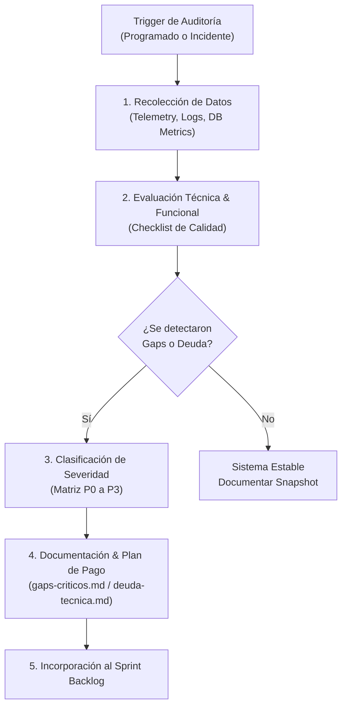
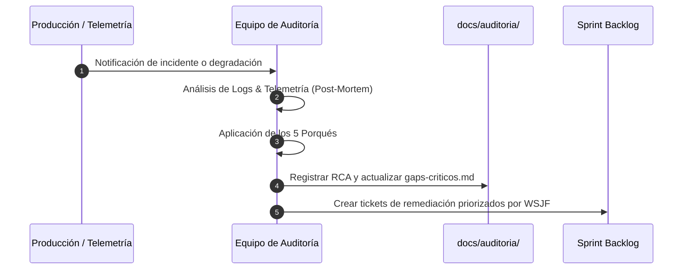

# 🔍 Auditoría del Sistema — Bienestar APP

Este directorio contiene las evaluaciones integrales de salud técnica, operativa y funcional de **Bienestar APP**. Acá se centralizan los diagnósticos sobre el estado real de la plataforma, el catálogo de fallas y vacíos funcionales, y la deuda técnica acumulada con su correspondiente plan de remediación.

---

## 📋 Archivos de Auditoría

A continuación se detallan los informes principales que componen esta sección:

| Archivo | Descripción | Estado / Frecuencia |
| :--- | :--- | :--- |
| **[`estado-actual-sistema.md`](./estado-actual-sistema.md)** | *Snapshot* completo del estado de madurez, disponibilidad, cobertura de pruebas y arquitectura de cada módulo del sistema. | Actualizado trimestralmente |
| **[`gaps-criticos.md`](./gaps-criticos.md)** | Registro detallado de funcionalidades faltantes, cuellos de botella de UX/UI y deficiencias funcionales que impactan la operación de entrenadores y atletas. | Actualización continua |
| **[`deuda-tecnica.md`](./deuda-tecnica.md)** | Inventario de deuda técnica (código legacy, consultas SQL ineficientes, falta de tipado, vulnerabilidades), priorizada con estimación de esfuerzo y plan de pago. | Revisión mensual |
| **[`auditoria_operativa_agosto_2026.md`](./auditoria_operativa_agosto_2026.md)** | Auditoría operativa integral consolidada (Agosto 2026) que analiza flujos de onboarding, rendimiento de la base de datos, motores de prescripción FIE/SARA y métricas B2B/B2C. | Informe consolidado |

---

## 🛠️ Proceso de Auditoría

El proceso de auditoría garantiza que la plataforma evolucione de manera limpia, segura y escalable. Se divide en 3 pilares clave: **Cadencia de Auditoría**, **Criterios de Evaluación** y **Flujo de Análisis de Causa Raíz (RCA)**.

### 1. Cadencia y Disparadores (Triggers)

Las auditorías se ejecutan bajo dos modalidades:

* **Auditorías Programadas**:
  * **Mensual (Deuda Técnica)**: Revisión de métricas de cobertura de código, logs de error en producción y dependencias obsoletas.
  * **Trimestral (Snapshot de Sistema)**: Evaluación integral de arquitectura y rendimiento antes de planificar el roadmap del siguiente Q.
* **Auditorías Event-Driven (Por Evento)**:
  * Incidente crítico en producción (P0/P1).
  * Degradación del tiempo de respuesta API > 500ms en el 95% de las solicitudes.
  * Lanzamiento de una nueva disciplina deportiva o módulo mayor.

---

### 2. Criterios de Evaluación y Checklists

Cada módulo es auditado contra 5 dimensiones de calidad técnica:

1. **Desempeño y Escalabilidad**: Tiempo de respuesta de API, optimización de queries (PostgreSQL/Redis), uso de memoria y renderizado frontend.
2. **Seguridad y Privacidad**: Cumplimiento de RBAC (Role-Based Access Control), sanitización de datos de salud (anamnesis), y protección contra inyecciones SQL / Vault Security.
3. **Mantenibilidad del Código**: Cobertura de tests unitarios y e2e (>80%), adherencia a reglas de linter y separación clara de capas (Clean Architecture).
4. **Experiencia de Usuario (UX)**: Latencia percibida en el registro de entrenamientos, resiliencia offline en el celular de los atletas y consistencia visual.
5. **Correlación de Dominio**: Integridad en el cruce bidireccional entre la programación del entrenamiento y la prescripción nutricional.

---

### 3. Flujo RCA (Root Cause Analysis)

Cuando una auditoría deriva de una falla técnica en producción, se aplica la plantilla **RCA** (`docs/RCA_TEMPLATE.md`) contemplando la técnica de los *5 Porqués*:

---

> [!IMPORTANT]
> **Regla de Oro en Auditorías**: Ninguna deuda técnica identificada debe quedar únicamente en una conversación verbal. Todo hallazgo debe registrarse formalmente en `deuda-tecnica.md` o `gaps-criticos.md` asignándole una severidad y un responsable de remediación.
