# Estado Actual del Sistema — Septiembre 2026

> **Bienestar APP** — Sistema Integral B2B/B2C de Entrenamiento, Nutrición Clínica, Gamificación Deportiva y Biometría.  
> **Fecha de Auditoría**: 3 de Septiembre de 2026  
> **Alcance**: Frontend (React 19.2 + Vite), Backend (FastAPI + PostgreSQL), Capa de Stores (Zustand 5), Motor de Periodización por Ciclos & Weider Canónico (`routineGeneratorEngine.ts`), Cortafuegos Clínico Axial/Lumbar/Hombro/Rodilla (`clinicalFirewall.ts`), Experiencia de Sesión Activa (`ActiveWorkoutSession.tsx`), Catálogo de Videos Técnicos en HD (`exerciseVideoMap.ts`), Gamificación Premium, Motores Clínicos (`correlationEngine`, `supplementationEngine`, Planes de Nutrición Inteligente), NaaS Studio, Ciclos y Periodos Ágiles, Distribución Semanal Reactiva con Onboarding (`PanoramicBuilder.tsx` y `NaaSWorkspace.tsx`) y Vistas B2B/B2C.

---

## 📋 1. Visión General y Resumen Ejecutivo

El presente documento constituye la auditoría técnica integral del estado del sistema de **Bienestar APP** a septiembre de 2026. La plataforma ha consolidado con éxito la arquitectura de **Prescripción y Periodización por Ciclos**, **Nutrición Inteligente con Paridad Metabólica**, **Cortafuegos Clínico de Lesiones (Injury Firewall V2 Pro)**, **Experiencia de Entrenamiento Móvil Activo con Videos Técnicos en HD y Gamificación Premium**, y el **Constructor Ágil de Ciclos y Periodos** en 1 clic para Nutrición y Rutinas.

El sistema cuenta con:
1. **Experiencia de Entrenamiento Móvil Activo en Modo Enfoque 1 a 1 (`ActiveWorkoutSession.tsx`)**:
   - **Modo Enfoque Cero Scroll:** Renderizado de 1 ejercicio por pantalla con Stepper Tracker superior `[#1] [#2] [#3] [#4]`, badges de estado completado `✓` y barra inferior ergonómica fija (`← Anterior` / `Siguiente Ejercicio →`).
   - **Video de Técnica Embebido Directo:** Reproductor de video nativo en la tarjeta activa con botón flotante **`Expandir ⛶`** para visualización en pantalla completa con cues biomecánicos, músculo agonista y sinergistas.
   - **Mapeo Canónico de 676 Videos Oficiales Técnicos en HD:** Base `catilli_all_videos.json` y motor de resolución `exerciseVideoMap.ts` con normalización fonética y prioridad a videos certificados de alta definición (ej: Press de Banca Plano con Barra `fcrDKKNBba8`).
   - **Reemplazo Biomecánico Inteligente con Tríos Rotativos continuos de 3 vías (Efecto ¡AJÁ!):** Algoritmo que detecta el grupo muscular y presenta **únicamente las 2 mejores alternativas equivalentes**, permitiendo rotar libremente entre las 3 variantes (ej: Sentadilla Barra $\leftrightarrow$ Sentadilla Mancuernas $\leftrightarrow$ Sentadilla Sissy en banco) conservando intactas las series, pesos y descansos.
   - **Micro-Evaluación Pedagógica por Serie:** `SetEffortPainModal` en lenguaje simple (*"¿Cuánto esfuerzo te costó?"* `🟢 Cómodo`, `🟡 En su punto justo ⭐`, `🟠 Muy pesado`, `🔴 Al fallo`) y dolor articular con selector de zonas anatómicas.
   - **Evaluación Rápida de Fin de Sesión:** `SessionDailyAssessmentModal` con 3 preguntas táctiles directas (Energía, Exigencia, Articulaciones).
   - **Celebración Gaming Premium con Pedagogía Visual:** `GamingCelebrationOverlay` alineado con la estética de la plataforma: Trofeo 3D, +140 XP ganados, Racha de Días 🔥, Nivel explicado fácilmente, desglose de XP por grupo muscular sin truncar (`Piernas +45 XP`, `Pecho +45 XP`, `Glúteos +35 XP`, `Espalda +35 XP`) y Medalla de Constancia 🏅.
2. **Motor de Generación de Rutinas 1-Clic (`routineGeneratorEngine.ts`)**:
   - Algoritmo determinista basado en los hitos de volumen de Renaissance Periodization (MEV, MAV, MRV) para 10 grupos musculares estratificados por nivel (*Principiante, Intermedio, Avanzado*).
   - Cálculo automático de **Volumen Fraccional** (1.0 agonistas, 0.5 sinergistas).
   - Gestión estricta de **Carga Axial ($\le 15$ puntos)** para proteger la columna lumbar (L4-L5/S1).
   - Presupuesto cronológico de sesión (*Time-Budgeting 60 min*) dividido en 5 fases: RAMP (7m), Primario Fuerza/Prilepin (18m), Secundario Hipertrofia (18m), Aislamiento/Myo-reps (12m), Core 360° McGill (5m).
   - Botón **`⚡ Auto-Poblar este Día`** en cada columna de día vacía y botón maestro **`⚡ Auto-Poblar Rutina (Algoritmo FIE)`** en la cabecera.
3. **Cortafuegos Clínico & Triage Médico (`clinicalFirewall.ts` - V2 Pro)**:
   - **Triage de Banderas Rojas (Red Flags):** 5 códigos de bloqueo total inmediato (`FLAG_NEURO_001`, `FLAG_ONCO_002`, `FLAG_CARDIO_003`, `FLAG_TRAUMA_004`, `FLAG_MYO_005`) ante síntomas de compresión radicular, cauda equina, isquemia o rotura miotendinosa.
   - **Matriz de Smart Swaps Biomecánicos:** Sustituciones automáticas con razonamiento clínico NIOSH para columna lumbar (Goblet Squat, Hip Thrust, McGill Curl-up, Press sentado), complejo del hombro (Scaption con rotación externa, Push-up Plus, Floor Press), rodilla (Prensa 45° pies altos, Spanish Squat), tobillo (Sentadilla con cuña si WBLT $<10$ cm, movilización en pared), fascia plantar (Protocolo Rathleff HSR con toalla) y codo (TNT con metrónomo a 60 bpm).
   - **Protocolos de Progresión Tisular (Cook & Purdam):** Isometría Analgésica (5x45s @ 70-80% MVC) $
ightarrow$ HSR + TNT $
ightarrow$ Carga Dinámica y CEA.
4. **Bóveda de 5 Plantillas Maestras (`useTemplateLibraryStore.ts` & `SmartVaultPanel.tsx`)**:
   - *Torso / Pierna 4 Días* (Lyle McDonald GBR / Eric Helms).
   - *Full Body A-B-A 3 Días* (GZCLP escalonada en niveles T1, T2 y T3).
   - *Push / Pull / Legs / Upper / Lower 5 Días* (Híbrido de especialización de volumen).
   - *Especialización Glúteos & Cadena Posterior 3-4 Días* (Bret Contreras / Regla de los Tercios en vectores de carga LVT).
   - *Calistenia Progresiva & Peso Corporal 3 Días* (Steven Low / Overcoming Gravity con balance 1:1 Push/Pull).
5. **Catálogo de Ejercicios & Bloques Inteligentes (`exercisesData.ts` & `templates.constants.ts`)**:
   - 22 nuevos ejercicios clínicos y de calentamiento RAMP con Cues de Foco Externo, Regresiones y Progresiones.
   - 12 categorías del catálogo lateral (`Movilidad`, `Calentamiento RAMP`, `Rehab/Prehab`, `Pliometría`, `Cardio Zonas`, `Stretching`, `Yoga`, `Pilates`, `Musculación`, `Funcional`, `Fuerza`, `Olímpico`) completamente pobladas.
   - 7 circuitos y biseries de élite: Biserie Torso A1/A2 (sin fatiga lumbar), Complejo PAPE (Sentadilla + Box Jump), Circuito Core 360° (McGill Big 3), Tabata 4 Min (KB Swing + Battle Ropes), EMOM 10 Min (Trap Bar Jumps + Push Press), Tríada AMRAP 12 Min y Complejo Miniband Wenning.
6. **Motor de Correlación y Disposición Autonómica (`correlationEngine.ts`)**: Basado en ACWR (EWMA) y Z-Score de HRV Matinal con semántica constructiva (`Óptimo`, `Precaución`, `Alto`, `Baja`).
7. **Termómetro de Recuperación Móvil (`RecoveryThermometer.tsx`)**: Integrado en el perfil del atleta con simulador hiper-realista de 30 días de telemetría para demostraciones comerciales de alto impacto (*Efecto Ajá*).
8. **Navegación Unificada y Canónica de Pestañas**: Estandarizada estrictamente en las vistas del Atleta ([`ClientHub.tsx`](file:///D:/Musica%20Descargada/Bienestar%20APP/web/src/components/ClientHub.tsx)) y del Entrenador ([`AthleteDetailView.tsx`](file:///D:/Musica%20Descargada/Bienestar%20APP/web/src/components/drilldown/AthleteDetailView.tsx)) bajo el orden: **RESUMEN → ENTRENAMIENTO → NUTRICIÓN → HÁBITOS → AGENDA**.
9. **Consolidación Comercial y Financiera**: Eliminación de vistas redundantes (`Watchtower.tsx`) e integración de alertas de retención de riesgo de abandono (`CHURN_RISK`) y botones de salvataje directo en [`FinanceDashboardView.tsx`](file:///D:/Musica%20Descargada/Bienestar%20APP/web/src/components/dashboard/FinanceDashboardView.tsx).
10. **Studio Nutricional NaaS & Presets SARA 2 con Calibración Dinámica**:
    - Selector dinámico de 1 a 8 ingestas que distribuye automáticamente los horarios y nombres de comidas.
    - Auto-calibración paramétrica al 100% de la meta diaria (ej: 2,850 kcal exactas en verde).
    - Erradicación de scrollbars nativos de Windows en la biblioteca de alimentos, sustituidos por una cuadrícula 4x2 simétrica.
    - Mapa de ciclos nutricionales slim colapsable (~75px).
    - Casillas de gramos delimitadas y visibles en cada alimento.
    - Botón pedagógico **`✨ Alternativa IA`** para crear variedad de platos con paridad metabólica.
11. **Smart Swap Engine & Base Unificada SARA 2 + USDA (834 Alimentos)**:
    - Motor matemático [`smartSwapEngine.ts`](file:///D:/Musica%20Descargada/Bienestar%20APP/web/src/utils/smartSwapEngine.ts) con detección automática de dominancia (`CARBS`, `PROTEIN`, `FAT`, `BALANCED`).
    - Muestra 4 datos macro completos (Kcal, Carbos, Proteínas, Grasas) + medida casera pedagógica + match de equivalencia.
    - Base de datos ampliada a **834 alimentos oficiales** tras traducir e integrar los alimentos fundacionales de **USDA FoodData Central**.
12. **Autenticación en Producción & Magic Links B2C**:
    - Router [`auth_b2c.py`](file:///D:/Musica%20Descargada/Bienestar%20APP/backend/app/api/auth_b2c.py) con endpoints `/redeem`, `/refresh` y `/logout`.
    - Sincronización global en [`AuthContext.tsx`](file:///D:/Musica%20Descargada/Bienestar%20APP/web/src/context/AuthContext.tsx) y [`MagicLinkRedeem.tsx`](file:///D:/Musica%20Descargada/Bienestar%20APP/web/src/components/auth/MagicLinkRedeem.tsx).
13. **Cableado E2E de Producción Coach & Atleta (137 Rutas Activas)**:
    - **Validaciones & Triaje Biomecánico:** Formato `{cursor, validations[]}` en `validations.py` y alias `POST /{id}/decide`.
    - **Dashboard de Nutricionista:** Conexión real en `nutritionist.ts` a `GET /api/v1/nutritionists/dashboard` con fallback transparente.
    - **Gestión de Entrenadores:** Endpoints reales de aprobación/rechazo de videos y resolución de morosidad (`/video-review/{id}/approve`, `/video-review/{id}/reject`, `/resolve-delinquency/{id}`) en `trainer_routes.py`.
    - **Action Cards & Atletas:** Normalización de prefijos a `/api/v1/action_cards` y corrección de desempaquetado de datos en `useAthletes.ts`.
    - **Sellado Clínico de Protocolos:** Activación real de `POST /api/v1/protocols` en `usePlanBuilderMutations.ts`.
14. **Suite de Tests de Integración E2E (26 Tests — 100% Pass Rate)**:
    - [`test_coach_workflows.py`](file:///D:/Musica%20Descargada/Bienestar%20APP/backend/tests/api/test_coach_workflows.py) (16 tests) y [`test_athlete_workflows.py`](file:///D:/Musica%20Descargada/Bienestar%20APP/backend/tests/api/test_athlete_workflows.py) (10 tests) verificados con arquitectura de aislamiento `NullPool` y soporte multi-tenant en PostgreSQL.
15. **Experiencia Móvil de Nutrición, Smart Swap & Validación Fotográfica con Coach**:
    - **Tarjeta de Comida Simplificada (`MealOptionCard.tsx`):** Eliminación de pestañas redundantes (Opción A/B), visualización directa del plato activo, Donut Chart pedagógico ("El Plato Nutricional") con desglose visual de macros (Proteína en azul, Carbos en ámbar, Grasas en rosa).
    - **Cambio de Menú Completo Isocalórico (`FullMealSwapModal.tsx`):** Catálogo curado de recetas por momento del día (Desayuno, Almuerzo, Merienda, Cena) montado con React Portal (`createPortal`) y `z-[99999]` para asegurar visualización perfecta y sin cortes en móviles.
    - **Sustitución 1 a 1 de Alimentos (`SmartSwapModal.tsx`):** Equivalencias bioquímicas instantáneas y banner de efecto equivalencia con medidas de la vida cotidiana.
    - **Motor de Medidas Caseras (`householdMeasures.ts`):** Validación estricta de `unit: 'u'` vs `'g'` eliminando choques de similitud y traduciendo gramos a porciones cotidianas (rebanadas medianas, bifes con palma de la mano, tazas cocidas).
    - **Validación Fotográfica de Ingestas (`MealPhotoValidationModal.tsx`):** Guía visual de 4 pasos (90° cenital, luz clara, encuadre total, escala con cubiertos), captura directa con cámara/galería, notas para el profesional y sincronización en tiempo real con `useCoachCommunicationStore`.
16. **Monetización Freemium & Candado Pro con Redirección a Coaches**:
    - Bloqueo asistido con candado en Ajuste de Cargas & RPE y Validación de Técnica en Video directamente integrados en el módulo de entrenamiento, con modal pedagógico y redirección a selección de entrenadores certificados si el usuario carece de plan activo con coach.
17. **Programación Semanal de Hábitos & Creador Rápido (`useHabitStore.ts`, `CreateHabitModal.tsx`)**:
    - Selector interactivo de días (`scheduledDays`), atajos de días frecuentes (`L-X-V`, `M-J-S`, `Laborales`, `Finde`) y cálculo reactivo de adherencia diaria y semanal.
18. **Remediación Integral de Producción Backend, Seguridad & Nutrición Atleta**:
    - **Seguridad P0:** Eliminación de backdoor `demo_b2b_token_123` en `auth.py`, CORS dinámico vía `settings.cors_origins_list` en `main.py`, y Dockerfile de producción con soporte de puerto dinámico `${PORT:-8000}`, requirements en UTF-8 y `.dockerignore`.
    - **Capa de Datos `NutritionRepository`:** Métodos asíncronos multi-tenant para búsqueda en SARA 2 (`search_foods`), CRUD de planes nutricionales, recetas y logs de ingesta.
    - **Motor de Compras `ShoppingListService`:** Consolidación de ingredientes con multiplicador temporal (`3d`, `1w`, `2w`, `1m`), agrupación por góndolas de retail argentino y forecast de porciones reales.
    - **Endpoints de Nutrición & Vision GPT-4o:** `GET /api/v1/nutrition/plans/active`, `POST /api/v1/nutrition/shopping-list`, `POST /api/v1/nutrition/meal-logs`, `GET /api/v1/nutrition/meal-logs`, `GET /api/v1/nutrition/adherence/today` y router `nutrition_vision.py`.
    - **Workers de Celery & Alembic:** Implementación de `recalculate_cri_task`, `generate_dietary_plan_task`, `generate_nutrition_pdf_task`, registro de 13 módulos en `celery_app.include`, migración Alembic de `recipes` (head `e4f5a6b7c8d9`), endpoints de infraestructura `/health` y `/ready`, y suite de tests de nutrición verificada al 100%.

```mermaid
graph TD
    subgraph Frontend ["Capa Frontend (React 19.2 + Vite)"]
        UI_B2B["CommandCenter & AthleteDetailView (B2B)"]
        UI_B2C["ClientHub & AthleteMobileView (B2C)"]
        PB["PlanBuilderCockpit & PanoramicBuilder"]
        ActiveSess["ActiveWorkoutSession (Modo Enfoque 1a1 + Videos Catilli)"]
        NaaS_Studio["NaaS Studio & SmartLibraryPanel (834 Alimentos)"]
        SmartSwap["Smart Swap Engine (smartSwapEngine.ts)"]
        PBStore["usePlanBuilderStore (Plan 7 días serializado)"]
        ExecStore["useExecutionStore (Tracking en Vivo de Series & RPE)"]
        NutStore["useNutritionStore (Recetas CRUD + DailyMealPlan + XP)"]
        FinStore["useFinanceStore (MRR + Churn Alerts)"]
        GamiStore["useGamificationStore (+140 XP entreno / +20 XP comida)"]
        HabitStore["useHabitStore"]
        AuthCtx["AuthContext & MagicLinkRedeem (Tokens JWT)"]
    end

    subgraph Engines ["Motores Inteligentes (Core Domain)"]
        RGE["routineGeneratorEngine.ts (Auto-Populate 1-Clic FIE)"]
        CF["clinicalFirewall.ts (Injury Firewall V2 Pro & Red Flags)"]
        EVM["exerciseVideoMap.ts (676 Videos Oficiales Catilli)"]
        SWE["SmartSwap Trio Matrix (Rotación Continua 3 Vías)"]
        CE["correlationEngine.ts (ACWR EWMA + HRV Z)"]
        SE["supplementationEngine.ts (Dosis P1)"]
        NE["nutritionEngine & Presets SARA 2 (Calibración Paramétrica)"]
        SSE["smartSwapEngine.ts (Detección Dominancia & Iso-macros)"]
    end

    subgraph Backend ["Capa Backend (FastAPI + PostgreSQL)"]
        API_Auth["Auth & Magic Links (/api/v1/auth-b2c)"]
        API_Nut["Nutrition & Food Catalog (/api/v1/nutrition)"]
        EngineTr["Motor de Entrenamiento FIE"]
        DB[(PostgreSQL + Alembic)]
    end

    UI_B2B --> Engines
    UI_B2C --> Engines
    PB --> RGE
    PB --> CF
    ActiveSess --> EVM
    ActiveSess --> SWE
    ActiveSess --> ExecStore
    ActiveSess --> GamiStore
    NaaS_Studio --> NE
    NaaS_Studio --> SSE
    UI_B2B --> FinStore
    UI_B2B --> PBStore
    UI_B2C --> NutStore
    UI_B2C --> HabitStore
    AuthCtx --> API_Auth

    PBStore <--> API_Nut
    NutStore <--> API_Nut
    API_Auth --> DB
    API_Nut --> DB
```

## 9. Módulo Social, Grupos & Retos Multidisciplinarios (Fase 93)
- **Centro de Mando del Entrenador:** `/gamification` ("Grupos & Retos") con selector de grupos, plantillas por disciplina (Fuerza, CrossFit, Running, Yoga, Pilates, Boxeo, Custom) y live preview móvil.
- **Widget de Inicio:** `ActiveClassesWidget.tsx` en `CommandCenter.tsx` con detalle de clases (`ClassDetailModal.tsx`).
- **Superficie Social del Atleta:** `AthleteTribuDashboard.tsx` organizado en 3 sub-pestañas simétricas (`Feed`, `Retos`, `Ranking`) con creación de squads (`CreateSquadModal.tsx`) e invitaciones virales WhatsApp (+50 XP).
- **Válvula de Escape Contextual:** `LazyDayButton` reubicado en `DailySurface.tsx` bajo la sesión del día.
- **Salud del Sistema:** Compilación TypeScript limpia (0 errores) y Smoke Tests E2E 10/10 (100% Pass Rate).

## 10. Onboarding Pedagógico, Foto Baseline y Ergonomía de Inicio (Fase 94)
- **Inicio Móvil Compacto:** Hábitos, Nutrición y Agenda colapsados por defecto en `AthleteDemoDashboard.tsx`, eliminando el scroll vertical masivo.
- **Foto de Punto de Partida:** Tarjeta en inicio (`BaselinePhotoCard.tsx`) y asistente guiado (`BaselinePhotoModal.tsx`) con recompensa de `+100 XP` y consejos de captura.
- **Wizard de Bienvenida del Atleta:** `AthleteWelcomeWizardModal.tsx` con 4 pasos interactivos, selección de metas y `+50 XP` de bienvenida.
- **Ajustes del Atleta:** `ProfileView.tsx` con accesos rápidos a foto baseline y guía de bienvenida.

## 11. Comparador Visual y Agendamiento Automático de Fotos (Fase 95)
- **Comparador Visual:** `VisualComparisonModal.tsx` con slider interactivo antes/después y vista lado a lado.
- **Agendamiento:** `BaselinePhotoModal.tsx` permite elegir recordatorio en 15, 20 o 30 días con cálculo automático de fecha.
- **Acceso Ubicuo:** Disponible en tarjeta de inicio (`BaselinePhotoCard.tsx`), perfil (`ProfileView.tsx`) y galería.

## 12. Galería de Progreso Unificada y Flujo One-Time de Foto de Inicio (Fase 96)
- **Cero Duplicación en Inicio:** `BaselinePhotoCard.tsx` se oculta tras la primera captura (`returns null`), preservando la limpieza del dashboard de inicio.
- **Galería Unificada:** `ProgressGallery.tsx` en `ProfileView.tsx` muestra la foto base guardada, el slider antes/después y el botón de nueva foto de control.
- **Aviso Guiado:** El modal de foto baseline instruye al atleta que sus fotos quedan resguardadas en el menú de perfil lateral.

## 13. Menú del Atleta Prémium y Carga de Foto de Perfil (Fase 97)
- **Avatar Simétrico:** Anillo concéntrico perfeccionado y badge de nivel centrado en `ProfileView.tsx`.
- **Foto de Perfil:** Subida de imagen activa con propagación al header de `AthleteMobileView.tsx`.
- **Estética de Vanguardia:** Tarjetas estilizadas con micro-interacciones táctiles y colores amigables.

## 14. Multi-Tribu Switcher y Ergonomía Social (Fase 98)
- **Multi-Tribu:** Selector horizontal de tribus en `AthleteTribuDashboard.tsx` vinculado a `useTribuStore.ts`.
- **Diseño Simétrico:** Tarjeta de escuadrón minimalista con barra de progreso limpia y avatares ordenados.
- **Pestañas:** Segmented control para Muro, Retos y Ranking.

## 15. Pestaña de Mis Tribus & Grupos (Fase 99)
- **Sub-pestaña 'Tribus':** Ubicada en el segmented control de `AthleteTribuDashboard.tsx`.
- **Navegación Intuitiva:** Permite conmutar de escuadrón, unirse a clases y administrar grupos sin saturar la pantalla.

## 16. Vitrina de Medallas y Ficha de Datos Generales (Fase 100)
- **Vitrina de Medallas:** `AthleteMedalsModal.tsx` con 8 medallas, filtros y exportación a Stories.
- **Ficha de Datos:** `AthleteGeneralDataModal.tsx` con edición y lectura de biometría (Peso, Altura, IMC, Metas, Coach).
- **Menú de Perfil:** `ProfileView.tsx` unificado y libre de redundancias.

## 17. Resumen de Estado del Sistema al Cierre de Fase 100
- **Experiencia del Atleta (B2C):**
  - Inicio ergonómico con acordeones colapsados por defecto (Hábitos, Nutrición, Agenda).
  - Wizard de Bienvenida pedagógico de 4 pasos con recompensa de +50 XP.
  - Foto de punto de partida con 4 consejos guiados (+100 XP), checklist único y recordatorios de 15/20/30 días.
  - Comparador visual interactivo con Split Slider táctil y exportación a Stories.
  - Menú lateral de perfil con avatar concéntrico, carga de foto de perfil, ficha biométrica con IMC y vitrina de 8 medallas con filtros.
  - Pestaña social multi-tribu con 4 sub-pestañas (`Muro`, `Retos`, `Ranking`, `Tribus`).
- **Portal del Entrenador (B2B):**
  - Prescripción NaaS con 12 recetas argentinas, Smart Swap Engine, Injury Firewall V2 y Magic Links de onboarding.
- **Calidad de Código:**
  - TypeScript 0 errores, 10/10 Smoke Tests E2E aprobados y arquitectura FSD respetada.

## 18. Ergonomía del Dashboard del Entrenador (Fase 101)
- **Grupos & Clases Colapsables:** `ActiveClassesWidget.tsx` cerrado por defecto con animación `AnimatePresence`.
- **Ahorro de Espacio Vertical:** El panel principal queda limpio y optimizado para una rápida lectura operativa.

## 19. Refinamiento UX y Alcance Nutricional (Fase 102)
- **Readiness:** Descartable por el usuario con botón `X`.
- **Identidad de Íconos:** Agenda (Calendario Azul) vs Hábitos (Checklist Violeta).
- **Nutrición:** Limitada a Menú Diario, Plan Semanal y Lista de Compras (Modo Cocina descartado).
- **Social:** Pestañas superiores sticky para acceso inmediato.

## 20. Muro de Victorias Social de Alto Engagement (Fase 103)
- **Actividad Hoy:** Fila interactiva de avatares con estados de cumplimiento diario y envío de aliento.
- **Micro-Tarjetas:** Reducción de altura del 55% y multirreacciones (`🔥`, `💪`, `🚀`, `👏`).
- **Store:** `useTribuStore.ts` con `toggleReaction`.

## 21. Estabilización de Render y Estado de Preparación (Fase 104)
- **Corrección de Runtime:** `isReadinessDismissed` y `X` declarados e importados correctamente en `AthleteDemoDashboard.tsx`.
- **Ruta Atleta:** `http://localhost:5173/athlete` 100% operativa (HTTP 200).

## 22. Mensajería con Coach y Modelo de 3 Planes (Fase 105)
- **Store de Coach:** `useCoachStore.ts` con gestión de planes, mensajes y marketplace.
- **Vistas:** `CoachChatView.tsx` y `CoachPlansModal.tsx` con soporte de planes y chat reactivo.

## 23. Ergonomía del Chat y Temas Rápidos (Fase 106)
- **Bandeja Inferior:** `CoachChatView.tsx` con 7 temas rápidos (`cargas`, `video`, `nutrición`, `dolor`, `nivel`, `fatiga`, `foto`).
- **Paleta Coherente:** Estilo visual unificado y ergonómico.

## 24. Malla Visible de 7 Temas y Contraste de Chat (Fase 107)
- **Contraste:** Texto blanco nítido sobre fondo índigo en mensajes del atleta.
- **Malla de 7 Temas:** 100% de pastillas accesibles a la vista en `CoachChatView.tsx`.

## 25. Layout Fijo Tipo WhatsApp en Coach Chat (Fase 108)
- **Eliminación de Scroll Global:** `h-[calc(100dvh-57px-64px)]` en `AthleteMobileView.tsx` con input y temas siempre visibles.
- **Micro-Proporciones:** Tamaños y márgenes adaptados a estándares de mensajería moderna.

## 26. Anclaje Viewport de Mensajería Coach (Fase 109)
- **Docking:** `top-[57px] bottom-16` en `AthleteMobileView.tsx` que garantiza cero solapamiento con la barra de navegación.

## 27. Scrollbar Ultra-Premium (Fase 110)
- **Estilo:** `.custom-scrollbar` de 4px con pista transparente y cápsula sutil.

## 28. Cableado Real de Comunicación y Validaciones (Fase 111)
- **Store Vivo:** `useCoachCommunicationStore.ts` con BroadcastChannel.
- **FastAPI Endpoints:** `/api/v1/chat` y `/api/v1/inbox` integrados.
- **Bucle de Cargas:** Validación del coach modifica dinámicamente `usePlanBuilderStore`.

## 29. Resumen de Consolidación de Fases Recientes (Fases 100 a 111)
- **Fase 100:** Vitrina de 8 medallas temáticas (`AthleteMedalsModal.tsx`) y Ficha de Datos Físicos (`AthleteGeneralDataModal.tsx`).
- **Fase 101:** Acordeón colapsable con animación suave en `ActiveClassesWidget.tsx` (Dashboard Coach).
- **Fase 102:** Readiness descartable con botón `X`, ícono violeta de hábitos (`CheckSquare`), exclusión de Modo Cocina y pestañas sociales en barra superior fija.
- **Fase 103:** Muro de Victorias con Stories Ticker de actividad diaria (`3/5 activos`), Micro-Tarjetas compactas (-55% de altura) y multirreacciones (`🔥`, `💪`, `🚀`, `👏`).
- **Fase 104:** Estabilización de runtime y resolución de variables en `/athlete`.
- **Fase 105:** Mensajería con Coach, pantalla de matching y 3 planes de negocio (`Free Trial 14d`, `Habits Pro $7.99/m`, `Habits Pro + Coach $49/m`).
- **Fase 106:** Ergonomía de bandeja inferior con 7 temas rápidos con 1 toque.
- **Fase 107:** Tipografía de alto contraste blanco puro en burbujas y malla visible flex-wrap de temas.
- **Fase 108:** Layout tipo WhatsApp sin doble scroll.
- **Fase 109:** Anclaje fijo de viewport (`top-[57px] bottom-16`) con visibilidad garantizada de input bar.
- **Fase 110:** Scrollbar ultra-premium minimalista de 4px transparente.
- **Fase 111:** Cableado real end-to-end sin mocks (`useCoachCommunicationStore.ts` con `BroadcastChannel` inter-pestañas, validaciones 1-clic con ajuste automático de carga en `usePlanBuilderStore`, y endpoints FastAPI `/api/v1/chat` e `/api/v1/inbox`).

## 30. Onboarding Progresivo Contextual (JIT) (Fase 112)
- **Entrenamiento:** `SetupWorkoutWizardModal.tsx` con captura de arquetipo, nivel, lugar y escudo de dolores articulares.
- **Nutrición:** `SetupNutritionWizardModal.tsx` con cálculo Mifflin-St Jeor, alergias y reparto de 3 a 5 comidas.

## 31. Rediseño de Nutrición Móvil (Fase 113)
- **Acordeón:** Ciclo y Pauta Energética colapsables en `AthleteNutritionDashboard.tsx`.
- **Navegación:** `Menú Diario` | `Plan Semanal` | `Compras` sin cortes.

## 32. Plan Semanal Inline en Nutrición (Fase 114)
- **Navegación:** `WeeklyMealPlanTab.tsx` integrado fluidamente como subpestaña móvil.

## 33. Desacople y Rendimiento en Compras (Fase 115)
- **Pronóstico:** Acordeón separado con cálculo de rendimiento de platos según período.

## 34. Empaque Comercial y Medidas Caseras en Compras (Fase 116)
- **Retail Packaging:** Traducción de gramajes a paquetes de góndola y medidas caseras pedagógicas.

## 35. Consolidación de Experiencia de Nutrición y Onboarding JIT (Fases 112 a 116)
- **Onboarding JIT:** `SetupWorkoutWizardModal.tsx` y `SetupNutritionWizardModal.tsx` con captura de dolores y alergias.
- **Nutrición Móvil:** Acordeón de ciclo y pauta energética en `AthleteNutritionDashboard.tsx`.
- **Plan Semanal:** `WeeklyMealPlanTab.tsx` integrado inline.
- **Compras Inteligentes:** `ShoppingListOrchestrator.tsx` con pronóstico en acordeón separado y empaques comerciales de góndola.

## 36. Sidebar Colapsable y Módulo Inbox Optimizado (Fase 117)
- **Sidebar:** Modo Slim colapsable `w-20` con tooltip reactivo y botón `H.`.
- **Inbox:** Renderizado ultra-rápido conectado a `useCoachCommunicationStore` con revisión de video y calibración en 1 toque.

## 37. Unificación de Mensajes & Validaciones (Fase 118)
- **Módulo Unificado:** `Mensajes & Validaciones` con acceso directo desde el Dashboard de Inicio y pestaña de Validaciones.

## 38. Validaciones Tinder en Pestaña Unificada (Fase 119)
- **Tinder Deck:** `TinderValidationDeck.tsx` integrado en la cabecera junto a Mensajes & Chat.

## 39. Estación Biomecánica con Telestrator y Dictado por Voz (Fase 120)
- **Telestrator:** Dibujo libre sobre el video con congelamiento de fotograma y lápices rojo/verde.
- **Audio:** Grabación y despacho de notas de voz del coach.

## 40. Pantalla Completa Cinemática en Validaciones (Fase 121)
- **Modo Darkroom:** Estudio biomecánico inmersivo a pantalla completa con telestrator y grabación de audio.

## 41. Feedback Multimodal en Validaciones Tinder (Fase 122)
- **Audio & Chat:** Reproductor de notas de voz, entrada de texto para el chat del atleta y sugerencias rápidas.

## 42. Optimización de Pantalla Completa y Segmentos (Fase 123)
- **Layout & Segmentos:** Altura completa sin cortes, grid de categorías simétrico y banner de video plegable en el chat.

## 43. Paleta de Chat, Píldoras Amigables y Ficha de Atleta (Fase 124)
- **Chat Personalizable:** Selector de 7 colores para burbujas, tipografía nítida y drawer de expediente clínico/deportivo.

## 44. Línea de Tiempo Pura del Atleta (Fase 125)
- **Actividad:** Historial de eventos reales (ejercicios, macros, hidratación, niveles) sin métricas simuladas.

## 45. Sidebar Depurado y Biblioteca Pedagógica (Fase 126)
- **Sidebar Slim:** Eliminado scroll horizontal y unificación de rol activo sin apilar iconos.
- **Biblioteca Maestra:** Visual pedagogy, presets de entrenamiento y nutrición, y asignación 1-clic.

## 46. Selector de Rol Coach/Nutri y Drive Explorer (Fase 127)
- **Roles:** Conmutador rápido de rol profesional en la base del sidebar.
- **Biblioteca Drive:** Explorador de carpetas jerárquico fiel a Google Drive.

## 47. Desacople de Tema y Roles Limpios (Fase 128)
- **Roles:** Selector `Coach` / `Nutrición` sin alterar tema visual activo.

## 48. Botón Swap Theme Dedicado (Fase 129)
- **Tema:** Accesos dedicados ☀️/🌙 en cabecera, pie de página y modo slim del sidebar.

## 49. Cabecera Libre y Swap Theme Inferior (Fase 130)
- **UI:** Logotipo superior 100% despejado y selector de tema posicionado en el pie de página.

## 50. Agenda y Tareas del Profesional (Fase 131)
- **Agenda Pro:** Gestión de turnos 1 a 1, consultas, clases, checklist de tareas y modal de agendamiento en `/calendar`.

## 51. Motor de Alertas de Fin de Ciclo (Fase 132)
- **Ciclos:** Disparo automático de tareas pendientes 7 días antes del cierre de rutinas o dietas.

## 52. Calendario Semanal de Disponibilidad (Fase 133)
- **Disponibilidad:** Matriz semanal de franjas libres y ocupadas con agendamiento en 1-clic.

## 53. Pedagogía Visual en Agenda Pro (Fase 134)
- **UX:** Vocabulario amigable, micro-copys guiados y menor carga cognitiva para nuevos entrenadores.

## 54. Servicios de Medición y Evaluación (Fase 135)
- **Agenda:** Incorporados servicios de medición antropométrica ISAK, testeos de fuerza 1RM y evaluación postural.

## 55. Servicios Personalizados Ilimitados (Fase 136)
- **Agenda:** Capacidad de crear y guardar cualquier tipo de servicio a medida con emoji e insignias dinámicas.

## 56. Alerta de Lesiones Prioritaria en Ficha del Atleta (Fase 137)
- **Seguridad Clínica:** Lesiones y patologías ubicadas en la parte superior de la ficha técnica.

## 57. Estabilidad de Hot-Reload en Plan Builder (Fase 138)
- **Corrección:** Eliminado conflicto de imports duplicados en `AthleteFormModal.tsx` restaurando HMR inmediato en `/plan-builder`.

## 58. Cableado Integral de Producción Backend (Fase 139)
- **FastAPI 133 Endpoints:** Activación y verificación de 133 rutas REST en FastAPI eliminando 404s en consola.
- **CRUD de Workouts (`workouts.py`):** Creación transaccional de planes anidados (días, superseries, ejercicios), listado con filtros, get por ID, update, soft delete multi-tenant, asignación y duplicación (Smart Fork).
- **Rutina del Día del Atleta (`athlete.py`):** Endpoint `GET /api/v1/athlete/routine/today` con rotación cíclica de mesociclos y `POST /api/v1/athlete/sets` con `idempotency_key` anti duplicados.
- **Catálogo de Ejercicios (`exercises_routes.py`):** Búsqueda y filtrado biomecánico (músculo, patrón, impacto articular, equipo) y autocomplete para PanoramicBuilder.
- **Plantillas Maestras (`templates_routes.py`):** CRUD de Master Templates y forking adaptativo para el Google Drive-style explorer.
- **Dashboard del Nutricionista (`nutritionist_routes.py`):** Métricas reales de pacientes activos, conteo de planes y check-ins en PostgreSQL.
- **Validaciones de Video (`validations.py`):** Cola de revisión de técnica conectada a `video_reviews` con feedback del entrenador.
- **Chat e Inbox con PostgreSQL (`chat.py` & `inbox.py`):** Persistencia en tablas `conversations` y `messages` sustituyendo estructuras en memoria.
- **Reconciliación Offline (`sync.py`):** `POST /api/v1/sync/push` idempotente y `GET /api/v1/sync/pull` incremental para la cola de IndexedDB.
- **Calidad y Verificación:** 0 errores TypeScript (`npx tsc --noEmit`) y 100% de aislamiento multi-tenant por `tenant_id`.

## 59. Cierre 100% Módulo de Entrenamiento del Atleta & Gaps Operativos (Fase 140)
- **Sincronización en la Nube de Plantillas Maestras (`useTemplateSync.ts` & `useTemplateLibraryStore.ts`):** Hook reactivo que consume `GET /api/v1/templates`, mutaciones completas (crear, editar, borrar, forkar) e invalidación de cache TanStack Query. Las plantillas maestras remotas se mapean automáticamente en una carpeta especial *"☁️ Plantillas en la Nube (Backend)"* y muestran badge en vivo `☁️ Nube activa` en `TemplateLibrary.tsx`.
- **Adherencia Dinámica en Tracking View (`WorkoutTrackingView.tsx`):** Erradicación del valor hardcodeado `85%`. Implementado cálculo reactivo mediante `useMemo` sobre `useExecutionStore.sessionHistory` (conteo real de sesiones completadas en ventana de 28 días vs sesiones semanales esperadas).
- **Tipografía y Contraste en Chat / Inbox (`IntelligentInbox.tsx`):** Corregido bug de invisibilidad de texto (burbuja blanca con `text-white` en modo claro). Implementado contraste contextual `isCoach ? 'text-white' : 'text-slate-900 dark:text-zinc-100'` con marcas de tiempo legibles.
- **Limpieza de Routers y Stubs Muertos (`main.py`):** Eliminados imports y registros de `readiness_routes` y `swap_routes` vacíos, consolidando la lógica de telemetría y reemplazos en `athlete.py` y `fitness.py`.
- **Suite de Tests Backend (40/40 Tests PASSED — 100% Pass Rate):** Verificados `test_workouts.py`, `test_athlete_workflows.py`, `test_coach_workflows.py`, `test_chapter3_biomechanics.py` y `test_domain_pure.py`.
- **Gobernanza de Diseño & Build Frontend:** Auditoría agéntica DTCG con 0 violaciones de diseño y compilación de producción Vite limpia.

## 60. Alertas Inteligentes de Clientes & Hero Strip Pedagógica (Fase 141)
- **Banner Dinámico de Alertas Clínicas (`CommandCenter.tsx`):** Reemplazo de la tarjeta estática de fatiga por una notificación inteligente contextual. Si existen alumnos con reportes de dolor, lesiones activas o fatiga aguda (ACWR > 1.5), se despliega un banner de advertencia médica con acceso directo a la revisión. En días normales sin incidencias, el espacio se compacta con un badge *"✓ Todo bajo control"*, maximizando el área útil para revisiones de planes y tareas de alta prioridad.
- **Tira Hero Pedagógica de 3 Tarjetas:** Optimización de métricas ejecutivas con lenguaje claro (*Revisiones Pendientes*, *Clases en Operación*, *Comunidad Activa*).
- **Sincronización de Clases Activas (`ActiveClassesWidget.tsx`):** Conectado directamente a `useClassesStore.ts` para reflejar en tiempo real los grupos creados y sus miembros.

## 61. Grupos, Clases y Retos Colectivos (Game Master) (Fase 142)
- **Doble Pestaña de Navegación (`GamificationBuilder.tsx`):** División limpia entre la gestión operativa de grupos (`👥 Clases & Grupos Activos`) y el catálogo de dinámicas colectivas (`🏆 Catálogo de Retos - Game Master`).
- **Acordeón Colapsable Cerrado por Defecto:** Cada clase se presenta en una fila compacta cerrada por defecto para brindar un relevamiento instantáneo de todas las clases en una sola pantalla sin necesidad de scroll vertical continuo. Incluye botón global `Expandir Todas` / `Colapsar Todas`.
- **Estructura Simétrica de 12 Columnas:** 
  - *Col 1-5 (41.6%):* Identidad de la clase, icono emoji, badge de disciplina y horario.
  - *Col 6-8 (25%):* Comunidad asignada, avatares solapados y conteo exacto de alumnos inscritos.
  - *Col 9-11 (25%):* **Píldora Violeta de Reto Activo** con trofeo, micro-etiqueta `"RETO EN VIVO"`, nombre del reto y punto verde pulsante `● Live` sincronizado con la app móvil de los alumnos. Si no hay reto, muestra botón `+ Asignar Reto`.
  - *Col 12 (8.4%):* Botón circular con chevron animado.
- **Banner Pedagógico Superior:** Leyenda explicativa sobre el propósito de las Píldoras Violetas y el ratio de clases con reto en vivo.
- **Store Persistente (`useClassesStore.ts`):** Estado global con persistencia de grupos, horarios, disciplinas, alumnos con rachas y retos activos sincronizados con `useTribuStore.ts` y `useGamificationStore.ts`.

## 62. Transformación del Dashboard de Finanzas & Cobranzas (Fase 143)
- **Sugerencias Inteligentes en Modo Notificación Superior (`FinanceDashboardView.tsx`):** Banner superior prioritario que alerta sobre cobros pendientes ($108.000) con botón directo `Ver Pendientes` para filtrar la tabla, o destaca el crecimiento mensual (+11.7%) y la retención (88%).
- **Lenguaje Pedagógico y Amigable:** Eliminación de tecnicismos fríos ("MRR", "Churn", "CLTV") y adopción de términos comprensibles: *Recaudación Mensual ($1.050.000)*, *Alumnos al Día (8 de 10)*, *Cobros Pendientes ($108.000)*, *Cuota Promedio ($38.600)*.
- **Flujo de Cobro por WhatsApp en 1 Toque:** Modal interactivo con mensaje cordial pre-redactado en español rioplatense (`"Hola {nombre}! ¿Cómo estás? Te dejamos el link para abonar tu cuota..."`), botón de copiado rápido, apertura directa en WhatsApp y confirmación inmediata con un toque (`Ya me pagó - Marcar Al Día`).
- **Gráfico de Evolución de Ingresos & Distribución de Planes:** Gráfico de área con tooltips monetarios en moneda local, filtros de rango (6 Meses / Año Completo) y barras visuales de planes (Pro, Premium, Basic, Custom).
- **Tabla de Alumnos con Buscador y Filtros:** Pestañas de estado (`Todos`, `Al Día`, `Pendientes/Mora`), buscador reactivo por nombre y badges de estado (`🟢 Al Día`, `🟡 Por Vencer`, `🔴 Vencido/Mora`).
- **Datos Seed & Persistencia v3 (`useFinanceStore.ts`):** 12 meses de facturación histórica ($320k a $1.05M) y 10 clientes con auto-migración y recuperación garantizada si el almacenamiento local está vacío.

## 63. Redirección a Perfil de Alumnos & Configurador de Planes Estandarizados (Fase 144)
- **Navegación al Perfil del Alumno en 1 Toque (`FinanceDashboardView.tsx`):** Al hacer clic en el nombre o avatar de cualquier alumno en la tabla de finanzas, se redirige de forma fluida a su ficha completa (`/trainer/athlete/:id`), con cursor táctil, efecto de subrayado, avatar resaltado e icono `ArrowUpRight`.
- **Doble Pestaña en Finanzas:** Switcher superior entre `📊 Resumen & Cobranzas` y `🏷️ Catálogo de Planes & Precios` (con badge contador en vivo).
- **Catálogo de Planes & Ofertas Comerciales:**
  - Segmentación de formatos: *Membresías Mensuales Recurrentes*, *Packs Trimestrales / Semestrales (3 y 6 meses con descuento)*, *Rutinas Sueltas (Pago Único)* y *Asesorías 1 a 1 / Evaluaciones ISAK*.
  - Filtros reactivos por formato con conteos automáticos.
  - Tarjetas de planes con diseño prémium: distintivos (*Más Elegido ⭐, Ahorro 25% 💎, Pago Único ⚡*), precio en $ ARS, desglose mensual (*"Equivale a $33.300/mes"*), checklist de beneficios incluidos con tildes verdes y contador de alumnos activos.
  - **Acciones Comerciales Rápidas:**
    - `🔗 Copiar Link de Pago`: enlace de checkout directo (`https://bienestar.app/pay/:id`) con feedback Toast.
    - `💬 WhatsApp`: apertura de WhatsApp con propuesta comercial pre-redactada para enviar a prospectos y alumnos.
- **Modal de Creación y Edición de Planes (`CreateEditPlanModal`):** Permite al entrenador crear o editar tarifas, periodicidad, nivel de servicio (Pro, Premium, Basic, Custom), distintivos y checklist de beneficios en texto libre de 1 por línea.
- **Store Persistente v4 (`useFinanceStore.ts`):** Inclusión de `CommercialPlan[]`, catálogo inicial de 7 planes representativos y acciones CRUD (`addPlan`, `updatePlan`, `deletePlan`, `togglePlanActive`) con migración automática garantizada.

## 64. Personalización Integral de Mensajes de WhatsApp para el Profesional (Fase 145)
- **Modal Maestro de Configuración de Plantillas (`WhatsAppSettingsModal`):**
  - Permite al entrenador configurar sus 3 plantillas clave: *💰 Recordatorio de Cuota Mensual*, *🏷️ Propuesta Comercial (Compartir Plan)* y *💖 Agradecimiento por Pago Recibido*.
  - Selector de tonos predeterminados en 1 clic (*"😊 Cálido y Cercano"*, *"📋 Directo y Formal"*, *"🔥 Motivacional & Fitness"*).
  - Soporte de variables dinámicas: `{nombre}`, `{plan}`, `{monto}`, `{link}`, `{dias_mora}`, `{nombre_plan}`, `{precio}`, `{duracion}`, `{descripcion}`, `{beneficios}`.
  - Botón de restauración a valores originales de fábrica (`Restaurar Originales`).
- **Edición en Tiempo Real en el Modal de Recordatorio (`WhatsAppModal`):**
  - El entrenador puede editar el texto sobre la marcha antes de abrir WhatsApp o copiarlo.
  - Chips de inserción rápida: `+ Cierre Motivacional`, `+ Mi Alias`, `+ Formas de Pago`.
  - Opción de guardar los cambios al instante con `Guardar como mi plantilla`.
- **Modal Interactivo para Compartir Planes (`WhatsAppPlanShareModal`):**
  - Vista previa y editor de la propuesta comercial personalizada con precio y beneficios del plan seleccionado antes de enviar.
- **Persistencia v5 (`useFinanceStore.ts`):** Inclusión del objeto `whatsappTemplates` con persistencia automática y migración transparente.

## 65. Integración del Hub de Comunicación, Depuración de Rutas y Navegación Reactiva a Pendientes (Fase 146)
- **Scroll Reactivo y Filtrado en "Ver Pendientes" (`FinanceDashboardView.tsx`):**
  - Al pulsar el botón `Ver Pendientes` del banner de sugerencias o la tarjeta KPI de *Cobros Pendientes*, la vista cambia al tab de cobranzas, filtra automáticamente por morosos/pendientes y hace scroll suave directo a la tabla con ancla `id="tabla-alumnos"`.
- **Integración de Canales & Automatizaciones en "Mensajes & Validaciones" (`IntelligentInbox.tsx`, `CommunicationConfigTab.tsx`):**
  - Incorporación de la 3ra pestaña principal `⚙️ Canales & Automatizaciones` en la bandeja del profesional.
  - **Guardián de Descanso & Horarios (Gatekeeper):** Franjas de atención personalizadas Lunes a Domingo, estado en vivo y Bypass de Alertas Críticas (lesiones/dolor).
  - **Canales de Contacto Conectados:** WhatsApp Business Directo, Notificaciones Push Móviles en tiempo real y Email Transaccional.
  - **Respuestas Automáticas:** Mensajes configurables para Fuera de Horario, Modo Vacaciones y En Sesión de Entrenamiento.
  - **Disparadores de Fidelización (Triggers):** Felicitaciones por racha de constancia, check-in anti-abandono (4 días inactivo) y avisos preventivos de cuota.
- **Depuración de Módulos Obsoletos & Duplicados:**
  - Eliminados del menú lateral y de rutas: `/client` (Simulador App obsoleto), `/debug-chat` (Terminal Debug redundante) y `/gatekeeper` (duplicado, ahora unificado en `/inbox?tab=communication`).
  - `/communication` ahora renderiza de forma prémium el configurador unificado con navegación contextual.

## 66. Rediseño Prémium de Pantalla de Login, Tipografía Optimizada y Micro-Interacciones del Logo Habits (Fase 147)
- **Transformación de Subtítulo de Marca (`LoginPage.tsx`):**
  - Actualizado *"Tu Camino al Cambio"* por **`HEALTHY RED SOCIAL`** con tipografía Montserrat ultra-nítida.
- **Coherencia Estética Prémium del Formulario:**
  - Tarjeta con esquinas redondeadas `rounded-3xl`, efecto `backdrop-blur-2xl`, inputs con `rounded-2xl` y anillo de enfoque índigo suave.
  - Botón de Inicializar Sesión con tipografía Montserrat mayúscula, estado de carga reactivo y pie de página SSL de 256 bits con icono de seguridad esmeralda.

## 67. Flor de la Vida Vectorial, Login con Google y Estrategia de Canal Propio con Resumen Semanal de Domingos (Fase 148)
- **Flor de la Vida Vectorial Nativa (`FlowerOfLifeLogo.tsx`):**
  - Creado componente SVG de geometría sagrada pura con 19 círculos interconectados, trazos gradientes ultra-nítidos y monograma central 'H' escalable sin pixelación ni halos difusos.
- **Subtítulo Minimalista & Botón de Google OAuth (`LoginPage.tsx`):**
  - Botón nativo *"Continuar con Google"* con isotipo oficial 'G' de 4 colores y login instantáneo.
- **Estrategia de Comunicación de Canal Propio (`CommunicationConfigTab.tsx`):**
  - **Canal Exclusivo Interno:** Toda la interacción, chat y auditoría transcurre dentro de la app. Los canales externos solo transmiten links rápidos unidireccionales (links de pago/renovación).
  - **📅 Resumen Semanal de los Domingos ("Sunday Briefing" - 19:00 hs):** Automatización que consolida los logros de la semana (% adherencia, volumen en toneladas, sesiones completadas) y entrega la estrategia y mensaje motivacional del coach para arrancar la semana siguiente.

## 68. Isotipo de Ecosistema Holístico Habits y Slogan "Tu Red Social Saludable" (Fase 149)
- **Nuevo Isotipo Oficial de Ecosistema (`LoginPage.tsx`, `logo-habits.jpg`):**
  - Integrado el nuevo diseño que combina la Flor de la Vida y la 'H' central con los 6 pilares de Habits en trazo pastel: 🍏 *Nutrición*, 🏋️ *Entrenamiento*, 🧘 *Mindfulness/Mente*, 📅 *Constancia*, 👥 *Comunidad Social* y 💖 *Salud Cardiovascular & Longevidad*.
- **Actualización del Slogan de Marca:**
  - Definido **`TU RED SOCIAL SALUDABLE`** (`Your Healthy Social Network`) con tipografía Montserrat Bold de alto espaciado (`tracking-[0.16em]`).

## 69. Malla de Gradiente Fluido Cinematográfico, Tarjeta Glassmorphic y Logo Agrandado Protagonista (Fase 150)
- **Malla de Gradiente Ambiental Dinámica (`LoginPage.tsx`):**
  - Fondo ultra-vanguardista con base obsidian `#0a0d18` y esferas de luz orgánica difuminada en tonos rosa/rubí, índigo profundo y azul periwinkle.
- **Logo de Ecosistema Agrandado & Centrado (`w-36 h-36` / `w-40 h-40`):**
  - Contenedor circular con reactividad elástica al cursor.

## 70. Coherencia Estética con la Sidebar Clínica, Logo Transparente y Selector de Idioma (Fase 151)
- **Paleta y Malla Ambiental Clínica (`LoginPage.tsx`):**
  - Alineada al 100% con los tonos claros de la barra lateral de la plataforma (`from-[#F3F5FA] via-[#F8FAFD] to-[#EDF2FA]`), esferas suaves lavanda/periwinkle/menta y tarjeta blanca glassmorphic `bg-white/85 backdrop-blur-2xl border-white/70`.
  - Isotipo `Habits.` con el punto esmeralda `text-emerald-500` y botón de inicio de sesión en índigo vibrante `bg-indigo-600` (idéntico al selector de Coach).
- **Logo 100% Transparente (`logo-habits-transparent.png`):**
  - Eliminado el círculo/disco blanco artificial; el mandala de geometría sagrada y sus 6 nodos flotan de forma natural y limpia sobre la tarjeta.
- **Selector de Idioma con Banderita & Slogan Dinámico:**
  - Botón interactivo con banderas `🇪🇸 ES` / `🇬🇧 EN` para alternar el idioma de la pantalla en tiempo real.
- **Slogan reactivo:** **`TU RED SOCIAL SALUDABLE`** (Español) / **`YOUR HEALTHY SOCIAL NETWORK`** (Inglés).

## 71. Pantalla de Login Cero-Scroll, 3D Parallax Liquid Glass y Menú Ultra-Translúcido (Fase 152)
- **Contención de Pantalla Cero-Scroll (`h-screen overflow-hidden`):**
  - Ajuste de paddings y jerarquía vertical para garantizar que el formulario de acceso, logo, botón de Google y pie SSL quepan al 100% en la altura del viewport sin generar barra de desplazamiento vertical.
- **Micro-Interacción 3D Parallax Liquid Glass en el Logo:**
  - Inclinación tridimensional interactiva al cursor (`rotateX`, `rotateY`, `scale`) mediante físicas de resorte `framer-motion` y reflejo especular líquido dinámico (`sheenX`).
- **Translucidez Optimizada en Barra Lateral (`Sidebar.css`):**
  - Ajustada la clase `.sidebar-glass` a un gradiente más translúcido (`rgba(255, 255, 255, 0.45)`) con desenfoque de 28px (`backdrop-filter: blur(28px)`).

## 72. Isotipo Hábits Agrandado Protagonista y Banderitas SVG Vectoriales (Fase 153)
- **Ampliación de Escala del Logo (`w-36 h-36` / `w-44 h-44`):**
  - El isotipo del ecosistema holístico Habits de 6 nodos y geometría sagrada se incrementó significativamente para una presencia dominante, centrada y armónica.
- **Banderitas Vectoriales Nítidas Multiplataforma (`FlagSpain`, `FlagUK`):**
  - Renderizado mediante SVG nativo independiente de fuentes del sistema operativo (evitando fallbacks de texto "ES/GB" en Windows).

## 73. Rediseño Pedagógico de Contactos Totales, Botón Generar Nuevo y Eliminación de Cansancio (Fase 154)
- **Botón `+ Nuevo Alumno` en Cabecera (`TrainerRoster.tsx`):**
  - Botón primario en índigo prémium con icono `UserPlus` que inicializa el registro del alumno (`useOnboardingPTStore.resetOnboarding()`) y conduce a `/cliente-cero-pt`.
- **Eliminación Total del Cansancio:**
  - Erradicada la tarjeta de cansancio/ACWR del resumen superior, el filtro de cansancio de la barra de búsqueda y la columna de cansancio de la lista de alumnos.
- **Nuevas Métricas Pedagógicas y Lenguaje Claro:**
  - **🎯 Objetivos:** Fuerza/Hipertrofia vs Rehabilitación/Salud.
  - **📋 Planes Asignados:** Planes Activos vs Pendientes/Borrador.
  - **💳 Estado de Cuotas:** Al Día vs En Mora.

## 74. Resolución de Runtime Errors en Atleta & Inicio Limpio con Menús Colapsados (Fase 155)
- **Inicio de Atleta Limpio & Minimalista (`DailyHabitCheckin.tsx`, `AthleteDemoDashboard.tsx`):**
  - Todas las secciones desplegables (*Agenda*, *Hábitos de Hoy*, *Nutrición del Día*) inician **cerradas/colapsadas por defecto** (`isCollapsed: true`).
  - La superficie de inicio ofrece una vista de pájaro limpia, sin fatiga cognitiva ni scroll excesivo, permitiendo al atleta expandir los módulos a demanda.
- **Corrección de Runtime Error en Nutrición (`MealOptionCard.tsx`):**
  - Resuelta la excepción `ReferenceError: useNutritionStore is not defined` mediante la importación canónica del store de nutrición.
- **Corrección de Runtime Error en Gamificación (`useGamificationStore.ts`, `DailyHabitCheckin.tsx`):**
  - Resuelta la excepción `TypeError: Cannot read properties of undefined (reading 'value')` al hacer el método `recordProgress` resiliente frente a argumentos indefinidos o incompletos con valores fallback seguros.

## 75. Menús Desplegables Cerrados en Datos & Progreso de Entrenamiento (Fase 156)
- **Cierre por Defecto en Todas las Tarjetas Analíticas (`AthleteWorkoutView.tsx`):**
  - El estado inicial de acordeón `expandedAnalytics` se configuró con todos los bloques cerrados (`compliance: false`, `volume: false`, `nextLevel: false`, `gallery: false`).
  - Las 4 tarjetas de rendimiento (*Cumplimiento de Entrenamiento*, *Peso Total Levantado*, *Tu Próximo Nivel*, *Fotos de Progreso Físico*) inician colapsadas con píldoras de valor sintético (`85% Hecho`, `12.500 kg`, `Semana 2 de 4`, `Día 1 Guardado`).
  - Navegación móvil fluida, cero scroll forzado y despliegue instantáneo mediante animación de resorte.

## 76. Workflow Integral de Actividades Complementarias y Clases Grupales (Fase 157)
- **Modal de Registro de Actividad Extra (`LogExtraActivityModal.tsx`):**
  - Permite al atleta registrar disciplinas no programadas en la rutina de fuerza (CrossFit, Running, Yoga, Pilates, Spinning/Ciclismo, Pádel, Natación, Funcional, Boxeo, Fútbol, etc.).
  - Registro de duración (minutos) e intensidad subjetiva mediante escala de esfuerzo RPE (1-10 / Foster).
- **Cálculo de Carga Interna (TRIMP) & Recompensa Gamificada:**
  - Computa carga interna de sesión (`Minutos × RPE = AU`) para calibración de fatiga y otorga XP dinámico (+20 a +60 XP).
  - Sincroniza automáticamente la racha del hábito de entrenamiento y actualiza el progreso del Squad / Tribu.

## 77. Menú Desplegable de Rutina Diaria, Botones a Mano y Sincronización Automática de Clases en Agenda (Fase 158)
- **Rutina Diaria Colapsable por Defecto (`AthleteWorkoutView.tsx`):**
  - La tarjeta del día (`Día 1: Fuerza & Hipertrofia`) inicia cerrada con chevron interactivo, dejando la pantalla totalmente despejada.
- **Acciones Principales a la Mano:**
  - Botón principal de inicio de sesión y botón destacado `+ Registrar Actividad Extra o Clase Grupal` inmediatamente accesibles sin scroll forzado.
- **Sincronización de Clases Recurrentes en Agenda (`useAgendaStore.ts`, `LogExtraActivityModal.tsx`):**
  - Al registrar una clase con el switch *"¿Esta clase se repite en tu semana?"*, el atleta selecciona los días (ej: Lun/Mié/Vie), horario (19:00 hs) y profesor (ej: Prof. Marcos).
  - La clase se inserta y persiste en `useAgendaStore.recurringClasses` y se proyecta automáticamente en todos los días correspondientes de la agenda y en la vista de inicio del atleta.
  - Sección visual *"Tus Clases Fijas en Agenda"* dentro de la pestaña de entrenamiento.

## 78. Clases en Vivo (Live Class Session) y Métricas de Distancia Opcionales con Cálculo de Ritmo (Fase 159)
- **Modal de Sesión en Vivo (`LiveClassSessionModal.tsx`):**
  - Botón *"▶ Iniciar Clase"* en cada tarjeta de clase agendada que abre una sesión en tiempo real con cronómetro digital gigante (`MM:SS`), controles de Play/Pausa/Reset y cálculo dinámico de XP (+25 a +80 XP).
- **Métricas de Distancia Opcionales y Ritmo Automático:**
  - Soporte para **Metros** en Natación (ej: `500m`, `1000m`, `1500m`) con cálculo de ritmo `min/100m`.
  - Soporte para **Kilómetros** en Running, Ciclismo, Pádel y Fútbol (ej: `3k`, `5k`, `10k`) con cálculo de ritmo `min/km` (pace).
  - Integrado tanto en el modal de registro rápido (`LogExtraActivityModal.tsx`) como en la sesión en vivo.
- **Botón "Check-in Rápido":**
  - Permite validar la asistencia a una clase ya realizada en 1 toque.

## 79. Persistencia de Cronómetro en Segundo Plano, Inmunidad a Bloqueo de Pantalla y Widget Flotante (Fase 160)
- **Store Global de Clase en Vivo con Timestamps (`useLiveClassStore.ts`):**
  - El tiempo transcurrido se calcula mediante deltas de timestamp (`Date.now() - startedAt + accumulatedSeconds`) persistidos en `localStorage`.
  - Si el teléfono se bloquea, se apaga la pantalla, o el atleta cambia de app durante 50 minutos, al desbloquear el cronómetro refleja el tiempo exacto sin perder ni un segundo.
- **Screen Wake Lock API (`navigator.wakeLock`):**
  - Mantiene la pantalla encendida de forma automática mientras la clase está en marcha para uso continuo en banco/atril de entrenamiento.
- **Pill Flotante Global de Clase Activa (`FloatingActiveClassPill.tsx`):**
  - Si el usuario minimiza el modal para revisar su dieta o mensajes del coach, una píldora flotante animada en la parte inferior muestra el cronómetro en vivo con botones de Pausa, Maximizar y Finalizar.

## 80. Persistencia de Hábitos en PostgreSQL, Motor Lally y Sincronización en la Nube (Fase 161 — P0 Blocker 1 Resuelto)
- **Tablas Relacionales en PostgreSQL (`habits` y `habit_logs`):**
  - Migración Alembic `f5a6b7c8d9e0_add_habits_tables.py` con aislamiento RLS multi-tenant e índices optimizados por cliente y fecha.
  - Modelos SQLAlchemy `Habit` y `HabitLog` en `models.py` con relaciones en cascada.
- **Motor Conductual Lally (`HabitService.py`):**
  - Evaluación de zonas de tolerancia (`NONE`, `LOW`, `HIGH`) para inputs booleanos y numéricos ($\ge 90\%$ de la meta no rompe la racha).
  - Recálculo inmutable de racha actual (`streak_current`), mejor racha (`streak_best`) y niveles Lally (1 a 7) sobre umbrales científicos `[7, 21, 45, 66, 90, 180, 365]`.
  - Cómputo de adherencia ponderada por `scheduled_days` (no penaliza días sin hábito asignado).
- **Router FastAPI de Hábitos (`/api/v1/habits`):**
  - 8 endpoints REST: `GET /habits`, `POST /habits` (prescripción o auto-creación), `PUT /habits/{id}`, `DELETE /habits/{id}`, `POST /habits/{id}/check-in`, `DELETE /habits/{id}/check-in/{date}`, `GET /habits/adherence`, `POST /habits/sync-batch`.
- **Sincronización Bidireccional en Frontend (`useHabitSync.ts`):**
  - Hook con TanStack Query que hidrata el store local, despacha check-ins en segundo plano y auto-migra hábitos previos de `localStorage` mediante `/sync-batch`.

## 81. Persistencia de XP, Niveles Exponenciales y Retos en PostgreSQL (Fase 162 — P0 Blocker 2 Resuelto)
- **Billetera Digital de XP y Libro Mayor Inmutable (`athlete_wallets` y `wallet_transactions`):**
  - Contabilidad de doble entrada con idempotencia estricta vía `reference_id` (previene duplicación de puntos en reintentos).
- **Retos y Progreso en DB (`athlete_challenges` y `challenge_progress_events`):**
  - Soporte de retos individuales y colectivos de tipo `STREAK`, `VOLUME` y `CONSISTENCY` con RLS habilitado en Supabase.
- **Motor de Niveles y Gamificación (`GamificationService.py`):**
  - Fórmula matemática exponencial idéntica en frontend y backend: $\text{level} = \lfloor 1.8 \times \sqrt{\text{xp}} \rfloor + 1$.
  - Títulos honoríficos dinámicos (`Novato`, `Guerrero`, `Titán`, `Leyenda`).
- **Router FastAPI de Gamificación (`/api/v1/gamification`):**
  - 7 endpoints REST: `GET /status`, `POST /award-xp`, `POST /sync-xp-outbox`, `GET /challenges`, `POST /challenges`, `POST /challenges/{id}/progress`.
- **Sincronización en la Nube (`useGamificationSync.ts`):**
  - Hook con TanStack Query que hidrata el saldo total de XP y nivel en `useGamificationStore`, y auto-sincroniza en background la cola `xpOutbox`.

## 82. Persistencia de Finanzas del Coach, Planes Comerciales y Gestión de Cobranzas en PostgreSQL (Fase 163 — P0 Blocker 3 Resuelto)
- **Catálogo de Planes Comerciales Multi-Tenant (`commercial_plans`):**
  - Planes configurables por el entrenador (`RECURRING`, `PACK`, `ONE_OFF`, `ADVISORY`) con precios, monedas, duración, beneficios y aislamiento RLS.
- **Membresías y Estado de Cobro/Mora de Alumnos (`client_memberships`):**
  - Seguimiento de cuotas (`PAID`, `PENDING`, `OVERDUE`, `FAILED`), último pago y cálculo de días de mora.
- **Historial Inmutable de Cobranzas (`client_payment_records`):**
  - Registro de pagos con método (`TRANSFER`, `CASH`, `MERCADOPAGO`, `STRIPE`), fecha y comprobante.
- **Motor Financiero Backend (`FinanceService.py`):**
  - Cálculo consolidado de MRR, porcentaje de morosidad, ticket promedio, LTV proyectado y tasa de retención.
  - Registro de cobro en 1 toque con reseteo de mora y actualización de fecha.
- **Router FastAPI de Finanzas (`/api/v1/finance`):**
  - 8 endpoints REST: `GET /overview`, `GET /plans`, `POST /plans`, `PUT /plans/{id}`, `DELETE /plans/{id}`, `GET /clients`, `POST /memberships/{id}/record-payment`, `POST /sync-batch`.
- **Sincronización en la Nube (`useFinanceSync.ts`):**
  - Hook con TanStack Query que hidrata `useFinanceStore` y `FinanceDashboardView`, asegurando que los planes comerciales y cobros persistan en cualquier dispositivo.

## 83. Auto-Asignación de Rutinas B2C y Persistencia de Entrenamiento Autónomo en PostgreSQL (Fase 164 — P0 Blocker 4 Resuelto)
- **Endpoint de Auto-Asignación (`POST /api/v1/athlete/routine/self`):**
  - Permite a atletas autónomos B2C auto-asignarse mesociclos completos a partir de plantillas maestras (`template_id`) o configuraciones estructuradas ad-hoc (`days` $\rightarrow$ `supersets` $\rightarrow$ `exercises`).
  - Auto-resolución de cliente y entrenador por defecto/IA ("Sistema Bienestar AI") si el atleta no tiene un coach asignado.
  - Archiva automáticamente planes previos (`delivery_status = 'SUPERSEDED'`) y activa el nuevo plan como `ASSIGNED`.
- **Integración con Motor Activo de Series (`ActiveCanvas.tsx`):**
  - Estado vacío enriquecido con botón de activación inmediata de rutina inteligente en 1 toque.
  - Hidratación reactiva y persistencia en IndexedDB offline y PostgreSQL online.

## 84. Conexión de Webhook de Pagos y Activación Automática Post-Checkout en PostgreSQL (Fase 165 — P0 Blocker 5 Resuelto)
- **Receptor de Webhooks de Mercado Pago (`billing_routes.py`):**
  - Endpoints montados en `main.py`: `POST /api/v1/billing/webhooks/payments` y `POST /api/v1/webhooks/payments`.
  - Inmunidad contra *retry storms* mediante `Redis SETNX` con TTL de 10 minutos y fallback seguro en DB.
  - Despacho híbrido resiliente: Celery si está disponible o `BackgroundTasks` de FastAPI para garantizar procesamiento en <100ms.
- **Cumplimiento y Activación Atómica:**
  - Actualización de `billing_invoices` a `PAID` y confirmación de reservas O2O con `ClassSessionWorkflowManager`.
  - Actualización de `PurchaseIntent` a `COMPLETED` y registro inmutable en `billing_ledger_entries` y `financial_ledger`.
- **Simulador de QA y Tests:**
  - Endpoint `POST /api/v1/billing/simulate-webhook` para pruebas automatizadas y tests unitarios en `test_billing_webhook.py`.

## 85. Wizards Pedagógicos de Configuración Inicial y Modo Beta Abierto de Usabilidad (Fase 166)
- **Wizard para Entrenadores (`CoachWelcomeWizardModal.tsx`):**
  - Configuración en 4 pasos amigables: Nombre del espacio/gimnasio, Especialidades activas, Generador de enlace/QR para invitar alumnos por WhatsApp y confirmación con confetti.
- **Wizard para Atletas (`AthleteWelcomeWizardModal.tsx`):**
  - Ramificación pedagógica dual (3 pasos ágiles para ingreso en <30s a la plataforma).
- **Modo Beta Abierto:**
  - Bypass de muros de pago (`PaymentWall`) para permitir que la cohorte de usuarios pruebe la usabilidad completa sin fricción financiera.

## 86. Onboarding Ultra-Rápido y Bloqueos Pedagógicos para Atleta Autónomo (Fase 167)
- **Onboarding Inicial Rápido:**
  - Reducción del wizard inicial del atleta autónomo a 3 pasos concisos (Bienvenida $\rightarrow$ Objetivo $\rightarrow$ Hábitos de inicio) para acceder a su espacio en menos de 30 segundos.
- **Bloqueo Inteligente de Entrenamiento (`AthleteWorkoutView.tsx`):**
  - Candado pedagógico que guía al atleta a completar sus 3 variables clave (días disponibles, nivel, lesiones) mediante `SetupWorkoutWizardModal` antes de desbloquear y renderizar su rutina FIE.
- **Bloqueo Inteligente de Nutrición (`AthleteNutritionDashboard.tsx`):**
  - Candado pedagógico que solicita peso, altura y objetivo metabólico mediante `SetupNutritionWizardModal` antes de desbloquear el cálculo de TMB, macros y plan de comidas SARA 2.
- **Bloqueo Exclusivo del Módulo Coach (`CoachChatView.tsx`):**
  - Canal 1 a 1 bloqueado con explicación pedagógica sobre acompañamiento profesional certificado y opciones para vincularse con código o explorar entrenadores.

## 87. Resumen Semanal de los Domingos y Brújula de Ciclo FIE (Fase 168)
- **Modal de Brújula Semanal (`SundayWeeklyBriefingModal.tsx`):**
  - Experiencia visual premium en 3 diapositivas:
    - **Slide 1 — Tu Semana en Números:** Sesiones completadas, adherencia a hábitos y XP acumulados con feedback celebratorio.
    - **Slide 2 — El Mapa de tu Ciclo:** Visualización de la semana activa (ej: Semana 2 de 4), barra de progreso porcentual del mesociclo y explicación pedagógica del objetivo de la fase (Adaptación $\rightarrow$ Intensificación $\rightarrow$ Deload).
    - **Slide 3 — Lo que se Viene & Motivación:** 3 metas claras para los próximos 7 días y frase motivacional de arranque de semana.
- **Detección Automática y Acceso a Demanda:**
  - Se activa automáticamente los domingos/lunes si no fue visto esa semana, y cuenta con un banner interactivo permanente en `AthleteDemoDashboard.tsx`.

## 88. Biblioteca Maestra Unificada, Gestión de Archivos, Compartición P2P y Wizard Pedagógico (Fase 169)
- **Superficie Unificada de 4 Categorías (`TemplateLibrary.tsx` + `useTemplateLibraryStore.ts`):**
  - 🏋️‍♂️ **Entrenamientos:** Mesociclos FIE, bloques de hipertrofia/fuerza, calistenia y biseries.
  - 🥗 **Nutrición & Dietas:** Pautas energéticas, déficit/superávit y planes de 1 a 8 comidas.
  - 🍳 **Recetarios SARA 2:** Fichas técnicas de recetas con cálculo de macros, porciones e ingredientes.
  - 📄 **Documentos & Guías:** Gestor de archivos adjuntos (PDFs, Word .docx, enlaces Drive/Notion) con asignación directa a clientes.
- **Carpetas Base Pre-configuradas con Iconos Temáticos:**
  - Carpetas iniciales con emojis amigables (`🔥`, `⚡`, `🍑`, `🤸`, `🌱`, `🥗`, `🍳`, `📚`, `💊`, `🧘`, `📋`, `📥`) y selector de icono al crear carpetas.
- **Colaboración P2P entre Profesionales:**
  - `ShareTemplateModal.tsx`: Generador de código único de 6 caracteres (ej: `FIE-HYPER-741`) y botón de envío por WhatsApp.
  - `ImportTemplateModal.tsx`: Importación instantánea de recursos de colegas a la carpeta *"📥 Recursos Importados de Colegas"*.
- **Subida de Archivos:**
  - `UploadDocumentModal.tsx`: Creación y carga de guías con notas para el alumno.
- **Wizard de Bienvenida a la Biblioteca (`LibraryWelcomeWizardModal.tsx`):**
  - Tour pedagógico en 3 pasos: Organización de carpetas $\rightarrow$ Asignación segura con Smart Fork $\rightarrow$ Colaboración P2P.

## 89. Rediseño Líquido Glassmorphism y Bienvenida Visual de Hábitos (Fase 170)
- **Onboarding de Atleta en Liquid Glass (`AthleteWelcomeWizardModal.tsx`):**
  - **Aura y Branding de Hábitos:** Integración del imagotipo de hábitos (`logo-habits-transparent.png`) con efecto de brillo ambiente y orbes de gradiente flotantes.
  - **Pedagogía Visual y Copywriting Cálido:** Eliminación de fricciones técnicas innecesarias (*"Sin contraseñas difíciles"*), reemplazándolas por 3 pilares de valor claros: *Plan en 1 toque*, *Disponible sin conexión en el gym* y *Evolución con puntos de experiencia (+50 XP)*.
  - **Glassmorphism de Vanguardia:** Tarjetas translúcidas `bg-white/[0.03]` con bordes de luz especular, selector de metas con anillos de brillo violeta/indigo y botón de entrada con gradiente esmeralda.
- **Check-in Diario en Liquid Glass (`DailyReadinessModal.tsx`):**
  - Rediseño con píldoras de cristal esmerilado, luces ambientales reactivas y feedback de Modo Calma adaptativo.

## 90. Tema Claro por Defecto, Logo Habits. sin Recuadro y Red Social Saludable (Fase 171)
- **Tema Claro por Defecto (Mobile-First 99%):**
  - `index.html` y `useThemeStore.ts` configurados para arrancar siempre en **Light Theme** (a menos que el usuario active dark mode de forma explícita).
- **Branding Oficial Habits. sin Recuadro:**
  - `AthleteWelcomeWizardModal.tsx` muestra el imagotipo limpio sin marcos ni cuadrados, junto al título **Habits.** y el subtítulo **"Tu Red Social Saludable"**.
- **Iluminación Ambiental Fija:**
  - Eliminación de animaciones parpadeantes (`animate-pulse`) en favor de halos de luz difusos y fijos para una experiencia visual reposada.
- **Pilar Social y Profesionales Certificados:**
  - Se enfatiza la faceta de comunidad: compartir logros con amigos, entrenar en equipo y conectar con profesionales certificados de entrenamiento y nutrición.
- **Flujo de Recompensa de Impacto (+50 XP):**
  - Eliminado de los pasos previos para concentrar todo el impacto al finalizar: pantalla de celebración con trofeo animado, confetti y badge de bienvenida desbloqueada.

## 91. Integración del Nuevo Logo Vectorial Habits. y Copywriting Amigable (Fase 172)
- **Imagotipo Oficial Actualizado:**
  - `AthleteWelcomeWizardModal.tsx` migrado a `/logo-habits-transparent.png` (mandala sagrada geométrica con iconos de salud, nutrición, yoga y fitness), eliminando el asset legacy con letra 'H' cuadrada.
  - Título `Habits.` con punto en verde esmeralda idéntico a la pantalla de Login y sidebar.
- **Copywriting Claro y Simple para Nuevos Usuarios:**
  - *Pilar 1 (Hábitos y Plan):* "Tu entrenamiento, tus comidas y tus objetivos del día en un solo lugar, fácil y rápido."
  - *Pilar 2 (Comunidad & Social):* "Compartí logros con amigos, sumate o creá grupos y conectá con profesionales certificados."
  - *Pilar 3 (Evolución y Recompensas):* "Sumá puntos con cada avance, mantené tus rachas activas y desbloqueá nuevos logros."

## 92. Protagonismo Premium en Sidebar y Punto con Gradiente de Marca (Fase 173)
- **Logo Nítido con Contraste Elevado:**
  - Integración de contenedor de cristal esmerilado translúcido `rounded-2xl bg-white/90 shadow-sm border border-slate-200/70` con `/logo-habits-transparent.png` y drop-shadow de alta gama, asegurando máxima visibilidad tanto en modo claro como oscuro.
- **Punto "." con Gradiente Oficial de Marca:**
  - Actualización del punto `.` a la paleta signature de Habits: `bg-gradient-to-tr from-amber-400 via-rose-500 to-indigo-600` con destello y sombra cálida.
- **Protagonismo y Jerarquía Visual en Navegación:**
  - Píldoras activas con fondo líquido glass (`bg-gradient-to-r from-indigo-50/90 via-purple-50/60 to-indigo-50/40`), bordes indigo sutiles y barra indicadora vertical de gradiente ámbar-rosa-índigo (`from-amber-400 via-rose-500 to-indigo-600`).
  - Selector de Rol (Coach/Nutrición) y Avatar de usuario con aros y botones de gradiente de alta saturación.

## 93. Guía de Inicio Rápido del Entrenador en Tema Claro y Lenguaje Profesional (Fase 174)
- **Tema Claro Predeterminado en Wizard del Coach (`CoachWelcomeWizardModal.tsx`):**
  - Migración completa de fondo oscuro a **Liquid Glass Blanco Translúcido** (`bg-white/95 backdrop-blur-2xl border border-slate-200/80 text-slate-900`) con luces ambientales fijas y barra de progreso de gradiente violeta/índigo.
- **Especialidades Profesionales y Vocabulario Riguroso:**
  - Reemplazo del término *"Descenso y Quema"* por **"Recomposición y Definición"** (*Pérdida de grasa, tonificación y gasto calórico*).
  - Categorías pedagógicas pulidas: *Fuerza y Músculo*, *Hábitos y Estilo de Vida*, *Recomposición y Definición*, *Nutrición y Macros*, *Clases y Actividades*, *Resistencia y Running*.
- **Pedagogía Visual y Copywriting Cálido:**
  - Explicaciones directas y amigables para vincular alumnos mediante enlace directo de WhatsApp sin fricción de contraseñas.

## 94. Liquid Glass Vanguardista y Paleta Cromática del Mandala en Sidebar (Fase 175)
- **Diferenciación de Fondo Líquido (`Sidebar.css`):**
  - Fondo del sidebar con degradé multi-capa esmerilado (`rgba(255, 255, 255, 0.94)` a `rgba(240, 243, 255, 0.96)`) con `backdrop-filter: blur(32px) saturate(180%)` y sombra volumétrica multi-nivel (`6px 0 35px -5px rgba(99, 102, 241, 0.09)`), resolviendo el problema de mezcla con el fondo del dashboard.
- **Borde Especular Cromático Cuádruple:**
  - Línea perimetral derecha de 1.5px con micro-degradé continuo de los 4 colores del mandala: Índigo $\rightarrow$ Rosa $\rightarrow$ Ámbar $\rightarrow$ Esmeralda.
- **Identidad Cromática de Cada Sección (`colorStyles` en `Sidebar.tsx`):**
  - Cada módulo cuenta con su cápsula cromática distintiva (Entrenamiento: Índigo; Agenda: Violeta; Contactos: Celeste; Finanzas: Esmeralda; Biblioteca: Ámbar; Mensajes: Rosa; Retos: Fucsia; Clínica: Verde azulado; Smart Lab: Cian).
- **Header con Cápsula Liquid Glass y Subtítulo:**
  - Imagotipo `/logo-habits-transparent.png` sobre cápsula de cristal con destello violeta y subtítulo *"Tu Red Social Saludable"* en micro-gradiente.

## 95. Hero Cards de Inicio Líquidos y Refinamiento Cromático de Vanguardia (Fase 176)
- **Burbujas / Tarjetas de Inicio con Profundidad Liquid Glass (`CommandCenter.tsx`):**
  - Rediseño de las 3 tarjetas de métricas iniciales (*Revisiones, Agenda de Hoy, Atletas en Seguimiento*) con gradientes translúcidos temáticos (Índigo/Púrpura, Púrpura/Rosa, Esmeralda/Teal).
  - Micro-bordes especulares superiores (`h-[1.5px] bg-gradient-to-r from-transparent via-color-400/50 to-transparent`).
  - Cápsulas de icono 3D con gradientes vivos, badges de micro-KPI con pulsos de actividad y micro-interacciones `framer-motion` (`whileHover: y: -3, scale: 1.01`).
- **Banner de Clases y Grupos Líquido (`ActiveClassesWidget.tsx`):**
  - Contenedor con gradiente horizontal suave, cápsula de icono en púrpura/rosa y botón *+ Crear Clase* con degradé de marca.
- **Saturación y Gradientes Enriquecidos en Sidebar (`Sidebar.tsx` & `Sidebar.css`):**
  - Fondo `sidebar-glass` con refracción enriquecida (`blur(36px) saturate(190%)`), borde derecho de 2px con gradiente continuo de alta saturación y cápsulas de icono con degradés cromáticos multidimensionales.

## 96. Optimización de Dimensiones en Dashboard y Ficha Prolija de Contactos (Fase 177)
- **Eliminación de Elementos Redundantes:**
  - Se eliminó la píldora dropdown 'Vista: Panel Principal' del header de CommandCenter.tsx.
  - Se removió el chip superior '🏋️ Entrenador' de la barra lateral en Sidebar.tsx.
- **Tarjetas Hero Compactas y Prolijas:**
  - Reducción ergonómica de padding, márgenes y tamaño de iconos (w-10 h-10) para un balance visual superior.
- **Visual de Contactos Recientes de Alta Densidad:**
  - Reestructuración de cada contacto en una tira de datos horizontal de alta legibilidad con Avatar + online dot, Objetivo/Especialidad, Pills de estado de Plan (⚡ Activo / 📝 Borrador), Finanzas (✓ Al Día / ⚠️ En Mora), Recuperación (🟢 Óptimo / 🟡 Atención / 🔴 Alerta) y grupo de acciones rápidas.

## 97. Resiliencia de Biblioteca y Wizard de Onboarding en Tema Claro (Fase 178)
- **Eliminación de Caracteres Parásitos en Dashboard:**
  - Se eliminó la línea residual de delimitador ascii que se renderizaba como texto plano sobre la cuadrícula de contactos en CommandCenter.tsx.
- **Resiliencia Anticaídas en /library:**
  - useTemplateSync.ts envuelve las llamadas a la API en try-catch y valida la presencia de token JWT antes de consultar /api/v1/templates, evitando dispatch erróneo de eventos de logout y redirigir al usuario al login.
- **Wizard de Biblioteca en Tema Claro Liquid Glass:**
  - Rediseño completo de LibraryWelcomeWizardModal.tsx con fondo blanco translúcido (bg-white/95 backdrop-blur-2xl), borde perimetral refinado, barra de progreso con gradiente y pedagogía visual clara dividida en 3 pasos: (1) Organización Centralizada, (2) Smart Fork Inmutable y (3) Colaboración e Importación por Código.

## 98. Remediación Integral de Producción, Eliminación de Crashes P0 & P1 (Fase 179)
- **Corrección de 9 Bugs P0 Críticos:**
  - `MagicLinkRedeem.tsx`: Reemplazado `.reset()` inexistente por `.resetOnboarding()`, desbloqueando el flujo de canje de Magic Links del atleta (Workflow 2).
  - `RouteGuard.tsx`: Eliminado el bypass que otorgaba acceso ADMIN a usuarios no autenticados; ahora redirige limpiamente a `/login` y limpia tokens expirados.
  - `ZeroClientWizard.tsx`: Reemplazado `require()` no soportado en bundles ESM de Vite por constante estática.
  - `athleteApi.ts`: Corregida la clave de autenticación de `'athlete_jwt'` a `'token'`.
  - `action_cards.py`: Corregido error de enum de roles inexistentes (`Role.OWNER`/`MANAGER`/`COACH`) por los roles del sistema (`Role.ADMIN`/`PERSONAL_TRAINER`).
  - `mesocycles.py`: Corregido acceso a `current_user.user_id` y `Professional.user_id` en lugar de `current_user.sub`.
  - `admin_internal.py`: Corregido acceso a atributos de Pydantic (`.role`, `.user_id`) en vez de llamadas a diccionarios (`.get()`).
  - `exercises_routes.py`: Reordenado el endpoint `GET /search` antes de `GET /{exercise_id}` para resolver el route shadowing que capturaba 'search' como UUID y respondía 422.
  - `auth_b2c.py`: Activado el quemado de enlace de un solo uso (single-use burn) con Redis SETNX sobre `jti` y configuración de cookie segura para HTTPS en producción.
- **Corrección de 10 Bugs P1 de Calidad y Resiliencia:**
  - `client.ts`: Preservación de `FormData` multipart para subida de archivos (Magic Import) y purga completa de tokens en fallos de refresh.
  - `useValidations.ts`: Eliminada la desestructuración errónea `{ data }` para consumir la respuesta real de la API de validaciones.
  - `useTribuStore.ts`: Corregida la llamada al método de XP a `.awardXP('habit', xp)` en lugar del inexistente `.addXP`.
  - `App.tsx`: Incorporadas las rutas `/nutrition-blocks`, `/habits/*`, `/redeem` y `/login` explícita en el enrutador.
  - `ZeroClientWizardPT.tsx`: Eliminada la supresión de errores; ahora notifica con toast explícito ante cualquier error de red o backend en lugar de simular creación exitosa.
  - `checkout.py`: Corregida la instanciación de `LedgerEntry` con `user_id` obligatorio y `reference_type` inmutable.
  - `main.py`: Eliminada la inclusión duplicada del router de facturación (`billing_router`).

## 99. Registro Público Autónomo, UI Dual de Acceso & Schema SSOT (Fase 180)
- **Endpoints de Registro Público (`POST /api/v1/auth/register` y `POST /api/v1/auth/register-b2c`):**
  - Registro de Coach: Creación atómica de `Tenant` con slug seguro, encriptación bcrypt de contraseña, vinculación de `Professional` y asignación de rol `ADMIN` en `UserRole`.
  - Registro de Atleta Standalone: Auto-registro con asignación a gimnasio por slug o al pool general (`Comunidad Bienestar`), creando `Client` y rol `CLIENT_FITNESS`.
  - Enriquecimiento de `POST /login` y `GET /whoami` con metadata de usuario completa (`id`, `email`, `first_name`, `last_name`, `tenant_id`, `role`).
- **UI Dual de Acceso y Registro en `LoginPage.tsx`:**
  - Selector suave de modo (*"Iniciar Sesión"* / *"Soy Coach"*), inputs para perfil y organización, y autenticación reactiva con el payload devuelto por el servidor.
- **Unificación de Base de Datos Maestro (`schema.sql` SSOT):**
  - Incorporadas 16 tablas faltantes al script maestro con Row-Level Security (RLS) para aislamiento multi-tenant: `habits`, `habit_logs`, `athlete_wallets`, `wallet_transactions`, `athlete_challenges`, `challenge_progress_events`, `squads`, `squad_members`, `commercial_plans`, `client_memberships`, `client_payment_records`, `master_templates`, `superset_groups`, `exercise_targets`, `video_reviews`, `daily_readiness`.
- **Verificación de Compilación Integral:**
  - Frontend: `npx tsc --noEmit` $\rightarrow$ **0 errores (Exit code 0)**.
  - Backend: `python3.13 -m compileall app` $\rightarrow$ **100% de módulos compilados sin errores (Exit code 0)**.

## 100. Suite de Smoke Tests E2E de Producción & Certificación de los 3 Workflows (Fase 181)
- **Suite de Pruebas E2E (`backend/tests/api/test_e2e_production_workflows.py`):**
  - **W1 (Coach B2B):** Validación completa del flujo de registro público con creación atómica de Tenant, encriptación bcrypt, emisión de JWT, login vía OAuth2 `/token`, consulta de perfil en `/whoami`, creación de atletas en roster con resolución de `Professional.id`, y catálogo/búsqueda de ejercicios sin shadowing de rutas.
  - **W2 (Atleta Invitado B2B2C):** Validación de creación de atleta por el Coach, emisión de Magic Link con token efímero y `jti` único, canje exitoso vía `POST /api/v1/auth-b2c/redeem` emitiendo par access/refresh token, y consulta de la rutina asignada para el día.
  - **W3 (Atleta Autónomo B2C):** Validación de registro directo de usuario autoservicio afiliado a `Comunidad Bienestar`, verificación de rol `CLIENT_FITNESS`, login con credenciales y acceso autónomo a la biblioteca de ejercicios y hábitos.
- **Correcciones Identificadas y Resueltas durante la Certificación:**
  - `patients.py`: Resuelto error de clave foránea (`fk_clients_professional_id_professionals`) resolviendo `Professional.id` desde la tabla `professionals` en lugar de asignar directamente `User.id`.
  - `main.py` y `telemetry.py`: Imports opcionales y tolerantes a fallos para `sentry_sdk`, `litellm` y `opentelemetry` garantizando arranque limpio en cualquier entorno.
  - `conftest.py`: Creado fixture `e2e_client` con soporte para validación real de tokens Bearer JWT sin interferencia de mocks.
- **Resultado de la Ejecución:**
  - `pytest tests/api/test_e2e_production_workflows.py -v` $\rightarrow$ **5/5 tests PASSED (100% Éxito)**.

## 101. Desacoplamiento de Login Standalone, Catálogo Multidisciplinario, Perfil Dinámico & Plataforma Virgen (Fase 182)
- **Desacoplamiento Completo de `/login` de `AppLayout` (`web/src/App.tsx`):**
  - La pantalla `/login` ahora se renderiza de forma standalone y a pantalla completa, eliminando la superposición con el sidebar y evitando que la plataforma se renderice en el fondo antes de autenticarse.
  - Se limpiaron los campos de prueba pre-rellenados (`gino@example.com` / `admin123`) para brindar una experiencia de usuario limpia y profesional.
- **Catálogo Completo de Especialidades & Disciplinas (`web/src/components/LoginPage.tsx`):**
  - El selector en *"Soy Coach"* se amplió con todas las disciplinas de la plataforma:
    1. 🏋️ *Personal Trainer (Fuerza, Hipertrofia & Fitness)*
    2. 🥗 *Nutricionista (Nutrición Clínica & Deportiva)*
    3. ⚡ *Coach Híbrido (Fitness + Nutrición Integral)*
    4. 🧠 *Coach de Hábitos, Psicología & Mindset*
    5. 🩺 *Kinesiólogo / Readaptación & Fisioterapia*
    6. ⚡ *Preparador Físico / Rendimiento Deportivo*
    7. 🔥 *Coach de Clases Grupales / Funcional / CrossFit*
    8. 🧘 *Instructor de Yoga / Pilates / Movilidad*
    9. 🏢 *Gimnasio / Box / Centro Multidisciplinario*
- **Perfil Dinámico en Footer de Sidebar (`web/src/components/Sidebar.tsx`):**
  - Se eliminó el nombre hardcodeado *"Nahuel H."* y el avatar estático *"NH"*.
  - Ahora el avatar, iniciales, nombre completo y rol/disciplina se resuelven dinámicamente desde la sesión activa (`useAuth`).
  - Botón de cierre de sesión (`LogOut`) con invalidación limpia de tokens y redirección al login standalone.
- **Plataforma Virgen & Onboarding Wizard para Nuevos Coaches:**
  - Los stores globales (`useCoachCommunicationStore.ts` y `useFinanceStore.ts`) inician en estado cero (0 mensajes ficticios, 0 atletas mock, 0 alertas simuladas).
  - Al registrarse un nuevo Coach, se activa automáticamente el **Wizard de Bienvenida Interactivo** (`CoachWelcomeWizardModal`) para realizar el tour por la plataforma, configurar el nombre de su gimnasio/marca y generar su enlace de invitación listo para compartir por WhatsApp.

## 102. Erradicación Terminológica Exhaustiva de "SARA 2", "FIE" y "Catilli" (Fase 183)
- **Higiene Semántica & Pedagogía Visual:**
  - Erradicación completa de acrónimos crípticos y nombres internos que generaban fricción y confusión en la adopción por parte de entrenadores y atletas.
  - **SARA 2:** Sustituido por *Nutrición Inteligente*, *Planes de Nutrición*, *Bases Nutricionales* y *Smart Ready*, manteniendo intacta la lógica matemática y bromatológica de 834 alimentos.
  - **FIE en Rutinas:** Reemplazado por *Periodización por Ciclos*, *Prescripción por Ciclos*, *Protocolo Estructurado* y *Mesociclos Estructurados*.
  - **Catilli:** Reemplazado por *Videos de Técnica en HD*, *Biblioteca de Videos Técnicos* y *Técnica Certificada*.
- **Impacto en el Código:**
  - Limpieza aplicada en `PanoramicBuilder.tsx`, `NaaSWorkspace.tsx`, `SmartVaultPanel.tsx`, `TemplateLibrary.tsx`, `ActiveWorkoutSession.tsx` y stores globales de Zustand.

## 103. Periodización Ágil y Ciclos en 1 Clic para Nutrición y Entrenamiento (Fase 184)
- **Constructor de Rutinas Ágil (`web/src/components/onboarding/PanoramicBuilder.tsx`):**
  - **4 Presets de Ciclos en 1 Clic en Empty State:**
    1. 🏆 *Macrociclo Completo (12 Semanas)*: Adaptación Anatómica (3s) ➔ Hipertrofia (5s) ➔ Fuerza (3s) ➔ Descarga Activa (1s).
    2. 💪 *Ciclo Hipertrofia & Fuerza (8 Semanas)*: Hipertrofia (4s) ➔ Fuerza (3s) ➔ Descarga (1s).
    3. 🔥 *Ciclo Recomposición Corporal (6 Semanas)*: Adaptación (2s) ➔ Recomposición (3s) ➔ Descarga (1s).
    4. ⚡ *Mesociclo de Hipertrofia (4 Semanas)*: Volumen progresivo acumulativo.
  - **Auto-Ensamblaje y Población Inteligente:** Al pulsar *"Cargar en 1 Clic"*, se crean las fases con sus semanas y se pueblan automáticamente los días con ejercicios mediante `generateSmartRoutine`, garantizando que el entrenador nunca empiece desde una pantalla en blanco.
  - **Chips Rápidos en Barra Superior de Fases:** Botones instantáneos para añadir periodos sin abrir modales complejos (`+4s Hipertrofia`, `+3s Fuerza`, `+1s Descarga`, `+2s Adaptación`).
- **Constructor Nutricional Ágil (`web/src/components/builders/DietBuilder/NaaSWorkspace.tsx`):**
  - **4 Presets de Ciclos Nutricionales en 1 Clic en Empty State:**
    1. ⚖️ *Ciclo Recomposición Corporal (8 Semanas)*: Déficit Calórico (4s) + Mantenimiento Isocalórico (4s).
    2. 🔥 *Ciclo Definición Rápida & Minicut (6 Semanas)*: Déficit Agresivo (4s) + Reverse Dieting (2s).
    3. 🍗 *Ciclo Volumen Limpio & Masa (10 Semanas)*: Superávit Controlado (8s) + Consolidación (2s).
    4. ⚡ *Ciclado de Carbohidratos (4 Semanas)*: Días Altos (Entreno) vs Días Bajos (Descanso).
  - **Chips Rápidos en Barra de Fases Nutricionales:** Botones instantáneos para añadir periodos (`+4s Déficit`, `+4s Mantenimiento`, `+4s Superávit`, `+2s Reverse`).
  - Navegación ágil día a día y conmutación fluida entre periodos.

## 104. Login Autónomo con Creación de Cuenta Explícita y Google OAuth (Fase 185)
- **Formulario Claro y Directo en `LoginPage.tsx`:**
  - Selector suave de modo (*"Iniciar Sesión"* / *"Crear Cuenta Nueva"*).
  - Campos dedicados de Email y Contraseña con iconos intuitivos (`Mail`, `Lock`), feedback visual y botón de visibilidad de contraseña (`Eye`/`EyeOff`).
  - Conmutador en 1 clic: *"¿No tenés cuenta? Creá tu cuenta gratis"* vs *"¿Ya tenés cuenta? Iniciá sesión acá"*.
- **Google OAuth Token Client Integrado:**
  - Integración nativa con Google Identity Services (`google.accounts.oauth2.initTokenClient`).
  - Recuperación automática del perfil (nombre, apellido, email, avatar) e inicio de sesión seguro.
- **Acceso Directo a la Plataforma:**
  - Resuelve las credenciales contra el backend FastAPI con fallback transparente a modo local para garantizar que el profesional nunca quede bloqueado sin poder trabajar.

## 105. Wizard de Bienvenida del Entrenador con Bento Grid Pedagógico (Fase 186)
- **Bento Grid de 6 Pilares en `CoachWelcomeWizardModal.tsx`:**
  - Arquitectura visual pedagógica que sintetiza las capacidades de la plataforma:
    1. 🏋️ **Rutinas & Ciclos de Entrenamiento:** Prescripción por mesociclos, series efectivas, RIR y videos en HD.
    2. 🥗 **Nutrición & Fases Metabólicas:** Menús diarios, distribución de macros y cambios equivalentes.
    3. 👥 **Clases Grupales & Retos:** Gestión de horarios de box/gimnasio y gamificación comunitaria.
    4. 📅 **Agenda de Turnos & Consultas:** Calendario semanal y agendamiento 1 a 1 sin solapamientos.
    5. 💬 **Chat & Validación 2-en-1:** Mensajería directa tipo WhatsApp y cola de corrección técnica y platos.
    6. 💳 **Finanzas & Cobros Automáticos:** Monitoreo de cuotas, membresías y recordatorios en 1 toque.
- **Validación de Compilación:**
  - Frontend: `npx tsc --noEmit` $\rightarrow$ **0 errores (Exit code 0)**.
  - Auditor de Gobernanza de Diseño: **100% de cumplimiento**.

## 106. Marco Científico de Hipertrofia & Biomecánica Avanzada (Fase 187)
- **Corpus de Referencia (~50 Estudios Científicos):**
  - Consolidación de principios empíricos basados en la literatura de Schoenfeld, Eric Helms, Mike Israetel, Chris Beardsley, Zourdos, Henselmans, Wernbom, etc.
- **Stretch-Mediated Hypertrophy (SMH):**
  - Priorización sistemática de ejercicios con tensión pico en posición de estiramiento sarcomérico para hipertrofia longitudinal (ej: cruces en polea en estiramiento, Bayesian curl, tríceps tras nuca en polea, RDL profundo).
- **Gestión de Fatiga Axial vs No Axial:**
  - Ponderación de carga compresiva sobre el raquis vertebral (L4-S1) en ejercicios axiales (Sentadilla libre, Peso muerto, Press militar) frente a variantes de bajo impacto axial (Prensa 45°, Belt Squat, Hip Thrust, RDL mancuernas) manteniendo el techo de $\le 15$ puntos de estrés axial acumulativo.
- **Landmarks de Volumen Muscular Fraccional:**
  - Monitorización de volumen por grupo muscular: MEV (Minimum Effective Volume), MAV (Maximum Adaptive Volume) y MRV (Maximum Recoverable Volume) con ponderación 1.0 para agonistas y 0.5 para sinergistas.
- **Presets de Periodización Científicos:**
  - Soporte canónico para Daily Undulating Periodization (DUP 3d), Generic Bulking Routine de Lyle McDonald (GBR 4d), Push/Pull/Legs Hypertrophy (PPL 6d) y PHAT Layne Norton (5d Power/Hypertrophy).

## 107. Supresión & Refactorización del Riesgo de Sobreentrenamiento (Fase 188)
- **Eliminación de Alertas Alarmistas e Intrusivas:**
  - Erradicación total del banner y popups de *"Riesgo de Sobreentrenamiento"* que bloqueaban o interrumpían la experiencia de prescripción y fluidez del entrenador.
- **Auditoría Silenciosa y Constructiva:**
  - La analítica de volumen semanal de entrenamiento pasa a operar como un indicador sutil, informativo y pedagógico dentro del balance de series, eliminando barreras artificiales y estrés cognitivo.

## 108. Cortafuegos Clínico Lumbar, Hombro y Rodilla en Generador (Fase 189)
- **Detección Estricta de Contraindicaciones Clínicas:**
  - Interconexión directa con el perfil y anamnesis del atleta (`injuries_or_limitations`: `'lumbar'`, `'shoulder'`, `'knee'`).
- **Sustituciones Biomecánicas Automáticas:**
  - **Lumbar:** Exclusión total de sentadilla con barra trasera y peso muerto convencional. Reemplazo automático por Prensa de Piernas 45°, Belt Squat, Hip Thrust y RDL con mancuernas.
  - **Hombro:** Limitación de press militar tras nuca o press de banca con abducción a 90°. Reemplazo automático por Press en plano escapular con mancuernas (Scaption 30°), Floor Press o Push-up Plus.
  - **Rodilla:** Reducción de momentos flexores de cizalla anterior. Reemplazo automático por Prensa 45° con pies altos y Spanish Squat con banda.

## 109. Motor Canónico Weider Clásico de 3 Días (Fase 190)
- **Función Canónica `generate3DayClassicWeider` en `routineGeneratorEngine.ts`:**
  - **Día 1 (Pecho / Tríceps):**
    - RAMP: Dislocaciones de hombro con banda elástica (1x12), Push-up Plus (1x10), Calentamiento específico de press banca (1x10 @ 40%).
    - Compuestos T1: Press de Banca Plano con Barra (4 series x 6-8 reps, RIR 1-2).
    - Secundarios T2: Press Inclinado con Mancuernas (3x8-10) + Fondos en Paralelas / Cruces en Polea (3x10-12).
    - Accesorios T3 / SMH: Press Francés con Barra Z (3x10-12) + Extensión de Tríceps en Polea Alta con Cuerda (3x12-15).
    - Core 360° & Enfriamiento: McGill Curl-up (3x30s) + Estiramiento de Pectoral y Tríceps (2x30s).
  - **Día 2 (Espalda / Bíceps):**
    - RAMP: Foam roller dorsal (1x60s), Cat-Camel torácico (1x10), Jalón al pecho liviano (1x12 @ 40%).
    - Compuestos T1: Dominadas Pronas o Remo con Barra Pendlay (4x6-8, RIR 1-2).
    - Secundarios T2: Jalón al Pecho Agarre Neutro (3x8-10) + Remo Unilateral con Mancuerna (3x10-12).
    - Accesorios T3 / SMH: Curl de Bíceps con Barra Recta (3x10-12) + Curl Martillo con Mancuernas (3x12-15).
    - Core 360° & Enfriamiento: Pallof Press (3x12/lado) + Estiramiento Dorsal y Bíceps (2x30s).
  - **Día 3 (Piernas / Hombros):**
    - RAMP: Rotaciones de cadera 90/90 (1x10/lado), Sentadilla Goblet con pausa (1x8), Calentamiento femoral (1x12).
    - Compuestos T1: Sentadilla Trasera con Barra / Prensa 45° (4x6-8, RIR 1-2).
    - Secundarios T2: Peso Muerto Rumano con Barra / Mancuernas (3x8-10) + Extensiones de Cuádriceps (3x12-15) + Curl Femoral Tumbado (3x12-15).
    - Hombros T1/T2: Press Militar con Barra / Mancuernas (3x8-10) + Elevaciones Laterales en Polea o Mancuernas (3x12-15) + Face Pulls (3x15).
    - Core 360° & Enfriamiento: Bird-Dog McGill (3x8/lado) + Estiramiento de Isquiotibiales y Deltoides (2x30s).
- **Protección Clínica Integrada:** Respeta al 100% las restricciones de lesiones lumbares, de hombro y rodilla, adaptando los ejercicios de forma segura.

## 110. Rediseño UX de "Distribución Semanal" & Sincronización con Onboarding (Fase 191)
- **Erradicación Terminológica de "Split":**
  - Desterrado el término en inglés en toda la interfaz de usuario en favor de *"Distribución Semanal"*.
  - Encabezado pedagógico: *"Cómo repartís los grupos musculares en los días de la semana. La regla de oro es que cada músculo entrene con máxima energía y luego descanse 48 horas para recuperarse y crecer."*
- **Etiquetas de Botones Claras y Diferenciadas:**
  - Anteriormente se truncaban produciendo etiquetas repetidas. Ahora cuentan con `buttonLabel` único:
    1. `Clásica (3d)`: Pecho/Tríceps, Espalda/Bíceps, Piernas/Hombros.
    2. `Full Body (3d)`: Estímulo global en cada sesión.
    3. `Torso / Pierna (4d)`: División por hemicuerpo superior e inferior.
    4. `Híbrido (5d)`: Especialización de volumen e hipertrofia.
    5. `PPL x 2 (6d)`: Empuje, Tirón y Pierna con alta frecuencia.
- **Sincronización Reactiva con Onboarding del Atleta:**
  - Lectura automática de `training.days_per_week` de `useOnboardingPTStore`.
  - Si el atleta informó sus días, la distribución semanal correspondiente se preselecciona por defecto al abrir el builder:
    - 4 días $\rightarrow$ `4_UPPERLOWER`
    - 5 días $\rightarrow$ `5_PPL_UL`
    - 6 días $\rightarrow$ `6_PPL`
    - 3 días $\rightarrow$ `3_WEIDER`
    - $\le 2$ días $\rightarrow$ `3_FULLBODY`
  - Insignia interactiva: `🎯 Preferencia del cliente: X días/semana` junto al título del selector.
  - Insignia `🎯 Onboarding` destacando visualmente el botón correspondiente.
  - Indicador dentro de la tarjeta activa: `✓ Preferencia del cliente: X días por semana`.
- **Reubicación Superior Ergonómica de Botones de Acción:**
  - Los botones `[ 📅 Diseñar Ciclo a Medida (Librería) ]` y `[ 🎓 Ver Guía de Periodización ]` se trasladaron a la parte superior del builder.
  - El panel desplegable de la Guía de Periodización se expande de forma fluida arriba mediante `AnimatePresence`, eliminando scroll vertical forzado y fatiga de navegación.
- **Verificación de Compilación Integral:**
  - Frontend: `npx tsc --noEmit` $\rightarrow$ **0 errores (Exit code 0)**.
  - HMR de Vite y backend FastAPI funcionando sincronizadamente.

## 111. Presentación Global Ágil de Intro, Overlay Sólido Móvil, Agenda Simétrica y Erradicación de Fuga de Estado en Clases (Fase 192)
- **Presentación e Intro Global:**
  - Fallback visual en `IntroPage.tsx` con mandala sagrado interactivo, orbes luminosos y botón *"Comenzar Ahora"*, asegurando que la falta de archivo físico de video no interrumpa la bienvenida.
- **Blindaje Visual de Menú Lateral en Móvil:**
  - En `Sidebar.tsx` y `MobileNavbar.tsx`, incorporación de telón de fondo sólido opaco (`bg-slate-900/98 backdrop-blur-2xl z-50`), eliminando solapamiento de tipografías con el contenido posterior.
- **Agenda Semanal Móvil Simétrica:**
  - Optimización de layout en `SmartCalendarPage.tsx` y `CalendarDayView.tsx` con tarjetas estilizadas, bordes armónicos y limpieza de datos residuales.
- **Erradicación de Fuga de Estado en Clases:**
  - `useAgendaStore.ts` con estado inicial limpio, eliminando el parpadeo de datos residuales previo al estado vacío (*Empty State*).

## 112. Selector Dual "Soy Usuario" / "Soy Coach" & Autenticación Contextual con Google y Correo (Fase 193)
- **Selector de Rol Primario:**
  - `[ 👤 Soy Usuario ]` (Atleta / Alumno / B2C) y `[ ⚡ Soy Coach ]` (Entrenador / Nutricionista / Profesional B2B) en `LoginPage.tsx`.
- **Sub-Modos Intuitivos para Cada Perfil:**
  - **Iniciar Sesión:**
    - *"Continuar con Google"* o Usuario (correo) y Contraseña.
    - Redirección reactiva: Atletas a `/athlete`, Coaches a `/dashboard`.
  - **Crear Cuenta:**
    - *"Registrarse con Google"* o *"Registrarse con correo"*.
    - Campos dinámicos con Nombre y Apellido (o Nombre/Marca de Coach), Correo y Contraseña.
    - Conexión con `POST /api/v1/auth/register-b2c` y `POST /api/v1/auth/register`.
- **Manejo de Errores & Resiliencia (HTTP 409):**
  - Auto-login automático o enlace rápido hacia inicio de sesión si el correo ya está registrado.
- **Validación de Compilación:**
  - Frontend: `npm run build` $\rightarrow$ **0 errores (Exit code 0)**.

## 113. Blindaje de Identidad, Aislamiento de Roles y Purga de Contactos de Prueba (Fase 194)
- **Aislamiento Estricto de Rutas por Rol:**
  - `AuthContext.tsx` y `App.tsx` con enrutamiento defensivo reactivo: usuarios con rol `ATHLETE` se aíslan hacia `/athlete`, previniendo que accedan por error al panel de Coach (`/dashboard` o `/triaje`).
- **Higiene de Datos de Producción:**
  - Purga de contactos y atletas de prueba residuales en el estado local y stores, asegurando que nuevas instancias operen en modo plataforma virgen (*clean slate*).
- **Depuración Estética de Video de Introducción:**
  - `IntroPage.tsx` sin capas de viñeta oscura para reproducir el video en sus colores 100% naturales, acompañado de botón *"Saltar Intro"*.

## 114. Planificación Ágil de Agenda: Drag-to-Select Estilo Google Calendar & Replicación Semanal (Fase 195)
- **Mecánica Drag-to-Select en Cuadrícula Semanal (`ProfessionalAgenda.tsx`):**
  - Selección continua de múltiples días y franjas horarias arrastrando el ratón (`onMouseDown`, `onMouseEnter`, listener global de `window.mouseup`).
  - Feedback visual táctil en el eje Z: elevación física (`scale-[1.01] z-20 shadow-md ring-2 ring-indigo-500`) y fondo índigo translúcido en celdas seleccionadas.
  - Píldora inferior flotante reactiva en tiempo real (*"Pintando X días (HH:MM - HH:MM) • Soltá el mouse para agendar o bloquear"*).
- **Modal Contextual de Creación en Lote:**
  - Doble modalidad: *Turnos Diarios Separados* (crea citas independientes para cada día seleccionado en el mismo horario) o *Bloqueo Horario Completo* (reserva todo el intervalo para eventos, descansos o evaluaciones).
- **Replicación de Semana con 1 Clic (`Replicar Semana`):**
  - Clona todos los turnos y actividades confirmadas de la semana visualizada a la semana siguiente (+7 días) y avanza automáticamente a ella con toast de éxito.
- **Navegación Semanal Ilimitada:**
  - Botones `<` y `>` para desplazarse sin límite entre semanas, con badge indicador (`+1 sem`, `+2 sem`) y botón contextual `[ ⟲ Hoy ]` para regresar de inmediato.

## 115. Microinteracciones Sonoras Neuroestéticas (Web Audio API) & Celebración Dopaminérgica (Fase 196)
- **Motor Sintetizado de Audio Nativo (`web/src/utils/audioEffects.ts`):**
  - Implementación con Web Audio API pura, sin archivos externos, cero dependencias, funcionamiento offline y latencia cero:
    - `playDopamineChime()`: Arpegio armónico ascendente dulce (F#5 $\rightarrow$ A#5 $\rightarrow$ C#6) con caída exponencial al completar tareas o consolidar hábitos.
    - `playSubtlePop()`: Pop acústico sutil y nítido para la creación instantánea de tareas (tecla Enter) o desmarcado.
    - `playCelebrationChord()`: Acorde mayor brillante (E5, G#5, B5, E6) para la duplicación de semana y confirmación de bloques en lote.
- **Microinteracciones Visuales en Checkboxes:**
  - Botón circular interactivo con animación de tilde spring (`motion.div`), rebote y tachado dinámico en verde esmeralda (`transition-all duration-300 line-through decoration-emerald-500/70`).

## 116. Reducción de Carga Cognitiva, Pedagogía Visual y Rediseño Integral del Panel "To DO" (Fase 197)
- **Erradicación de Sobrecarga Mental y Jerga Técnica (`ProfessionalAgenda.tsx`):**
  - Reducción de nombres largos a etiquetas concisas y humanas: `Semana`, `Tareas`, `Hoy`.
  - Reemplazo de botones dispersos por jerarquía limpia: acción primaria `+ Agendar Cita` y selector `To DO (X)`.
  - Tarjetas Bento compactas de un vistazo (`Citas Hoy`, `Por Vencer`, `Pendientes`, `Completadas`) que funcionan como atajos clicables de navegación.
- **Onboarding Pedagógico Visual No Invasivo:**
  - Cápsula introductoria sutil: *"Planificación ágil: Arrastrá el mouse sobre los días para agendar en bloque. Cada tarea completada suena para celebrar tu avance."* con botón *"Entendido"* y persistencia permanente en `localStorage` (`habits_agenda_quicktip_dismissed`).
- **Rediseño del Panel Lateral "To DO":**
  - Renombrado oficial a **`To DO`** con contador gramaticalmente correcto (`X pendientes`).
  - Input unificado de una sola línea horizontal (`+ [Nueva tarea... (Enter)]`) con micro-pills de prioridad directa (`Alta`, `Media`, `Baja`) eliminando el bloque vertical de dos pisos y la etiqueta pesada *"PRIORIDAD"*.
  - Eliminación de anglicismos crudos (`MEDIUM`, `HIGH`, `LOW` $\rightarrow$ `• Alta`, `• Media`, `• Baja`).
  - Píldoras de filtro compactas sin desbordes (`Todas`, `Importantes`, `Hábitos`, `Ciclos`).
  - Checkbox circular de alto contraste (`border-2 border-slate-300 dark:border-zinc-500 bg-white dark:bg-zinc-800`) con tilde animada en verde esmeralda y feedback dopaminérgico.
- **Reubicación Ergonómica a la Izquierda:**
  - Reubicación del panel lateral **To DO** al **lado izquierdo** de la cuadrícula semanal en escritorio (`xl:order-1`), respetando el patrón de lectura visual occidental (revisar pendientes $\rightarrow$ agendar/bloquear en el calendario a la derecha).
- **Validación de Compilación:**
  - Frontend: `npm run build` $\rightarrow$ **0 errores (Exit code 0)**.

