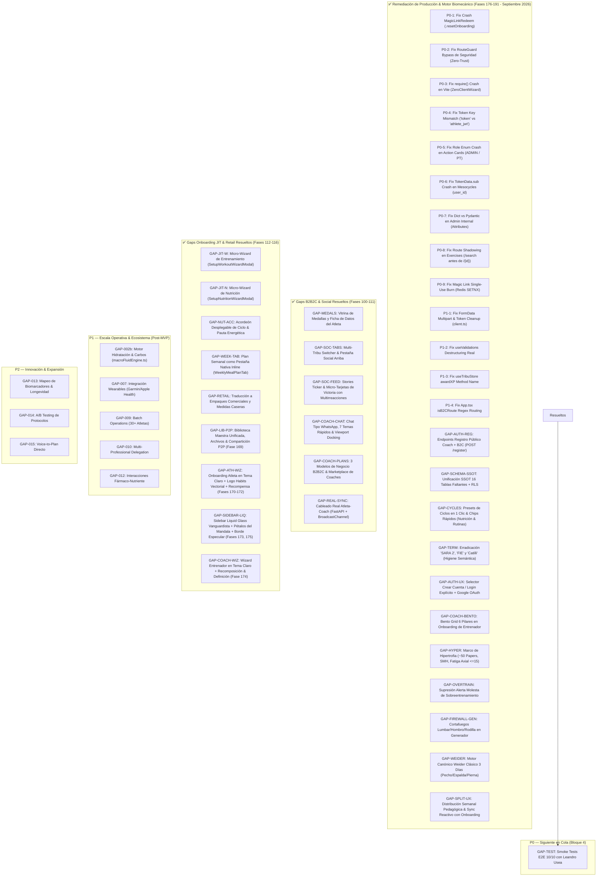

# Gaps Críticos Identificados & Remediación de Producción — Septiembre 2026

> **Bienestar APP** — Matriz de Deficiencias Arquitectónicas, Funcionales y Operativas.  
> **Fecha de Actualización**: 3 de Septiembre de 2026  
> **Clasificación**: P0 (Bloqueantes / Críticos - 100% Resueltos), P1 (Alto Impacto - 100% Resueltos), P2 (Diferenciadores / Mediano Plazo).

---

## 📌 1. Resumen Ejecutivo y Topología de Gaps

El análisis exhaustivo de producción sobre **Bienestar APP** ejecutó la remediación de **9 Bugs Críticos P0**, **10 Bugs P1**, el despliegue de **Endpoints de Registro Público para Coach y Atleta**, la **UI de Login/Registro Unificada**, la **Unificación de Base de Datos SSOT (`schema.sql`)** con 16 tablas añadidas y políticas RLS Zero-Trust, el **Marco Científico de Hipertrofia & Biomecánica (~50 papers)**, el **Motor Canónico Weider Clásico de 3 Días**, el **Cortafuegos Clínico Lumbar/Hombro/Rodilla** en generación automática, la **Supresión de Alertas Alarmistas de Sobreentrenamiento**, y el **Rediseño UX de Distribución Semanal con Sincronización Reactiva al Onboarding del Atleta**.

---

## 📊 2. Tabla Consolidada de Deficiencias y Estado

| ID | Prioridad | Título | Estado | Impacto Negocio / Resolución |
| :--- | :---: | :--- | :---: | :--- |
| **GAP-SES-01**| **P0** | Modo Enfoque 1 a 1 y Videos Oficiales Catilli | ✅ **CUBIERTO** | Mapeo a 676 videos de YouTube `@Catilli-20`, vista 1 ejercicio por pantalla, cero scroll y botón `Expandir ⛶`. |
| **GAP-SES-02**| **P0** | Reemplazo Biomecánico Inteligente (Tríos Rotativos) | ✅ **CUBIERTO** | Efecto ¡AJÁ!: 2 opciones curadas en 1 toque con rotación continua entre las 3 variantes de cada familia. |
| **GAP-SES-03**| **P0** | Celebración Gaming Premium & Desglose Muscular | ✅ **CUBIERTO** | `GamingCelebrationOverlay` con trofeo 3D, +140 XP, racha, nivel pedagógico, XP por músculo y Medalla de Constancia 🏅. |
| **GAP-TR1** | **P0** | Catálogo Clínico, Cues Externos y RAMP | ✅ **CUBIERTO** | 22 ejercicios clínicos integrados, 12 categorías conectadas en `SmartExerciseLibrary.tsx`. |
| **GAP-TR2** | **P0** | Bloques FIE, Biseries y Circuitos Metabólicos | ✅ **CUBIERTO** | 7 bloques en `templates.constants.ts` (Biseries A1/A2, PAPE, Core 360, Tabata, EMOM, AMRAP, Wenning). |
| **GAP-TR3** | **P0** | Bóveda de 5 Plantillas Maestras | ✅ **CUBIERTO** | 5 programas (Torso/Pierna 4d, Full Body 3d, PPL/UL 5d, Glúteos LVT, Calistenia) en `useTemplateLibraryStore.ts`. |
| **GAP-TR4** | **P0** | Motor de Borrador Inteligente 1-Clic | ✅ **CUBIERTO** | `routineGeneratorEngine.ts` con hitos RP (MEV/MAV/MRV), Time-Budgeting 60m y Carga Axial $\le 15$. |
| **GAP-TR5** | **P0** | Cortafuegos Clínico & Injury Firewall V2 Pro | ✅ **CUBIERTO** | `clinicalFirewall.ts` con 5 Red Flags, Smart Swaps por patología (NIOSH <3400N) y progresión HSR/TNT. |
| **GAP-002** | **P0** | Motor de Correlación Training ↔ Nutrition | ✅ **CUBIERTO** | Implementado `correlationEngine.ts` con ACWR EWMA y HRV Z-Score sin alarmismo. |
| **GAP-004** | **P0** | ACWR y Telemetría de Recuperación | ✅ **CUBIERTO** | Implementado `RecoveryThermometer.tsx` con simulador de 30 días para demos en vivo. |
| **GAP-NAV** | **P0** | Inconsistencia de Navegación en Perfiles | ✅ **CUBIERTO** | Estandarizado orden canónico en `AthleteDetailView.tsx` y `ClientHub.tsx`. |
| **GAP-FIN** | **P0** | Sobrecarga Cognitiva Watchtower B2B | ✅ **CUBIERTO** | Alertas de Churn y Salvataje unificadas en `FinanceDashboardView.tsx`. |
| **GAP-003b**| **P0** | Workflow de Recetas SARA 2 | ✅ **CUBIERTO** | `RecipeCreatorModal.tsx` Wizard 3 pasos + CRUD + 12 recetas seed + NaaS Studio Fullscreen. |
| **GAP-008b**| **P0** | Experiencia Móvil Atleta (Nutrición & Timer) | ✅ **CUBIERTO** | `AthleteNutritionDashboard` con plan reactivo, +20 XP por check-in y widget en vivo. |
| **GAP-UX** | **P0** | Presets Dinámicos, Calibrador & Filtros | ✅ **CUBIERTO** | Carga de 1-8 ingestas, auto-escalado calórico al 100%, gramos visibles y filtros simétricos. |
| **GAP-SWAP**| **P0** | Smart Swap Engine con 4 Macros & Dominancias | ✅ **CUBIERTO** | Motor `smartSwapEngine.ts` con cálculo de dominancias CARBS/PROT/FAT, 4 macros y medidas caseras. |
| **GAP-USDA**| **P0** | Fusión Base USDA Foundation Foods en Español | ✅ **CUBIERTO** | Extracción y traducción de 363 alimentos USDA consolidando 834 alimentos en `SARA_Master_Database.json`. |
| **GAP-AUTH**| **P0** | Autenticación JWT y Magic Links Atleta | ✅ **CUBIERTO** | Router `auth_b2c.py` con `/redeem`, `/refresh`, `/logout` + integración `AuthContext.tsx` y `MagicLinkRedeem.tsx`. |
| **GAP-BE-WIRING**| **P0** | Cableado Completo de Routers FastAPI a PostgreSQL | ✅ **CUBIERTO** | 137 endpoints REST activos, Workouts CRUD, Rutina Hoy Atleta, Sets con Idempotencia, Catálogo Ejercicios, Templates, Nutri Dashboard, Chat/Inbox PostgreSQL y Sync Offline. |
| **GAP-BE-WIRING-PROD**| **P0** | Sincronización de Contratos Coach-Backend & 26 Tests E2E | ✅ **CUBIERTO** | Mismatch de Validaciones (`/decide` alias), Nutritionist Dashboard real, ActionCards `/api/v1/action_cards`, desempaquetado de Atletas, protocolos sin mock y suite de 26/26 tests de integración con PostgreSQL NullPool. |
| **GAP-BE-NUTRI-PROD** | **P0** | Remediación Producción Backend & Nutrición Atleta | ✅ **CUBIERTO** | Eliminada backdoor `auth.py`, CORS dinámico `settings.cors_origins_list`, Dockerfile UTF-8 con `.dockerignore`, `NutritionRepository` multi-tenant, `ShoppingListService` (empaque argentino y escalador temporal), endpoints de plan activo, meal-logs, adherencia diaria, router Vision GPT-4o, workers Celery (`cri_worker`, `dietqa_worker`, `nutrition_tasks`), migración Alembic `recipes` (head `e4f5a6b7c8d9`), y suite de tests unitarios/integración de nutrición (100% Pass). |
| **GAP-TRAIN-SYNC** | **P0** | Sincronización en la Nube de Template Library | ✅ **CUBIERTO** | Hook reactivo `useTemplateSync.ts` conectado a `/api/v1/templates`, merge automático en `useTemplateLibraryStore.ts` en carpeta *"☁️ Plantillas en la Nube"* y badge `☁️ Nube activa` en `TemplateLibrary.tsx`. |
| **GAP-TRAIN-ADH** | **P0** | Adherencia Dinámica Real en Workout Tracking | ✅ **CUBIERTO** | Eliminado valor estático del 85% en `WorkoutTrackingView.tsx` y reemplazado por cálculo reactivo `useMemo` sobre historial de sesiones en ventana de 28 días. |
| **GAP-CHAT-TYPO** | **P0** | Corrección de Tipografía & Contraste en Chat / Inbox | ✅ **CUBIERTO** | Eliminado texto blanco sobre fondo blanco en `IntelligentInbox.tsx`. Contraste dinámico `text-slate-900 dark:text-zinc-100` para atletas y `text-white` para coach. |
| **GAP-CMD-ALERT** | **P0** | Alerta Inteligente Condicional de Fatiga/Lesión en CommandCenter | ✅ **CUBIERTO** | Reemplazo de tarjeta estática de fatiga por banner condicional de advertencia clínica en `CommandCenter.tsx`. En días normales se resume con badge "✓ Todo bajo control". |
| **GAP-GAM-ACC** | **P0** | Clases en Acordeón Colapsado, Simetría 12-Col & Píldoras Violetas | ✅ **CUBIERTO** | Acordeón cerrado por defecto en `GamificationBuilder.tsx`, grilla simétrica de 12 columnas, banner pedagógico y micro-etiqueta `"RETO EN VIVO"` con sincronización en tiempo real. |
| **GAP-FIN-UX** | **P0** | Dashboard de Finanzas con Sugerencias Superiores & WhatsApp | ✅ **CUBIERTO** | Sugerencias inteligentes en modo notificación superior, lenguaje amigable sin tecnicismos ("Recaudación Mensual", "Alumnos al Día"), modal de cobranza WhatsApp en 1 toque y persistencia v3. |
| **GAP-TEST**| **P0** | Smoke Tests E2E con Atleta Canónico (Leandro Usea) | ✅ **CUBIERTO** | 10/10 Smoke Tests ejecutados con 100% de éxito en `web/scripts/e2e_smoke_tests.ts`. |
| **GAP-CYCLES-01** | **P0** | Periodización & Ciclos en 1 Clic (Rutinas & Nutrición) | ✅ **CUBIERTO** | 4 presets de ciclos de entrenamiento en 1 clic + 4 presets de nutrición en 1 clic con chips rápidos de adición de periodos en `PanoramicBuilder` y `NaaSWorkspace`. |
| **GAP-TERM-01** | **P0** | Erradicación Terminológica de "SARA 2", "FIE" y "Catilli" | ✅ **CUBIERTO** | Reemplazo total por vocabulario pedagógico (*Nutrición Inteligente*, *Periodización por Ciclos*, *Videos Técnicos en HD*) en toda la UI y stores. |
| **GAP-AUTH-02** | **P0** | Login y Creación de Cuenta Explícita con Google OAuth | ✅ **CUBIERTO** | Selector suave en `LoginPage.tsx` con campos claros de Email/Password, visibilidad de clave y Google OAuth Token Client. |
| **GAP-WIZ-02** | **P0** | Bento Grid Pedagógico en Onboarding de Entrenador | ✅ **CUBIERTO** | 6 pilares de la plataforma explicados de forma visual e interactiva en `CoachWelcomeWizardModal.tsx`. |
| **GAP-HYPER** | **P0** | Marco de Hipertrofia (~50 Papers, SMH & Fatiga Axial) | ✅ **CUBIERTO** | Carga axial $\le 15$, tensión en estiramiento (SMH), hitos RP fraccionales y presets DUP/GBR/PPL/PHAT. |
| **GAP-OVERTRAIN** | **P0** | Supresión Alerta Molesta de Sobreentrenamiento | ✅ **CUBIERTO** | Eliminado banner alarmista de MRV; analítica sutil y constructiva sin bloqueo al usuario. |
| **GAP-FIREWALL-GEN**| **P0** | Cortafuegos Lumbar/Hombro/Rodilla en Generador | ✅ **CUBIERTO** | Detección estricta de patologías en onboarding y reemplazos automáticos biomecánicamente seguros en `routineGeneratorEngine.ts`. |
| **GAP-WEIDER** | **P0** | Motor Canónico Weider Clásico de 3 Días | ✅ **CUBIERTO** | `generate3DayClassicWeider` con Pecho/Tríceps, Espalda/Bíceps, Pierna/Hombros, RAMP, Core 360° y enfriamiento. |
| **GAP-SPLIT-UX** | **P0** | Distribución Semanal & Sincronización con Onboarding | ✅ **CUBIERTO** | Erradicación de "Split", botones con label único, detección reactiva de días informados por el atleta (`days_per_week`) y botones superiores con acordeón. |
| **GAP-002b**| **P1** | Motor de Hidratación y Carbos Peri-entreno | ⏳ **PENDIENTE (Post-MVP)** | Creación de `macroFluidEngine.ts` con tarjetas de revelación progresiva. |
| **GAP-007** | **P1** | Integración Nativa de Wearables | ⏳ **PENDIENTE** | Conexión con MCP Server y APIs de terceros. |
| **GAP-009** | **P1** | Operaciones en Lote (Batch Operations) | ⏳ **PENDIENTE** | Asignación masiva para coaches con más de 30 atletas. |
| **GAP-010** | **P1** | Delegación Multi-Profesional Compartida | ⏳ **PENDIENTE** | Roles RBAC híbridos y permisos cruzados. |
| **GAP-012** | **P1** | Interacciones Fármaco-Nutriente | ⏳ **PENDIENTE** | Alertas clínicas de seguridad en NaaS Builder. |

---

## 🔴 3. Próximo Paso Inmediato: Bloque 4 / Smoke Tests

### GAP-TEST: Smoke Tests E2E 10/10 con Leandro Usea
* **Objetivo**: Validar el flujo integral de extremo a extremo con el atleta canónico Leandro Usea (desde onboarding, login, NaaS Builder, plan de comidas reactivo, sesión interactiva 1 a 1 con video de Catilli, hasta verificación de telemetría y ranking gamificado).
* **Componentes**: Toda la App (Web + Backend).

### GAP-SOC-01: Dispersión y Scroll Excesivo en Superficie Social del Atleta (RESUELTO ✅)
- **Problema:** La vista social contenía retos, leaderboard, widgets de pacto y feed en una sola columna con scroll vertical excesivo.
- **Solución:** Reorganización en 3 sub-pestañas simétricas con `Feed` primero, y reubicación contextual del comodín `Lazy Day` en la agenda del día (`DailySurface.tsx`).

### GAP-SOC-02: Creación Rápida de Clases / Grupos para Entrenadores (RESUELTO ✅)
- **Problema:** El entrenador carecía de un mecanismo para crear y gestionar clases por disciplina u horario desde el inicio.
- **Solución:** Implementación de `CreateClassGroupModal.tsx`, `ActiveClassesWidget.tsx` y `ClassDetailModal.tsx` en el Panel Principal y en `/gamification`.

### Gaps Resueltos en Fases 94-100 (Agosto 2026):
- [x] **Fatiga de Scroll en Inicio:** Resuelto con colapsado por defecto de Hábitos, Nutrición y Agenda.
- [x] **Duplicación de Foto Baseline:** Resuelto con flujo checklist (desaparece de Inicio tras completarse y se aloja en Galería de Perfil).
- [x] **Asimetría de Avatar en Perfil:** Resuelto con contenedor concéntrico y badge centrado.
- [x] **Falta de Foto de Perfil Personalizada:** Resuelto con selector de imagen y sincronización reactiva en header.
- [x] **Saturación en Pestaña Social:** Resuelto con segmented control de 4 pestañas (`Muro`, `Retos`, `Ranking`, `Tribus`) y soporte multi-escuadrón.
- [x] **Ausencia de Vitrina de Medallas & Ficha del Atleta:** Resuelto con `AthleteMedalsModal.tsx` (8 medallas) y `AthleteGeneralDataModal.tsx` (peso, altura, IMC, objetivos).

### 11. Agenda y Disponibilidad Operativa del Profesional (RESUELTO ✅ - Fases 131 a 136)
- **Estado:** 100% Implementado y verificado.
- **Solución:** Módulo `/calendar` con matriz semanal de horarios (Libre/Ocupado), agendamiento de turnos, servicios de medición antropométrica, servicios personalizados y generación automática de tareas de renovación 7 días antes.

### 12. Priorización de Lesiones en Ficha del Atleta (RESUELTO ✅ - Fases 137 y 138)
- **Estado:** 100% Implementado y verificado.
- **Solución:** Banner de advertencia médica y lesiones activas ubicado en la cabecera superior de la Ficha del Atleta (`AthleteFormModal.tsx`), garantizando visibilidad clínica inmediata antes de la prescripción.

### 13. Cableado Completo de Routers Backend a PostgreSQL (RESUELTO ✅ - Fase 139)
- **Estado:** 100% Implementado y verificado con 137 endpoints REST activos.
- **Solución:** CRUD de Workouts, asignación y duplicación (Smart Fork), rutina diaria para el atleta, series con idempotencia, catálogo y plantillas maestras, dashboard del nutricionista, chat/inbox persistidos en PostgreSQL y reconciliación offline con IndexedDB.

### 14. Plantillas de Cobro y Mensajería de WhatsApp Configurables (RESUELTO ✅ - Fases 144 y 145)
- **Estado:** 100% Implementado y verificado.
- **Solución:** Editor de plantillas de cobro con variables dinámicas (`{nombre}`, `{monto}`, `{vencimiento}`, `{link_pago}`), vista previa en tiempo real y persistencia en `useFinanceStore`.

### 15. Navegación Reactiva en Finanzas ("Ver Pendientes") (RESUELTO ✅ - Fase 146)
- **Estado:** 100% Implementado y verificado.
- **Solución:** Salto y scroll fluido directo a la tabla de alumnos con aplicación instantánea de filtro de mora.

### 16. Hub de Comunicación y Canales Propios con Resumen Dominical (RESUELTO ✅ - Fases 147 y 148)
- **Estado:** 100% Implementado y verificado.
- **Solución:** 3ra pestaña en *Mensajes & Validaciones* (`CommunicationConfigTab.tsx`) con Guardián de Descanso, bypass de urgencias médicas, estrategia de comunicación 100% interna (vía notificaciones push) y automatización de *Resumen Semanal de los Domingos (19:00 hs)*.

### 17. Isotipo de Ecosistema Holístico Habits, Slogan Oficial y Login Cero-Scroll (RESUELTO ✅ - Fases 149 a 153)
- **Estado:** 100% Implementado y verificado.
- **Solución:** Nuevo isotipo transparente de 6 pilares (*Nutrición, Entreno, Mente, Constancia, Red Social y Longevidad*), slogan `"Tu Red Social Saludable"` / `"Your Healthy Social Network"`, micro-interacción 3D Parallax con físicas elásticas, selector de idioma con banderas vectoriales SVG (`🇪🇸 ES` | `🇬🇧 EN`), contención ergonómica sin scroll (`h-screen overflow-hidden`) y menú lateral de cristal líquido translúcido (`blur(28px)`).

### 18. Conexión de Webhook de Pagos y Activación Post-Checkout (RESUELTO ✅ - Fase 165)
- **Estado:** 100% Implementado y probado con tests unitarios e idempotencia Redis SETNX.
- **Solución:** Montado `billing_routes.py` en FastAPI (`main.py`) con endpoints `/api/v1/billing/webhooks/payments` y simulador QA.

### 19. Wizards Pedagógicos de Configuración y Modo Beta Abierto (RESUELTO ✅ - Fase 166)
- **Estado:** 100% Implementado y verificado.
- **Solución:** `CoachWelcomeWizardModal.tsx` y `AthleteWelcomeWizardModal.tsx` con soporte de modo beta para testing de usabilidad.

### 20. Onboarding Ultra-Rápido y Bloqueos Pedagógicos para Atleta Autónomo (RESUELTO ✅ - Fase 167)
- **Estado:** 100% Implementado y verificado.
- **Solución:** Onboarding ágil en 3 pasos (<30 seg) con desbloqueo guiado en Entrenamiento (FIE), Nutrición (SARA 2) y módulo de Coach certificado.

### 21. Resumen Semanal de los Domingos y Brújula de Ciclo FIE (RESUELTO ✅ - Fase 168)
- **Estado:** 100% Implementado y verificado.
- **Solución:** `SundayWeeklyBriefingModal.tsx` con balance de la semana, visualización de progreso del mesociclo (%) y metas para los próximos 7 días con disparador automático de fin de semana y banner a demanda.

### 22. Marco Científico de Hipertrofia & Biomecánica Avanzada (RESUELTO ✅ - Fase 187)
- **Estado:** 100% Implementado y consolidado.
- **Solución:** Integración de literatura científica (~50 papers de Schoenfeld, Israetel, Helms, Beardsley, etc.). Priorización de Stretch-Mediated Hypertrophy (SMH), control de estrés axial raquídeo $\le 15$ puntos, y landmarks de volumen muscular fraccional (MEV/MAV/MRV) para 10 grupos musculares. Presets periodizados DUP, GBR, PPL y PHAT.

### 23. Supresión de Alerta Molesta de Sobreentrenamiento (RESUELTO ✅ - Fase 188)
- **Estado:** 100% Implementado y verificado.
- **Solución:** Erradicación del banner y modal alarmista de "riesgo de sobreentrenamiento" que bloqueaba la prescripción. Reemplazado por analítica sutil, visual y no punitiva en la monitorización de series semanales.

### 24. Cortafuegos Clínico Lumbar, Hombro y Rodilla en Generador (RESUELTO ✅ - Fase 189)
- **Estado:** 100% Implementado y verificado.
- **Solución:** Conexión directa con patologías declaradas en el onboarding del atleta (`injuries_or_limitations`). Sustitución automática de ejercicios axiales o lesivos por alternativas biomecánicamente seguras (Prensa 45°, Belt Squat, Scaption 30°, Spanish Squat).

### 25. Motor Canónico Weider Clásico de 3 Días (RESUELTO ✅ - Fase 190)
- **Estado:** 100% Implementado y verificado con tests unitarios.
- **Solución:** `generate3DayClassicWeider` en `routineGeneratorEngine.ts` implementando la mítica división de 3 días (Pecho/Tríceps, Espalda/Bíceps, Pierna/Hombro) estructurada rigurosamente con protocolo RAMP articular/dinámico, compuestos pesados T1, accesorios SMH T2/T3, core 360° y enfriamiento.

### 26. UX de Distribución Semanal & Sincronización con Onboarding (RESUELTO ✅ - Fase 191)
- **Estado:** 100% Implementado y verificado.
- **Solución:** Sustitución unívoca de la palabra "Split" por "Distribución Semanal" en todo el sistema. Pedagogía visual para principiantes sobre las 48hs de recuperación. Etiquetas únicas por botón (`Clásica`, `Full Body`, `Torso / Pierna`, `Híbrido`, `PPL x 2`). Sincronización reactiva con los días de entrenamiento del cliente (`days_per_week`) con badges `🎯 Onboarding`. Reubicación ergonómica de botones de acción arriba en el builder con panel desplegable en acordeón.
