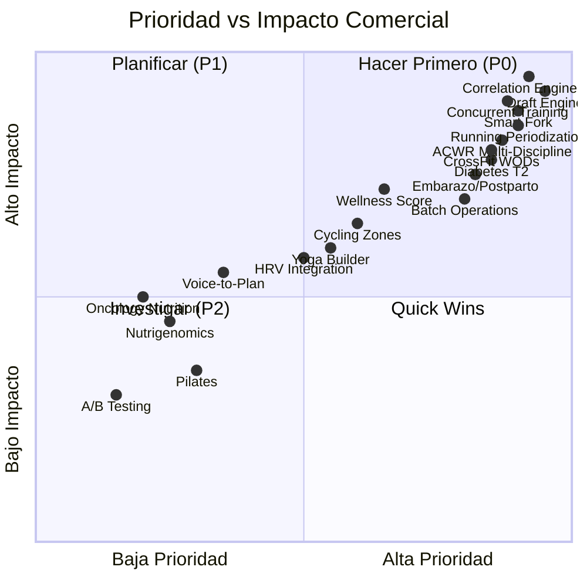

# 🔬 Investigación Estratégica — Temas a Profundizar

> Cobertura completa de arquetipos, disciplinas deportivas, nutrición clínica y optimización de workflows  
> v1.0 — 25 de Julio 2026

---

## Estado Actual del Sistema

Antes de enumerar los temas, es importante entender qué **ya existe** y qué **falta**:

### ✅ Lo que ya tenemos cubierto

| Componente | Estado | Detalle |
|-----------|--------|---------|
| Disciplinas declaradas en store | Parcial | `STRENGTH`, `YOGA`, `CROSSFIT`, `CLINICAL`, `ENDURANCE` — pero solo `STRENGTH` tiene implementación completa |
| Modalidades de entrenamiento | Sólido | 18 modalidades en `PERIOD_PALETTE` con colores, métricas y categorías |
| Fases nutricionales | Sólido | 20 módulos en `NUTRITION_PERIOD_PALETTE` con 7 categorías clínicas |
| Arquetipos de cliente | Parcial | 9 arquetipos, pero todos orientados a fuerza/gym. Faltan running, crossfit, ciclismo, yoga |
| Builder de entrenamiento | Completo | Días, bloques, ejercicios, progresión, periodización |
| Builder de nutrición | Completo | Comidas, opciones A/B, SARA 2, macros, swaps |
| Correlación training ↔ nutrition | ❌ No existe | Se prescriben como silos independientes |
| Métricas específicas por disciplina | ❌ No existe | Solo métricas de fuerza (peso, series, reps, RPE) |

### ❌ Gaps Críticos Identificados

```
┌─────────────────────────────────────────────────────────────────┐
│  GAP 1: Disciplinas no-fuerza son "ciudadanos de segunda"      │
│  → YOGA, CROSSFIT, ENDURANCE existen como enum pero no tienen  │
│    UI, métricas, ni templates propias.                          │
│                                                                 │
│  GAP 2: No hay motor de correlación automática                  │
│  → El coach elige training y nutrition por separado sin ayuda   │
│                                                                 │
│  GAP 3: Nutrición clínica tiene gaps de patologías              │
│  → Faltan: diabetes T2 avanzada, ERC, oncología, pediatría     │
│                                                                 │
│  GAP 4: No hay borradores inteligentes por disciplina           │
│  → Cada plan se arma desde cero, sin templates discipline-aware │
│                                                                 │
│  GAP 5: Métricas de endurance inexistentes                      │
│  → No hay: pace, zonas FC, FTP, TSS, cadencia, VO2max estimado │
└─────────────────────────────────────────────────────────────────┘
```

---

## Dominio 1 — Disciplinas de Alto Volumen y Competitivas

### 🏃 Tema 1.1: Periodización de Running (Road & Trail)

> **Prioridad: P0** — Alta demanda comercial

**Objetivo**: Diseñar el subsistema completo de prescripción para corredores (5K, 10K, 21K, 42K, trail running).

**Preguntas clave a investigar**:
1. ¿Cuáles son las zonas de frecuencia cardíaca estándar (Karvonen vs %FCmax vs Lactate Threshold)?
2. ¿Cómo se estructura un mesociclo de running (base → tempo → speed → taper)?
3. ¿Qué métricas del campo debe capturar la app (pace, cadencia, GAP, desnivel acumulado)?
4. ¿Cómo integrar la regla del 10% semanal de volumen con el ACWR existente?
5. ¿Cuáles son los ejercicios complementarios de fuerza para corredores (técnica de carrera, pliometría)?

**Entregable esperado**:
- Nuevas modalidades para `PERIOD_PALETTE`: `RUNNING_BASE`, `RUNNING_TEMPO`, `RUNNING_INTERVAL`, `RUNNING_LONG_RUN`, `RUNNING_RECOVERY`, `RUNNING_RACE`
- Nuevos fields: `pace_min_km`, `distancia_km`, `zona_fc`, `cadencia_spm`, `desnivel_m`
- Templates de mesociclo: Plan 5K (8 sem), Plan 10K (12 sem), Plan 21K (16 sem), Plan 42K (20 sem)

---

### 🏋️ Tema 1.2: Taxonomía de WODs y Benchmarks de CrossFit

> **Prioridad: P0** — Disciplina con alta retención y comunidad

**Objetivo**: Mapear la totalidad de formatos de workout de CrossFit para prescripción automatizada.

**Preguntas clave a investigar**:
1. ¿Cuáles son los formatos oficiales (AMRAP, EMOM, For Time, Chipper, Couplet, Triplet, Ladder)?
2. ¿Cómo se clasifican los benchmarks (Girls: Fran, Grace, Diane; Heroes: Murph, DT)?
3. ¿Qué gimnasia (muscle-ups, HSPU, TTB) y movimientos olímpicos (snatch, C&J) requieren progressión técnica?
4. ¿Cómo adaptar la prescripción a niveles (Scaled, RX, RX+)?
5. ¿Cómo calcular el volumen de trabajo en WODs mixtos para el ACWR?

**Entregable esperado**:
- Extensión de `blockType` existente (`TABATA`, `EMOM`, `AMRAP`, `CIRCUIT`) con: `FOR_TIME`, `CHIPPER`, `LADDER`, `DEATH_BY`
- Base de datos de benchmarks con scores de referencia por nivel
- Selector de escalado (Scaled/RX/RX+) con sustituciones automáticas
- Nuevos fields: `tiempo_total`, `rounds_completados`, `calorias_rower_bike`

---

### 🚴 Tema 1.3: Zonas de Potencia y Periodización de Ciclismo

> **Prioridad: P1** — Nicho técnico pero alto ticket

**Objetivo**: Integrar la prescripción basada en potencia (FTP) para ciclistas indoor y outdoor.

**Preguntas clave a investigar**:
1. ¿Cuáles son las 7 zonas de Coggan (Active Recovery → Neuromuscular Power)?
2. ¿Cómo calcular TSS (Training Stress Score) e IF (Intensity Factor) por sesión?
3. ¿Cómo integrar CTL/ATL/TSB (Chronic/Acute Training Load y Training Stress Balance) con nuestro ACWR?
4. ¿Qué fases de periodización usa un ciclista (Base 1, Base 2, Build, Peak, Race, Transition)?
5. ¿Cómo manejar entrenamiento indoor (Zwift, smart trainer) vs outdoor?

**Entregable esperado**:
- Nuevas modalidades: `CYCLING_ENDURANCE`, `CYCLING_SWEETSPOT`, `CYCLING_THRESHOLD`, `CYCLING_VO2MAX`, `CYCLING_SPRINT`, `CYCLING_RECOVERY`
- Nuevos fields: `ftp_watts`, `zona_potencia`, `tss`, `if_factor`, `cadencia_rpm`, `distancia_km`
- Calculadora de FTP integrada (test de 20 min × 0.95)

---

### ⚡ Tema 1.4: Entrenamiento Funcional y Calistenia

> **Prioridad: P1** — Crecimiento explosivo, especialmente en LATAM

**Objetivo**: Sistematizar la progresión de ejercicios bodyweight y movimientos funcionales.

**Preguntas clave a investigar**:
1. ¿Cuáles son las progresiones calisténicas estándar (push-up → dip → muscle-up; squat → pistol)?
2. ¿Cómo se mide la intensidad sin carga externa (leverage, tempo, pausa, unilateral)?
3. ¿Qué formato tiene un "circuito funcional" vs un WOD vs un HIIT clásico?
4. ¿Cómo integrar movimientos de animal flow, locomotion y ground work?
5. ¿Qué métricas de movilidad capturar (FMS score, overhead squat assessment)?

**Entregable esperado**:
- Árbol de progresiones por patrón de movimiento (Push, Pull, Squat, Hinge, Carry, Locomotion)
- Nuevos fields: `nivel_progresion`, `leverage_angle`, `duracion_isometrica`
- Templates: "Calistenia Principiante (12 sem)", "Funcional HIIT (8 sem)", "Street Workout (16 sem)"

---

### 🏊 Tema 1.5: Programación Concurrente (Atleta Híbrido)

> **Prioridad: P0** — El cliente más común del 2026: quiere correr, levantar y verse bien

**Objetivo**: Resolver el conflicto de interferencia entre entrenamiento de fuerza y resistencia aeróbica.

**Preguntas clave a investigar**:
1. ¿Cómo aplicar el "Concurrent Training Effect" sin destruir adaptaciones?
2. ¿Cuál es la separación mínima entre sesiones de fuerza y aeróbico (4-6 horas, AM/PM splits)?
3. ¿Cómo priorizar según objetivo (fuerza primero → agregar cardio, o viceversa)?
4. ¿Qué modelo de periodización funciona mejor para híbridos (Block vs DUP)?
5. ¿Cómo calcular un ACWR unificado que combine carga de fuerza + volumen aeróbico?

**Entregable esperado**:
- Nuevo arquetipo: `ARQ_HYBRID_ATHLETE`
- Regla de scheduling: separación mínima entre modalidades
- ACWR dual: `acwr_strength` + `acwr_endurance` → `acwr_combined`
- Template: "Híbrido 5K + Hipertrofia (12 sem)"

---

### 🏆 Tema 1.6: Preparación Competitiva Multideporte

> **Prioridad: P2** — Nicho pero diferenciador

**Objetivo**: Diseñar el workflow de peaking y tapering para competiciones específicas.

**Preguntas clave a investigar**:
1. ¿Cuánto dura un taper óptimo por disciplina (running: 2-3 sem, ciclismo: 1-2 sem, powerlifting: 1 sem)?
2. ¿Cómo se maneja el "Race Calendar" con múltiples eventos en una temporada?
3. ¿Qué protocolo nutricional de carb-loading es específico por disciplina?
4. ¿Cómo manejar el peso de competición en deportes con categorías (powerlifting, boxeo, judo)?
5. ¿Qué métricas de readiness pre-competición capturar (HRV, sueño, wellness score)?

**Entregable esperado**:
- Race Calendar integrado al builder con cuenta regresiva
- Auto-ajuste de volumen en las últimas 2-3 semanas pre-competición
- Protocolo nutricional automático de supercompensación

---

### 🏃‍♀️ Tema 1.7: Métricas de Campo y Wearables Integration

> **Prioridad: P1** — Diferenciador técnico clave

**Objetivo**: Definir qué métricas de dispositivos externos integrar y cómo.

**Preguntas clave a investigar**:
1. ¿Qué APIs de wearables son viables (Garmin Health API, Strava API, Apple Health, Google Fit)?
2. ¿Qué datos importar automáticamente (FC promedio, pace, TSS, HRV matutino, sueño)?
3. ¿Cómo reconciliar datos de wearable con datos manuales del builder?
4. ¿Qué métricas alimentan directamente las decisiones de prescripción (HRV baja → día ligero)?
5. ¿Cómo manejar la privacidad y consentimiento (GDPR / Habeas Data)?

**Entregable esperado**:
- Arquitectura de integración con Garmin/Strava como MVP
- Schema de `WearableDataPoint` para el store
- Rules engine: "Si HRV < 50 → sugerir día de recovery"

---

## Dominio 2 — Disciplinas de Bienestar y Cuerpo-Mente

### 🧘 Tema 2.1: Motor de Secuenciación de Yoga

> **Prioridad: P1** — Alta retención, bajo churn

**Objetivo**: Crear un builder específico para yoga que no sea "ejercicios con series y reps".

**Preguntas clave a investigar**:
1. ¿Cuáles son los estilos principales (Hatha, Vinyasa, Ashtanga, Yin, Restaurativo, Kundalini)?
2. ¿Cómo se estructura una secuencia (warm-up → standing → seated → inversions → savasana)?
3. ¿Qué métricas capturar (duración de hold, dificultad subjetiva, estado emocional pre/post)?
4. ¿Cómo integrar pranayama (respiración) y meditación como "ejercicios" en el builder?
5. ¿Qué progresiones existen (ej: pigeon → king pigeon → full splits)?

**Entregable esperado**:
- Builder de secuencias con drag-and-drop de asanas en vez de ejercicios
- Base de datos de asanas con: nombre sánscrito, nombre español, grupo muscular, contraindicaciones
- Nuevos fields: `duracion_hold`, `lado` (izq/der), `breathing_pattern`, `emotional_state`

---

### 🤸 Tema 2.2: Pilates y Rehabilitación de Suelo Pélvico

> **Prioridad: P2** — Nicho especializado con alto ticket

**Objetivo**: Integrar Pilates reformer/mat y protocolos de suelo pélvico.

**Preguntas clave a investigar**:
1. ¿Cuáles son los principios de Pilates que afectan la prescripción (centering, control, precision)?
2. ¿Cómo diferenciar prescripción Pilates Mat vs Reformer vs Cadillac?
3. ¿Qué ejercicios de suelo pélvico (Kegel, hipopresivos) y sus progresiones?
4. ¿Cómo integrar con los firewalls clínicos existentes (embarazo, postparto, prolapso)?
5. ¿Qué métricas específicas capturar (spring resistance, carriage position)?

**Entregable esperado**:
- Subtipo de disciplina `PILATES_MAT`, `PILATES_REFORMER`
- Base de datos de ejercicios Pilates con springs y posiciones
- Protocolo de suelo pélvico integrado al firewall `CLINICAL_PELVIC_FLOOR`

---

### 🧠 Tema 2.3: Wellness Score Compuesto y Carga Alostática

> **Prioridad: P1** — Transversal a todas las disciplinas

**Objetivo**: Crear un índice unificado de "readiness" del cliente que combine todas las señales.

**Preguntas clave a investigar**:
1. ¿Cómo ponderar sueño, estrés, dolor, ánimo, nutrición en un score único (0-100)?
2. ¿Qué modelo usar: suma ponderada simple, regresión logística, o bayesiano?
3. ¿Cómo incorporar la carga alostática (acumulación de estrés crónico multi-sistema)?
4. ¿Qué umbrales definen "entrenar normal", "bajar intensidad", "descansar"?
5. ¿Cómo comunicar el wellness score al cliente sin generar ansiedad?

**Entregable esperado**:
- `WellnessScoreEngine` que consume: sueño, estrés, dolor, ACWR, HRV (si disponible)
- Widget visual en el dashboard del coach: semáforo de readiness por cliente
- Auto-sugerencias: "Juan tiene wellness score 35/100 → Sugerir día de movilidad"

---

### 🏊‍♂️ Tema 2.4: Natación y Deportes Acuáticos

> **Prioridad: P2** — Complemento para triatletas y rehabilitación

**Preguntas clave**:
1. ¿Cómo se estructura un plan de natación (metros, series, pace/100m, estilo)?
2. ¿Qué métricas capturar (SWOLF, pace por 100m, brazadas, descanso en pared)?
3. ¿Cómo integrar natación en la programación concurrente del atleta híbrido?

---

### 🎯 Tema 2.5: Movilidad y Corrective Exercise como Disciplina Independiente

> **Prioridad: P1** — Crossover con rehabilitación y envejecimiento

**Preguntas clave**:
1. ¿Cómo sistematizar el FMS (Functional Movement Screen) como input del builder?
2. ¿Qué protocolos de movilidad articular (CARs, PAILs/RAILs, FRC) integrar?
3. ¿Cómo prescribir "dosis" de movilidad (sets × holds × frecuencia semanal)?
4. ¿Qué progresiones de ROM (Range of Motion) trackear longitudinalmente?

**Entregable**: Assessment de movilidad integrado al onboarding → auto-genera bloque correctivo

---

## Dominio 3 — Nutrición Clínica Avanzada

### 🩺 Tema 3.1: Diabetes Tipo 2 y Resistencia Insulínica Avanzada

> **Prioridad: P0** — Pandemia global, demanda masiva

**Preguntas clave a investigar**:
1. ¿Cuáles son los protocolos nutricionales basados en evidencia para DM2 (Mediterranean, DASH, Low-Carb)?
2. ¿Cómo integrar monitoreo de glucosa continuo (CGM) como input del motor nutricional?
3. ¿Qué reglas de timing de CHO aplicar en pacientes con insulina exógena?
4. ¿Cómo calcular el ajuste calórico cuando el paciente está en metformina u otros hipoglucemiantes?
5. ¿Qué alimentos tienen índice glucémico/carga glucémica como metadata en SARA 2?

**Entregable**: Firewall clínico `DIABETES_T2` con reglas de CHO timing + alertas de hipoglucemia

---

### 🫘 Tema 3.2: Enfermedad Renal Crónica (ERC) y Restricción Proteica

> **Prioridad: P1** — Alto riesgo clínico, necesita firewalls estrictos

**Preguntas clave**:
1. ¿Cómo calcular la restricción proteica según estadio ERC (0.6-0.8 g/kg en estadio 3-5)?
2. ¿Qué electrolitos restringir y cómo afecta al swap engine (potasio, fósforo, sodio)?
3. ¿Cómo integrar la fórmula CKD-EPI para estimar filtración glomerular?
4. ¿Qué interacciones farmacológicas afectan la prescripción nutricional (IECA, ARA-II)?

**Entregable**: Firewall `ERC_ESTADIO_3_5` con restricción proteica automática + filtros de K/P/Na en swaps

---

### 🎗️ Tema 3.3: Nutrición Oncológica y Soporte en Quimioterapia

> **Prioridad: P2** — Alto impacto social, diferenciador ético

**Preguntas clave**:
1. ¿Qué protocolos de soporte nutricional existen para quimio (hiper-proteico, anti-caquexia)?
2. ¿Cómo manejar la mucositis oral y las restricciones de textura?
3. ¿Qué suplementos tienen evidencia en onco-nutrición (omega-3, probióticos, glutamina)?
4. ¿Cómo integrar las fases de tratamiento (pre-QT, durante QT, post-QT, remisión)?

**Entregable**: Módulo `SOPORTE_ONCOLOGICO` con 4 sub-fases y firewalls de textura

---

### 🧬 Tema 3.4: Nutrigenómica y Personalización por SNPs

> **Prioridad: P2** — Vanguardia, alto ticket en B2B premium

**Preguntas clave**:
1. ¿Qué SNPs tienen evidencia robusta para nutrición (MTHFR, FTO, APOE, LCT, CYP1A2)?
2. ¿Cómo traducir un perfil genético en ajustes prácticos de macros/micros?
3. ¿Qué plataformas de testing genético ofrecen APIs para integración (23andMe, Dante Labs)?
4. ¿Cómo comunicar recomendaciones basadas en genética sin sobreprometer?

**Entregable**: Schema de `GeneticProfile` → reglas de ajuste automático en macros y suplementación

---

### 🤰 Tema 3.5: Nutrición en Embarazo, Lactancia y Postparto

> **Prioridad: P0** — Gap crítico, alta demanda y responsabilidad legal

**Preguntas clave**:
1. ¿Cuáles son los ajustes calóricos por trimestre (+0 / +340 / +452 kcal)?
2. ¿Qué micronutrientes son críticos (folato, hierro, DHA, calcio, colina)?
3. ¿Qué alimentos están contraindicados (listeria, mercurio, alcohol)?
4. ¿Cómo se ajusta la prescripción durante lactancia (+500 kcal, hidratación)?
5. ¿Qué firewalls de seguridad deben activarse automáticamente?

**Entregable**: Firewalls `EMBARAZO_T1`, `EMBARAZO_T2`, `EMBARAZO_T3`, `LACTANCIA` con auto-ajustes

---

### 💊 Tema 3.6: Interacciones Fármaco-Nutricionales

> **Prioridad: P1** — Safety-critical, diferenciador vs competencia

**Preguntas clave**:
1. ¿Qué pares fármaco-alimento son críticos (warfarina↔vitamina K, IMAO↔tiramina, metformina↔B12)?
2. ¿Cómo integrar la lista de medicamentos del onboarding con el swap engine?
3. ¿Qué nivel de granularidad es viable sin entrar en prescripción médica (informar vs bloquear)?
4. ¿Cómo manejar el disclaimer legal?

**Entregable**: Base de datos de interacciones → warnings automáticos en el builder nutricional

---

## Dominio 4 — Correlación Dinámica Training ↔ Nutrition por Disciplina

### 🔄 Tema 4.1: Timing Peri-Workout Específico por Disciplina

> **Prioridad: P0** — Impacto directo en resultados

**Preguntas clave**:
1. ¿Cuál es el timing óptimo de CHO para running (2h pre, during si >60min, 30min post)?
2. ¿Cuál es el timing para fuerza/hipertrofia (PRO 30-60min pre, PRO+CHO <30min post)?
3. ¿Qué diferencias hay en CrossFit (mixto: necesita CHO rápido intra-WOD)?
4. ¿Cómo ajustar si el cliente entrena en ayunas (fasted training)?
5. ¿Cómo traducir esto en la UI del plan nutricional (meal tags: `pre_workout`, `intra_workout`, `post_workout`)?

**Entregable**: Reglas de auto-asignación de `MealType` según disciplina y horario de entrenamiento

---

### 💧 Tema 4.2: Periodización de Hidratación y Electrolitos

> **Prioridad: P1** — Subtema ignorado con alto impacto en rendimiento

**Preguntas clave**:
1. ¿Cómo calcular la tasa de sudoración y necesidades de sodio por disciplina?
2. ¿Qué protocolos de pre-hidratación existen (glycerol hyperhydration, sodium loading)?
3. ¿Cómo integrar recomendaciones de hidratación en el builder nutricional?
4. ¿Qué relación hay entre hidratación y ACWR/wellness score?

---

### 💊 Tema 4.3: Suplementación Basada en Evidencia por Disciplina

> **Prioridad: P1** — Alto valor percibido por el cliente

**Preguntas clave**:
1. ¿Qué suplementos tienen evidencia Tier 1 (creatina, cafeína, beta-alanina, bicarbonato)?
2. ¿Cuáles son las dosis y timing óptimos por disciplina?
3. ¿Cómo integrar un "stack de suplementación" en el plan nutricional?
4. ¿Qué interacciones suplemento-medicamento considerar?

**Entregable**: Módulo de suplementación con recomendaciones discipline-aware

---

### 🧪 Tema 4.4: Adaptogens y Nootropics para Performance

> **Prioridad: P2** — Tendencia emergente, diferenciador premium

**Preguntas clave**:
1. ¿Qué evidencia tienen ashwagandha, rhodiola, lion's mane para el rendimiento?
2. ¿Cómo ciclar adaptogens para evitar tolerancia?
3. ¿Integrar en el módulo de suplementación o como categoría separada?

---

### 📊 Tema 4.5: Matriz de Correlación Dinámica v2 (Context-Aware)

> **Prioridad: P0** — Pieza central de la estrategia

**Preguntas clave**:
1. ¿Cómo hacer que la correlación training↔nutrition considere: disciplina + fase + semana + día?
2. ¿Cómo manejar días de doble sesión (AM fuerza / PM running)?
3. ¿Cómo ajustar macros automáticamente en días de descanso vs días de entrenamiento?
4. ¿Qué reglas de "carb cycling" automático implementar basado en volumen planificado?

**Entregable**: `CorrelationEngine v2` con awareness de disciplina, día de la semana y volumen

---

## Dominio 5 — Motor de Borradores Inteligentes (Draft Engine)

### 📝 Tema 5.1: Generación Automática de Plan Completo por Arquetipo

> **Prioridad: P0** — Reduce el workflow de 12 pasos a 3

**Preguntas clave**:
1. ¿Qué templates base necesitamos por cada combinación arquetipo × disciplina?
2. ¿Cómo parametrizar un template para que se adapte a nivel, días disponibles y equipamiento?
3. ¿Cuánta variación permitir (¿el coach puede modificar 100% o hay guardrails)?
4. ¿Cómo generar el componente nutricional automáticamente vinculado al training template?

**Entregable**: `DraftEngine` que recibe `(archetype, discipline, biometrics)` → retorna `Plan completo`

---

### 🧩 Tema 5.2: Template Composables (Lego-Style Blocks)

> **Prioridad: P1** — Reutilización masiva de trabajo

**Preguntas clave**:
1. ¿Cómo definir un "bloque reutilizable" que pueda insertarse en cualquier plan?
2. ¿Qué metadata necesita un bloque composable (prerequisitos, incompatibilidades, duración)?
3. ¿Cómo manejar conflictos cuando dos bloques comparten el mismo día?
4. ¿Cómo versionar bloques y propagar actualizaciones a planes que los usan?

**Entregable**: `ComposableBlockStore` con insert, versioning, dependency resolution

---

### 🔀 Tema 5.3: Fork Inteligente con Ajuste Contextual

> **Prioridad: P0** — Multiplica la productividad del coach

**Preguntas clave**:
1. Cuando se forkea un template a un cliente, ¿qué parámetros se deben ajustar automáticamente?
2. ¿Cómo escalar pesos/volumen según el nivel del cliente (principiante: 60% del template)?
3. ¿Cómo aplicar injury swaps automáticamente al fork?
4. ¿Cómo ajustar macros nutricionales al TMB/DER real del cliente?

**Entregable**: `smartFork()` que recibe template + athleteProfile → plan personalizado

---

### 📊 Tema 5.4: Progressive Disclosure en el Builder

> **Prioridad: P1** — UX crítica para no abrumar al coach

**Preguntas clave**:
1. ¿Qué campos mostrar por defecto vs ocultos detrás de "Más opciones"?
2. ¿Cómo adaptar la UI según la disciplina (yoga no necesita peso/reps)?
3. ¿Cómo manejar el modo "express" (solo lo mínimo) vs "avanzado" (todo)?
4. ¿Qué tooltips/ayudas contextualizar por experiencia del coach?

**Entregable**: `UIModeEngine` que adapta la interfaz según discipline + coachExperience

---

### 🤖 Tema 5.5: AI-Assisted Draft Refinement

> **Prioridad: P2** — Diferenciador a largo plazo

**Preguntas clave**:
1. ¿Qué LLM/modelo usar para sugerir ajustes al borrador (GPT-4o, Gemini, Claude)?
2. ¿Qué contexto mínimo enviar al modelo (biometrics, injuries, goals, current draft)?
3. ¿Cómo presentar las sugerencias sin reemplazar el criterio del coach?
4. ¿Qué feedback loop implementar para mejorar las sugerencias con el tiempo?

---

### 📋 Tema 5.6: Importación y Reconciliación Multi-Formato

> **Prioridad: P1** — Reduce fricción de migración

**Preguntas clave**:
1. ¿Qué formatos además de Excel importar (Google Sheets, PDF de gimnasios, Trainerize export)?
2. ¿Cómo mejorar el fuzzy matching de nombres de ejercicios (actualmente NLP simple)?
3. ¿Cómo importar planes nutricionales de Nutrium, MyFitnessPal, Cronometer?
4. ¿Cómo manejar conflictos de nomenclatura (mismo ejercicio, 10 nombres distintos)?

---

## Dominio 6 — Telemetría y Decisiones Basadas en Datos

### 📈 Tema 6.1: ACWR Multi-Disciplina

> **Prioridad: P0** — Safety-critical

**Preguntas clave**:
1. ¿Cómo calcular ACWR para running (distancia × intensidad), ciclismo (TSS), y fuerza (tonnage)?
2. ¿Cómo combinar ACWRs de distintas disciplinas en un score unificado?
3. ¿Qué modelo usar: EWMA (Exponentially Weighted Moving Average) vs Rolling Average?
4. ¿Cuáles son los umbrales safe zone por disciplina (runners toleran más que lifters)?

---

### 💓 Tema 6.2: HRV y Readiness Automática

> **Prioridad: P1**

**Preguntas clave**:
1. ¿Qué dispositivos dan HRV confiable y con API (Oura, Garmin, Whoop, Apple Watch)?
2. ¿Cómo normalizar HRV entre dispositivos (rMSSD vs SDNN vs lnRMSSD)?
3. ¿Qué umbral de HRV gatilla auto-sugerencias de reducción de volumen?
4. ¿Cómo combinar HRV + sueño + wellness subjetivo en un score de readiness?

---

### 📹 Tema 6.3: Biomecánica por Video y AI Feedback

> **Prioridad: P1** — Ya existe base, falta profundizar

**Preguntas clave**:
1. ¿Qué modelos de pose estimation usar (MediaPipe, MoveNet, AlphaPose)?
2. ¿Qué ejercicios priorizar para detección automática (squat, deadlift, bench)?
3. ¿Qué ángulos articulares son clínicamente relevantes (profundidad de squat, valgus de rodilla)?
4. ¿Cómo comparar form del cliente vs referencia biomecánica "gold standard"?

---

### 🎯 Tema 6.4: Dashboards Predictivos para el Coach

> **Prioridad: P1**

**Preguntas clave**:
1. ¿Qué métricas predicen abandono del cliente (frecuencia decreciente, RPE creciente, no-shows)?
2. ¿Cómo visualizar la "salud del portafolio" del coach (X clientes en riesgo, Y en meseta)?
3. ¿Qué alertas proactivas generar (cliente no entrena hace 5 días, adherencia nutricional <50%)?

---

### 🔬 Tema 6.5: A/B Testing de Protocolos

> **Prioridad: P2**

**Preguntas clave**:
1. ¿Cómo permitir al coach comparar dos protocolos en el mismo cliente (A/B split)?
2. ¿Qué métricas de outcome trackear (composición corporal, 1RM, wellness, adherencia)?
3. ¿Cómo generar reportes de efectividad comparativa al final de un mesociclo?

---

## Dominio 7 — Arquetipos Faltantes (Nuevos Perfiles de Cliente)

### 🏃 Tema 7.1: Arquetipo Runner (5K → Ultratrail)

**Entregable**: `ARQ_RUNNER_5K`, `ARQ_RUNNER_21K`, `ARQ_RUNNER_42K`, `ARQ_TRAIL`  
**Presets**: Días de entrenamiento, tipos de sesión, fase nutricional vinculada, métricas objetivo.

### 🚴 Tema 7.2: Arquetipo Ciclista (Indoor y Outdoor)

**Entregable**: `ARQ_CYCLIST_ROAD`, `ARQ_CYCLIST_INDOOR`, `ARQ_TRIATHLETE`  
**Presets**: Zonas de potencia, volumen semanal en km/TSS, nutrición periodizada.

### 🏋️ Tema 7.3: Arquetipo CrossFitter (Scaled → Competitor)

**Entregable**: `ARQ_CROSSFIT_SCALED`, `ARQ_CROSSFIT_RX`, `ARQ_CROSSFIT_COMPETITOR`  
**Presets**: Benchmark scores, skills gymnastics, nutrición de alto volumen.

### 🤰 Tema 7.4: Arquetipo Embarazo y Postparto

**Entregable**: `ARQ_PRENATAL_T1`, `ARQ_PRENATAL_T2`, `ARQ_PRENATAL_T3`, `ARQ_POSTPARTUM`  
**Presets**: Ejercicios contraindicados por trimestre, firewalls nutricionales, suelo pélvico.

### 👴 Tema 7.5: Arquetipo Adulto Mayor (+65)

**Entregable**: `ARQ_SENIOR_ACTIVE`, `ARQ_SENIOR_FRAIL`  
**Presets**: Sarcopenia prevention, balance & falls, densitometría ósea, proteína elevada.

---

## Dominio 8 — Escalabilidad del Workflow del Coach

### ⚡ Tema 8.1: Batch Operations (Operaciones Masivas)

> **Prioridad: P0** — El coach tiene 30+ clientes

**Preguntas clave**:
1. ¿Cómo asignar el mismo template a 15 clientes con personalización automática por perfil?
2. ¿Cómo avanzar de fase a 10 clientes simultáneamente?
3. ¿Cómo enviar feedback masivo post-sesión?
4. ¿Cómo clonar la semana actual a la siguiente para todos los clientes activos?

---

### 🎙️ Tema 8.2: Voice-to-Plan (Prescripción por Voz)

> **Prioridad: P2** — Diferenciador "wow"

**Preguntas clave**:
1. ¿Cómo traducir "quiero un plan de hipertrofia de 4 días con énfasis en tren superior" a un borrador?
2. ¿Qué modelo de ASR (Whisper) y NLU usar para extraer intención + parámetros?
3. ¿Cómo manejar ambigüedad ("quiero que baje de peso y gane músculo")?

---

### 👥 Tema 8.3: Delegation Engine (Equipo Multi-Profesional)

> **Prioridad: P1** — Escalabilidad de clínicas y centros

**Preguntas clave**:
1. ¿Cómo permitir que un nutricionista y un entrenador trabajen en el mismo cliente?
2. ¿Qué permisos y visibilidad tiene cada rol sobre el plan del otro?
3. ¿Cómo resolver conflictos (nutricionista pone déficit, entrenador pone hipertrofia)?
4. ¿Cómo implementar un "handoff" formal entre profesionales?

**Entregable**: Role-based access control + conflict resolution rules + notification system

---

## Resumen de Prioridades



| Prioridad | Temas | Timeline Estimado |
|-----------|-------|-------------------|
| **P0 — Hacer Primero** | 1.1, 1.2, 1.5, 3.1, 3.5, 4.1, 4.5, 5.1, 5.3, 6.1, 8.1 | Sprint 1-4 |
| **P1 — Planificar** | 1.3, 1.4, 1.7, 2.1, 2.3, 2.5, 3.2, 3.6, 4.2, 4.3, 5.2, 5.4, 5.6, 6.2, 6.3, 6.4, 8.3 | Sprint 5-10 |
| **P2 — Investigar** | 1.6, 2.2, 2.4, 3.3, 3.4, 4.4, 5.5, 6.5, 8.2 | Sprint 11+ |

---

*Documento de investigación estratégica — Bienestar APP Engineering — Julio 2026*
