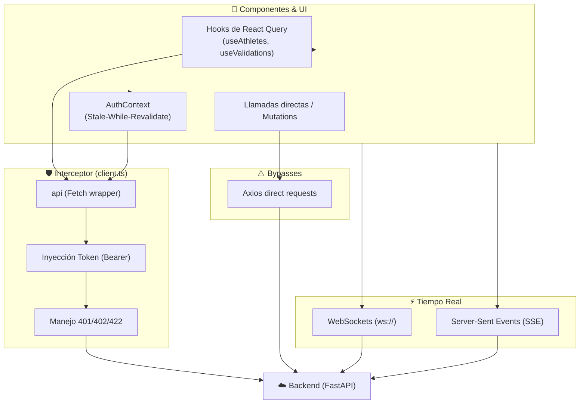

# Relevamiento: API Layer y Autenticación — Julio 2026

> Capa de integración con el backend, interceptores HTTP, hooks de React Query, WebSockets y SSE.  
> **14 módulos API** · **3 hooks de query dedicados** · **5 endpoints streaming (SSE/WS)** · **Contexto de Autenticación PWA**

---

## Arquitectura de la Capa de API

---

## Inventario de Archivos Core

### Módulos Base y Clientes (3)

| Archivo | Líneas | Responsabilidad |
|---------|:------:|-----------------|
| `client.ts` | 154 | Interceptor global `api` (Fetch API). Maneja inyección de Bearer Token, errores (401, 402, 422) y parseo JSON |
| `index.ts` | 11 | Hub de re-exportación de módulos API |
| `types.ts` | 74 | Tipos base TypeScript (IWorkoutPlan, IExerciseTarget, etc.) |

### Módulos de Dominio API (10)

| Módulo | Líneas | Endpoints Clave | Mecanismo Auth |
|--------|:------:|-----------------|----------------|
| `auth.ts` | 116 | `/auth/dev-login` | Headless Dev Auto-Login (JWT en memoria) |
| `athleteApi.ts` | 92 | `/api/v1/auth-b2c/redeem`, `/feedback` | Magic link token unauthenticated, luego `athlete_jwt` |
| `fitness.ts` | 61 | `/api/v1/fitness/exercises`, `/calculate-sets-reps` | Interceptor global (`api`) |
| `nutritionClient.ts` | 69 | `/api/v1/nutrition/plans` | Interceptor global (`api`) con Zod pre-vuelo |
| `nutritionist.ts` | 82 | `/nutritionist/patients`, `/photo-review` | Interceptor global (`api`) + Mock local |
| `trainer.ts` | 464 | `/api/v1/dashboard/triage`, `/patients` | Interceptor global (`api`) + Mocks |
| `magicImportApi.ts`| 29 | `/magic-import/upload`, `/tasks/{id}` | Interceptor global (`api`) |
| `voiceToChart.ts` | 88 | `/api/v1/voice-to-chart/upload` | **Bypass**: Axios directo + Fallback `/demo` |
| `workoutApi.ts` | 80 | `/api/v1/workouts/{id}/share/whatsapp` | **Bypass**: Axios directo |

### Hooks React Query (3 principales)

| Hook | Líneas | Uso |
|------|:------:|-----|
| `useAthletes.ts` | 63 | Listado y asignación de atletas (queries a `/api/v1/patients`) |
| `useExercises.ts` | 24 | Catálogo de ejercicios |
| `useValidations.ts`| 142 | Cola de validaciones con mutación optimista y mock fallback |

*(Existen múltiples hooks `useQuery`/`useMutation` adicionales dispersos en `/src/hooks/`)*

---

## Flujo de Autenticación (AuthContext.tsx)

El sistema de sesión implementa una **arquitectura Stale-While-Revalidate** pensada para entornos PWA con conectividad intermitente:

1. **Cold Start**: Lee token de `localStorage`.
2. **Hydration Optimista**: Si hay un usuario cacheado, renderiza la app sin esperar validación.
3. **Validación Background**: Llama a `/api/v1/auth/whoami`.
4. **Offline Resilience**: Si la llamada falla por red, mantiene sesión cacheada. Solo limpia sesión en `401/403`.

---

## Ecosistema de Tiempo Real

### Server-Sent Events (SSE)
- **Canje Magic Link (B2C)**: `/api/v1/clinical/sse/auth-wait/{reqId}` (espera autorización)
- **Streaming Clínico**: `/api/v1/clinical/sse/stream/{patientId}` (datos en vivo)
- **Checkout Funnel**: `/api/v1/checkout/stream/{txId}` (estado de pago)

### WebSockets (WS)
- **Canvas Heartbeat**: Sincronización en vivo del `ActiveCanvas`
- **Watchtower (Conflictos)**: ws://localhost:8010/ws
- **Biometría HUD**: ws://localhost:8000/api/v1/ws-telemetry/mock-telemetry/{uuid}
- **Debug Chat**: ws://localhost:8000/ws/1

---

## Estado Actual vs Deuda Técnica

### ✅ Puntos Fuertes Implementados

| Feature | Estado |
|---------|--------|
| Interceptor HTTP centralizado (`api`) con catch general de errores | ✅ |
| Auth PWA resiliente (Stale-while-revalidate offline-ready) | ✅ |
| Zod validation prevuelo en llamadas críticas (Nutrición) | ✅ |
| Telemetría de tiempo real via WebSockets/SSE | ✅ |

### ⚠️ Deuda Técnica (Tech Debt)

| ID | Issue | Severidad | Descripción |
|----|-------|-----------|-------------|
| DT-API01 | **Bypass de Interceptor (`axios`)** | Media | `voiceToChart.ts` y `workoutApi.ts` usan axios directamente, bypasseando validaciones de tokens y manejo unificado de errores (401/402). |
| DT-API02 | **Hooks mutación dispersos** | Baja | Hooks de query como `useActionCards` o `useCompleteSetMutation` están tirados en `/hooks/` en lugar de en `/hooks/queries/`. |
| DT-API03 | **Endpoints hardcodeados** | Media | Los WebSockets apuntan a `localhost:8000` / `localhost:8010` directo en el código, sin usar variables de entorno. |

---

*Última actualización: 26 de Julio 2026*
