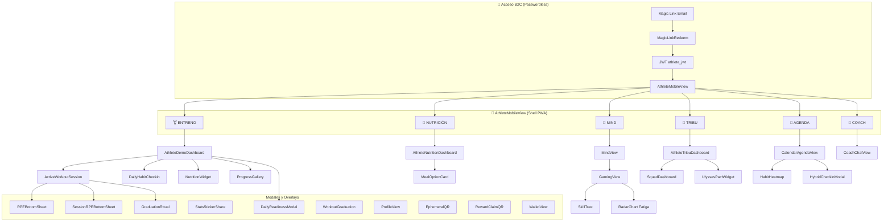
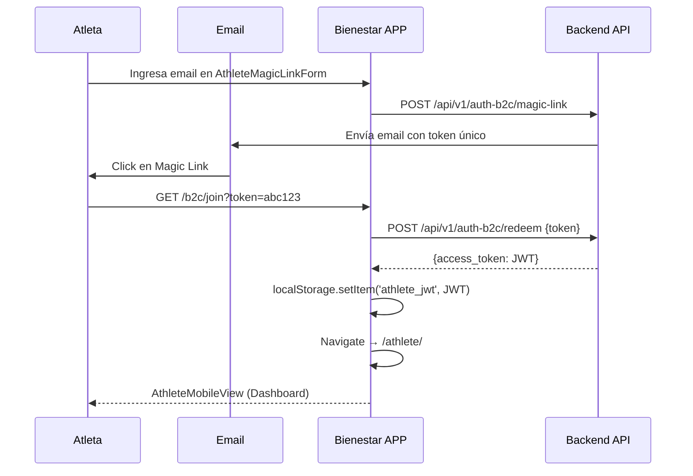

# Relevamiento: Experiencia del Atleta (B2C) — Julio 2026

> Análisis funcional completo de la app del usuario final: el cliente de los profesionales.  
> **39 componentes** · **9 stores dedicados** · **17 rutas** · **~7,800 líneas de código**

---

## Arquitectura General



---

## Inventario de Componentes (39 archivos)

### Sección 1: Core de Navegación y Shell

| Componente | Líneas | Descripción |
|-----------|:------:|-------------|
| [AthleteMobileView.tsx](file:///D:/Musica%20Descargada/Bienestar%20APP/web/src/components/athlete/AthleteMobileView.tsx) | 211 | Shell PWA mobile-first con bottom bar de 6 tabs, gestión de sesión activa y modos cognitivos |
| [AthleteDemoDashboard.tsx](file:///D:/Musica%20Descargada/Bienestar%20APP/web/src/components/athlete/AthleteDemoDashboard.tsx) | 221 | Dashboard diario: resumen de hábitos, entrenamiento del día, nutrición y galería de progreso |
| [ProfileView.tsx](file:///D:/Musica%20Descargada/Bienestar%20APP/web/src/components/athlete/ProfileView.tsx) | 151 | Drawer lateral animado con perfil, tema claro/oscuro y configuración |
| [DailySurface.tsx](file:///D:/Musica%20Descargada/Bienestar%20APP/web/src/components/athlete/DailySurface.tsx) | 183 | Superficie diaria consolidando métricas vitales y readiness |

### Sección 2: Entrenamiento Activo y Clases Grupales

| Componente | Líneas | Descripción |
|-----------|:------:|-------------|
| [AthleteWorkoutView.tsx](file:///D:/Musica%20Descargada/Bienestar%20APP/web/src/components/athlete/AthleteWorkoutView.tsx) | 905 | Pestaña de entrenamiento: rutina colapsable, analíticas desplegables, clases fijas en agenda y accesos directos al coach |
| [ActiveWorkoutView.tsx](file:///D:/Musica%20Descargada/Bienestar%20APP/web/src/components/athlete/ActiveWorkoutView.tsx) | 337 | Vista principal de sesión activa con carga cognitiva y feedback RPE |
| [ActiveWorkoutSession.tsx](file:///D:/Musica%20Descargada/Bienestar%20APP/web/src/components/athlete/ActiveWorkoutSession.tsx) | 406 | Ejecución guiada paso a paso: timer de descanso, tonelaje acumulado, confetti |
| [LiveClassSessionModal.tsx](file:///D:/Musica%20Descargada/Bienestar%20APP/web/src/components/athlete/LiveClassSessionModal.tsx) | 315 | Modal de clase en vivo con cronómetro continuo inmune a bloqueo de pantalla, WakeLock y cálculo de ritmo en vivo |
| [FloatingActiveClassPill.tsx](file:///D:/Musica%20Descargada/Bienestar%20APP/web/src/components/athlete/FloatingActiveClassPill.tsx) | 110 | Widget flotante global con cronómetro en tiempo real para navegación multitarea mientras la clase está activa |
| [LogExtraActivityModal.tsx](file:///D:/Musica%20Descargada/Bienestar%20APP/web/src/components/athlete/LogExtraActivityModal.tsx) | 470 | Modal de registro de actividades libres (CrossFit, Running, Yoga, Natación) con cálculo TRIMP, XP y métricas de distancia |
| [ActiveCanvas.tsx](file:///D:/Musica%20Descargada/Bienestar%20APP/web/src/components/athlete/ActiveCanvas.tsx) | 424 | Canvas interactivo PWA con cola de sync offline e indicador de conectividad |
| [RPEBottomSheet.tsx](file:///D:/Musica%20Descargada/Bienestar%20APP/web/src/components/athlete/RPEBottomSheet.tsx) | 95 | Bottom sheet para registrar RPE por ejercicio |
| [SessionRPEBottomSheet.tsx](file:///D:/Musica%20Descargada/Bienestar%20APP/web/src/components/athlete/SessionRPEBottomSheet.tsx) | 147 | Evaluación RPE global de sesión completa |
| [LazyDayButton.tsx](file:///D:/Musica%20Descargada/Bienestar%20APP/web/src/components/athlete/LazyDayButton.tsx) | 105 | Botón "Día Libre" que reajusta carga sin romper rachas |
| [BiomechanicalSplitView.tsx](file:///D:/Musica%20Descargada/Bienestar%20APP/web/src/components/athlete/BiomechanicalSplitView.tsx) | 168 | Balance biomecánico por grupo muscular y plano de movimiento |
| [SyncConflictBanner.tsx](file:///D:/Musica%20Descargada/Bienestar%20APP/web/src/components/athlete/SyncConflictBanner.tsx) | 56 | Resolución de conflictos de sync offline/online |

### Sección 3: Nutrición del Atleta

| Componente | Líneas | Descripción |
|-----------|:------:|-------------|
| [AthleteNutritionDashboard.tsx](file:///D:/Musica%20Descargada/Bienestar%20APP/web/src/components/athlete/AthleteNutritionDashboard.tsx) | 408 | Dashboard nutricional: macros, comidas diarias, registro fotográfico |
| [MealOptionCard.tsx](file:///D:/Musica%20Descargada/Bienestar%20APP/web/src/components/athlete/MealOptionCard.tsx) | 342 | Tarjeta de comida con macros, ingredientes y alternativas de swap |
| [NutritionWidget.tsx](file:///D:/Musica%20Descargada/Bienestar%20APP/web/src/components/athlete/NutritionWidget.tsx) | 137 | Widget compacto de ingesta calórica del día |

### Sección 4: Hábitos y Check-in

| Componente | Líneas | Descripción |
|-----------|:------:|-------------|
| [DailyHabitCheckin.tsx](file:///D:/Musica%20Descargada/Bienestar%20APP/web/src/components/athlete/DailyHabitCheckin.tsx) | 934 | Check-in completo: anillo radial, tabs, sanctuary BREAK, stickers |
| [DailyHabitCard.tsx](file:///D:/Musica%20Descargada/Bienestar%20APP/web/src/components/athlete/DailyHabitCard.tsx) | 115 | Tarjeta unitaria con recompensa XP inmediata |
| [MicroHabits.tsx](file:///D:/Musica%20Descargada/Bienestar%20APP/web/src/components/athlete/MicroHabits.tsx) | 132 | Lista rápida de micro-hábitos con canvas-confetti |
| [HabitHeatmap.tsx](file:///D:/Musica%20Descargada/Bienestar%20APP/web/src/components/athlete/HabitHeatmap.tsx) | 116 | Mapa de calor de consistencia (28 días, estilo GitHub) |
| [DailyReadinessModal.tsx](file:///D:/Musica%20Descargada/Bienestar%20APP/web/src/components/athlete/DailyReadinessModal.tsx) | 134 | Evaluación matutina: sueño, energía, dolor, estrés |
| [HybridCheckinModal.tsx](file:///D:/Musica%20Descargada/Bienestar%20APP/web/src/components/athlete/HybridCheckinModal.tsx) | 204 | Check-in combinado entrenamiento + nutrición |

### Sección 5: Gamificación y Social

| Componente | Líneas | Descripción |
|-----------|:------:|-------------|
| [GamingView.tsx](file:///D:/Musica%20Descargada/Bienestar%20APP/web/src/components/athlete/GamingView.tsx) | 280 | Centro de gamificación: radar SVG de fatiga, skill tree, niveles de resiliencia |
| [SquadDashboard.tsx](file:///D:/Musica%20Descargada/Bienestar%20APP/web/src/components/athlete/SquadDashboard.tsx) | 277 | Dashboard de escuadrón con competencia amistosa y kudos |
| [AthleteTribuDashboard.tsx](file:///D:/Musica%20Descargada/Bienestar%20APP/web/src/components/athlete/AthleteTribuDashboard.tsx) | 190 | Panel de tribu: muro social, kudos, pactos de Ulises |
| [SocialView.tsx](file:///D:/Musica%20Descargada/Bienestar%20APP/web/src/components/athlete/SocialView.tsx) | 142 | Muro e interactividad social del gimnasio |
| [UlyssesPactWidget.tsx](file:///D:/Musica%20Descargada/Bienestar%20APP/web/src/components/athlete/UlyssesPactWidget.tsx) | 48 | Compromiso preestablecido de asistencia (commitment device) |
| [StatsStickerShare.tsx](file:///D:/Musica%20Descargada/Bienestar%20APP/web/src/components/athlete/StatsStickerShare.tsx) | 127 | Generador de stickers para Instagram Stories |

### Sección 6: Wellness Mental y Agenda

| Componente | Líneas | Descripción |
|-----------|:------:|-------------|
| [MindView.tsx](file:///D:/Musica%20Descargada/Bienestar%20APP/web/src/components/athlete/MindView.tsx) | 207 | Bienestar mental: respiración guiada, cortisol, recarga cognitiva |
| [CalendarAgendaView.tsx](file:///D:/Musica%20Descargada/Bienestar%20APP/web/src/components/athlete/CalendarAgendaView.tsx) | 210 | Agenda semanal con tira horizontal y precarga silenciosa del canvas |
| [CoachChatView.tsx](file:///D:/Musica%20Descargada/Bienestar%20APP/web/src/components/athlete/CoachChatView.tsx) | 165 | Chat en tiempo real con el entrenador/nutricionista |

### Sección 7: Progreso y Recompensas

| Componente | Líneas | Descripción |
|-----------|:------:|-------------|
| [ProgressGallery.tsx](file:///D:/Musica%20Descargada/Bienestar%20APP/web/src/components/athlete/ProgressGallery.tsx) | 258 | Galería de evolución corporal: frente, lateral, espalda en timeline |
| [GraduationRitual.tsx](file:///D:/Musica%20Descargada/Bienestar%20APP/web/src/components/athlete/GraduationRitual.tsx) | 184 | Ritual de graduación al completar mesociclos |
| [WorkoutGraduation.tsx](file:///D:/Musica%20Descargada/Bienestar%20APP/web/src/components/athlete/WorkoutGraduation.tsx) | 222 | Celebración con cristales/recompensas al terminar entrenamiento |
| [WalletView.tsx](file:///D:/Musica%20Descargada/Bienestar%20APP/web/src/components/athlete/WalletView.tsx) | 123 | Billetera de tokens canjeables en servicios del gimnasio |
| [RewardClaimQR.tsx](file:///D:/Musica%20Descargada/Bienestar%20APP/web/src/components/athlete/RewardClaimQR.tsx) | 90 | Canje de recompensas mediante QR |
| [EphemeralQR.tsx](file:///D:/Musica%20Descargada/Bienestar%20APP/web/src/components/athlete/EphemeralQR.tsx) | 120 | QR efímero para validar asistencia física al gym |

### Sección 8: Onboarding y Perfil

| Componente | Líneas | Descripción |
|-----------|:------:|-------------|
| [AthleteWelcomeWizardModal.tsx](file:///D:/Musica%20Descargada/Bienestar%20APP/web/src/components/athlete/AthleteWelcomeWizardModal.tsx) | 280 | Onboarding líquido B2C en tema claro, 3 pilares pedagógicos, imagotipo vectorial oficial y +50 XP |
| [CoachWelcomeWizardModal.tsx](file:///D:/Musica%20Descargada/Bienestar%20APP/web/src/components/onboarding/CoachWelcomeWizardModal.tsx) | 260 | Guía de inicio rápido para el entrenador en tema claro con áreas de especialidad y enlace WhatsApp |
| [OnboardingB2C.tsx](file:///D:/Musica%20Descargada/Bienestar%20APP/web/src/components/athlete/OnboardingB2C.tsx) | 541 | Onboarding conversacional gamificado con wearables y datos clínicos |
| [ProgressiveProfilerWidget.tsx](file:///D:/Musica%20Descargada/Bienestar%20APP/web/src/components/athlete/ProgressiveProfilerWidget.tsx) | 134 | Perfilado progresivo con preguntas inteligentes post-onboarding |
| [ContextualOptInModal.tsx](file:///D:/Musica%20Descargada/Bienestar%20APP/web/src/components/athlete/ContextualOptInModal.tsx) | 91 | Modal de consentimiento para tracking de salud avanzado |


---

## Stores Dedicados al Atleta (10)

| Store | Líneas | Persistencia | Responsabilidad |
|-------|:------:|:------------:|-----------------|
| [useExecutionStore](file:///D:/Musica%20Descargada/Bienestar%20APP/web/src/stores/useExecutionStore.ts) | 144 | ✅ persist | Ejecución en tiempo real: series, reps, peso, RPE, inicio/fin sesión |
| [useLiveClassStore](file:///D:/Musica%20Descargada/Bienestar%20APP/web/src/stores/useLiveClassStore.ts) | 165 | ✅ persist | Gestión de clases en vivo, cronómetro continuo inmune a suspensión, Screen Wake Lock y métricas |
| [useHabitStore](file:///D:/Musica%20Descargada/Bienestar%20APP/web/src/stores/useHabitStore.ts) | 362 | ✅ persist | Catálogo, prescripción, streaks, niveles Lally, cumplimiento diario |
| [useGamificationStore](file:///D:/Musica%20Descargada/Bienestar%20APP/web/src/stores/useGamificationStore.ts) | 461 | ✅ persist | XP, squads, challenges, HVI, simulación de miembros, kudos |
| [useAgendaStore](file:///D:/Musica%20Descargada/Bienestar%20APP/web/src/stores/useAgendaStore.ts) | 151 | ✅ persist | Agenda diaria, clases fijas recurrentes, hábitos programados |
| [useNutritionStore](file:///D:/Musica%20Descargada/Bienestar%20APP/web/src/stores/useNutritionStore.ts) | 134 | ✅ persist | Registro de comidas, metas de macros, diario nutricional |
| [useSessionLogStore](file:///D:/Musica%20Descargada/Bienestar%20APP/web/src/stores/useSessionLogStore.ts) | 145 | ✅ persist | Historial de sesiones completadas |
| [useBiometricStore](file:///D:/Musica%20Descargada/Bienestar%20APP/web/src/stores/useBiometricStore.ts) | 34 | ✅ persist | Datos biométricos del atleta |
| [useCeremonyStore](file:///D:/Musica%20Descargada/Bienestar%20APP/web/src/stores/useCeremonyStore.ts) | 73 | ✅ persist | Estado de celebraciones y rituales completados |
| [useFavoritesStore](file:///D:/Musica%20Descargada/Bienestar%20APP/web/src/stores/useFavoritesStore.ts) | 45 | ✅ persist | Ejercicios y comidas favoritas |

---

## Flujo de Acceso B2C (Magic Link — Passwordless)



---

## Rutas del Atleta (17)

| Ruta | Componente | Tipo |
|------|-----------|------|
| `/athlete/*` | `AthleteMobileView` | Shell principal |
| `/athlete/canvas` | `ActiveCanvas` | Entrenamiento interactivo |
| `/atleta/*` | Redirect → `/athlete` | Alias español |
| `/b2c/onboarding` | `ZeroClientWizardPT mode="B2C"` | Onboarding |
| `/onboarding` | `ZeroClientWizardPT mode="B2C"` | Alias onboarding |
| `/b2c/onboarding-clinico` | `ClinicalOnboardingWizard` | Onboarding clínico |
| `/b2c/join` | `MagicLinkRedeem` | Canje de Magic Link |
| `/magic-link-onboarding` | `AthleteMagicLinkForm` | Solicitar Magic Link |
| `/cliente-cero` | `ZeroClientWizard` | Alta directa general |
| `/cliente-cero-pt` | `ZeroClientWizardPT` | Alta para PT |
| `/cliente-cero-nutri` | `ClienteCeroNutri` | Alta para nutrición |
| `/longevidad` | `PatientLongevityCanvas` | Métricas de longevidad |
| `/join` | `JoinView` | Registro público |
| `/app/auth/success` | `AuthSuccessHandler` | Post-auth OAuth |
| `/recepcion/escaner` | `ReceptionScanner` | Check-in QR gym |

---

## Navegación Interna (Bottom Bar)

```
┌──────────────────────────────────────────────────────────┐
│                    AthleteMobileView                      │
│  ┌─────────┬─────────┬──────┬───────┬───────┬──────────┐ │
│  │ 🏋️      │ 🥗      │ 🧠   │ 👥    │ 📅    │ 💬       │ │
│  │ ENTRENO │ NUTRI   │ MIND │ TRIBU │ AGENDA│ COACH    │ │
│  └─────────┴─────────┴──────┴───────┴───────┴──────────┘ │
└──────────────────────────────────────────────────────────┘
```

| Tab | Key | Componente Principal | Sub-componentes |
|-----|-----|---------------------|-----------------|
| 🏋️ ENTRENO | `today` | `AthleteDemoDashboard` | ActiveWorkoutSession, DailyHabitCheckin, NutritionWidget, ProgressGallery |
| 🥗 NUTRICIÓN | `nutrition` | `AthleteNutritionDashboard` | MealOptionCard, registro fotográfico |
| 🧠 MIND | `mind` | `MindView` | GamingView (RadarChart, SkillTree), respiración guiada |
| 👥 TRIBU | `social` | `AthleteTribuDashboard` | SquadDashboard, UlyssesPactWidget, kudos, muro social |
| 📅 AGENDA | `calendar` | `CalendarAgendaView` | HabitHeatmap, HybridCheckinModal, tira semanal |
| 💬 COACH | `coach` | `CoachChatView` | Chat en tiempo real |

---

## Módulos de Dominio del Atleta (`domains/athlete/`)

| Archivo | Líneas | Descripción |
|---------|:------:|-------------|
| [AcwrGuardrail.ts](file:///D:/Musica%20Descargada/Bienestar%20APP/web/src/domains/athlete/features/AcwrGuardrail.ts) | 52 | Regla de negocio para prevención de lesiones via ACWR |
| [OptimisticSyncManager.ts](file:///D:/Musica%20Descargada/Bienestar%20APP/web/src/domains/athlete/features/OptimisticSyncManager.ts) | 85 | Sync optimista sin latencia percibida |
| [ConversationalOnboarding.tsx](file:///D:/Musica%20Descargada/Bienestar%20APP/web/src/domains/athlete/features/ConversationalOnboarding.tsx) | 120 | Onboarding conversacional |
| [WearablesMCPServer.ts](file:///D:/Musica%20Descargada/Bienestar%20APP/web/src/domains/athlete/mcp/WearablesMCPServer.ts) | 110 | Servidor MCP para Apple Health, Garmin, WHOOP |
| [AthleteAdrenalineLayout.tsx](file:///D:/Musica%20Descargada/Bienestar%20APP/web/src/domains/athlete/ui/AthleteAdrenalineLayout.tsx) | 20 | Layout alto contraste para sesiones intensas |
| [WodLogger.tsx](file:///D:/Musica%20Descargada/Bienestar%20APP/web/src/domains/athlete/ui/WodLogger.tsx) | 130 | Registro rápido de WODs |
| [FrictionlessRPEModal.tsx](file:///D:/Musica%20Descargada/Bienestar%20APP/web/src/domains/athlete/widgets/FrictionlessRPEModal.tsx) | 160 | Modal RPE sin fricción |

---

## APIs del Atleta

| Función | Endpoint | Método | Descripción |
|---------|----------|--------|-------------|
| `redeemMagicToken` | `/api/v1/auth-b2c/redeem` | POST | Canjear Magic Link por JWT |
| `submitAthleteFeedback` | `/api/v1/athlete/feedback` | POST | Feedback: COMPLETED / TOO_HEAVY / PAIN |
| `fetchMissedMessages` | `/api/v1/inbox/missed` | GET | Mensajes pendientes del coach |

---

## Estado Actual vs Objetivo

### ✅ Implementado

| Feature | Componentes | Estado |
|---------|------------|--------|
| Shell PWA mobile-first con bottom bar 6 tabs | AthleteMobileView | ✅ Completo |
| Wizard de Bienvenida Pedagógico en Tema Claro | AthleteWelcomeWizardModal | ✅ Completo (Fase 172) |
| Ejecución de entrenamiento guiada | ActiveWorkoutSession, ActiveWorkoutView | ✅ Completo |
| Sync offline con cola optimista | ActiveCanvas, OptimisticSyncManager, SyncConflictBanner | ✅ Completo |
| Dashboard nutricional con macros y comidas | AthleteNutritionDashboard, MealOptionCard | ✅ Completo |
| Check-in de hábitos con gamificación | DailyHabitCheckin, DailyHabitCard, MicroHabits | ✅ Completo |
| Evaluación de readiness matutina en Liquid Glass | DailyReadinessModal | ✅ Completo |
| Squads y competencia social | SquadDashboard, AthleteTribuDashboard, UlyssesPactWidget | ✅ Completo |
| Skill tree y radar de fatiga | GamingView | ✅ Completo |
| Billetera de tokens y QR de canje | WalletView, RewardClaimQR, EphemeralQR | ✅ Completo |
| Galería de progreso fotográfico | ProgressGallery | ✅ Completo |
| Stickers compartibles en redes | StatsStickerShare | ✅ Completo |
| Graduación y rituales de logro | GraduationRitual, WorkoutGraduation | ✅ Completo |
| Auth passwordless via Magic Link | MagicLinkRedeem, AthleteMagicLinkForm | ✅ Completo |
| Perfilado progresivo post-onboarding | ProgressiveProfilerWidget | ✅ Completo |
| Botón de "Día Libre" sin romper racha | LazyDayButton | ✅ Completo |

### ❌ Gaps Identificados

| # | Gap | Prioridad | Impacto |
|---|-----|-----------|---------|
| 1 | **Sin notificaciones push** — El atleta no recibe recordatorios de entrenamiento ni hábitos | P0 | Adherencia y retención |
| 2 | **Chat mockup** — CoachChatView es UI estática, sin WebSocket ni backend real | P1 | Comunicación coach↔atleta |
| 3 | **Nutrición read-only** — El atleta ve macros pero no registra comidas reales (solo fotos) | P1 | Tracking nutricional real |
| 4 | **Sin métricas de endurance en ejecución** — ActiveWorkoutSession solo maneja peso/reps/RPE, no pace/distancia/FC | P1 | Runners y ciclistas |
| 5 | **Wearables MCP sin integración real** — WearablesMCPServer existe como archivo pero no conecta con Garmin/Apple Health | P1 | Datos automáticos |
| 6 | **Sin historial de sesiones navegable** — useSessionLogStore guarda data pero no hay UI de historial | P1 | Revisión de progreso |
| 7 | **Tokenomics sin economía real** — WalletView y tokens no conectan con sistema de pagos/descuentos del gym | P2 | Monetización B2C |
| 8 | **Sin modo landscape/tablet** — Todo es mobile portrait, sin adaptación para tablet | P2 | Experiencia en tablets |

---

## Deuda Técnica del Módulo

| ID | Issue | Severidad |
|----|-------|-----------|
| DT-A01 | `DailyHabitCheckin.tsx` (934L) y `OnboardingB2C.tsx` (541L) son monolíticos | Media |
| DT-A02 | Dos `AthleteMobileView.tsx` — uno en `components/` (462L) y otro en `components/athlete/` (211L) | Alta |
| DT-A03 | `HabitHeatmap` consume workouts en vez de hábitos (ya documentado en DT-H02) | Media |
| DT-A04 | `ActiveCanvas.tsx` tiene lógica PWA + sync + UI mezcladas | Baja |
| DT-A05 | Sin tests E2E del flujo Magic Link → Dashboard | Alta |

---

*Última actualización: 26 de Julio 2026*
