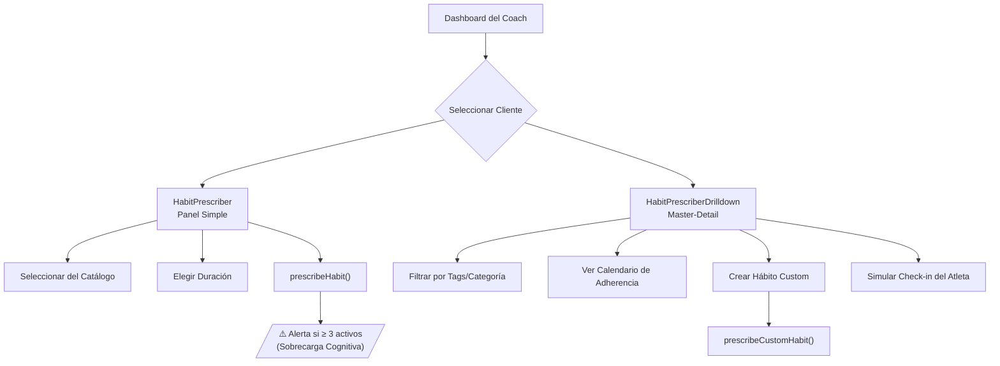
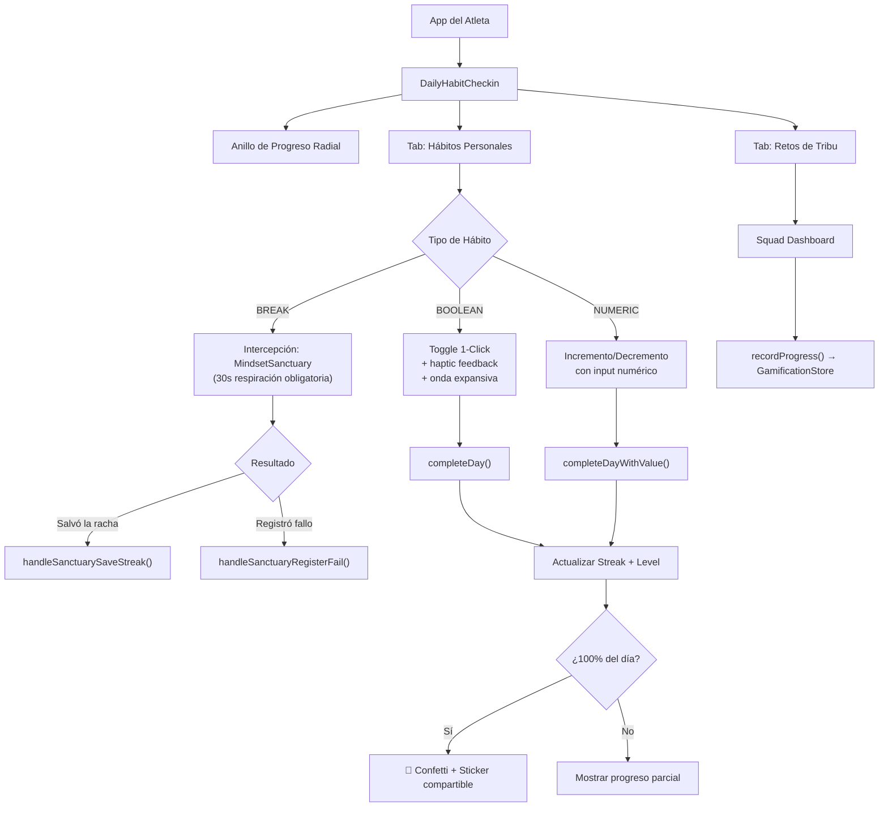

# Relevamiento Módulo 3: Hábitos — Actualizado Julio 2026

> Análisis funcional completo del módulo de prescripción, cumplimiento y gamificación de hábitos.  
> Fuentes: Código fuente (`useHabitStore`, componentes coach/athlete), relevamiento con Leandro, workflow B2B2C.

---

## Arquitectura del Módulo

```
                        ┌──────────────────────────────┐
                        │    useOnboardingPTStore       │
                        └──────────────┬───────────────┘
                                       │ (clientId / identity)
                                       ▼
┌─────────────────────────────────────────────────────────────────────────────┐
│                             useHabitStore (362 líneas)                      │
│  - HABIT_CATALOG (22 hábitos)     - prescribedHabits: PrescribedHabit[]    │
│  - prescribeHabit / completeDay / completeDayWithValue                     │
│  - getAdherence / getDailyCompletionRate / getDailyStreak                  │
└───────┬──────────────────────────────┬──────────────────────────────┬───────┘
        │                              │                              │
        ▼                              ▼                              ▼
┌───────────────────┐      ┌───────────────────────────┐      ┌───────────────────────────┐
│  HabitPrescriber  │      │ HabitPrescriberDrilldown   │      │       MicroHabits         │
│  (Coach Simple)   │      │ (Coach Master-Detail 749L) │      │ (Atleta Lista Compacta)   │
│  140 líneas       │      └───────────┬───────────────┘      │  124 líneas               │
└───────────────────┘                  │                       └───────────────────────────┘
                                       ▼
                           ┌───────────────────────────┐
                           │    DailyHabitCheckin       │
                           │   (Atleta - 934 líneas)   │
                           └─────────────┬─────────────┘
                                         │
                 ┌───────────────────────┼───────────────────────┐
                 ▼                       ▼                       ▼
      ┌────────────────────┐   ┌───────────────────┐   ┌───────────────────┐
      │ useGamification    │   │ MindsetSanctuary  │   │ StatsStickerShare │
      │ Store (Squads/XP)  │   │ (Fricción Positiva)│  │ (Social Sharing)  │
      └────────────────────┘   └───────────────────┘   └───────────────────┘
                                                        
      ┌────────────────────┐   ┌───────────────────┐
      │  DailyHabitCard    │   │   HabitHeatmap     │
      │  (Tarjeta XP) 100L │   │  (Mapa Calor) 115L │
      └────────────────────┘   └───────────────────┘
```

---

## Inventario de Archivos

| # | Archivo | Rol | Líneas | Última revisión |
|---|---------|-----|:------:|:---------------:|
| 1 | [useHabitStore.ts](file:///D:/Musica%20Descargada/Bienestar%20APP/web/src/stores/useHabitStore.ts) | Store global (Zustand + Immer + Persist) | 362 | ✅ Jul 2026 |
| 2 | [HabitPrescriber.tsx](file:///D:/Musica%20Descargada/Bienestar%20APP/web/src/components/coach/HabitPrescriber.tsx) | Panel de prescripción simple (Coach) | 140 | ✅ Jul 2026 |
| 3 | [HabitPrescriberDrilldown.tsx](file:///D:/Musica%20Descargada/Bienestar%20APP/web/src/components/coach/HabitPrescriberDrilldown.tsx) | Dashboard Master-Detail avanzado (Coach) | 749 | ✅ Jul 2026 |
| 4 | [DailyHabitCheckin.tsx](file:///D:/Musica%20Descargada/Bienestar%20APP/web/src/components/athlete/DailyHabitCheckin.tsx) | Check-in diario principal (Atleta) | 934 | ✅ Jul 2026 |
| 5 | [DailyHabitCard.tsx](file:///D:/Musica%20Descargada/Bienestar%20APP/web/src/components/athlete/DailyHabitCard.tsx) | Tarjeta unitaria con recompensa XP | 100 | ✅ Jul 2026 |
| 6 | [HabitHeatmap.tsx](file:///D:/Musica%20Descargada/Bienestar%20APP/web/src/components/athlete/HabitHeatmap.tsx) | Mapa de calor de consistencia (28 días) | 115 | ✅ Jul 2026 |
| 7 | [MicroHabits.tsx](file:///D:/Musica%20Descargada/Bienestar%20APP/web/src/components/athlete/MicroHabits.tsx) | Lista interactiva de micro-hábitos | 124 | ✅ Jul 2026 |

**Total**: 7 archivos, ~2,524 líneas de código

---

## Modelo de Datos

### Tipos Core

```typescript
type HabitType      = 'BUILD' | 'BREAK';
type HabitDuration  = '1_WEEK' | '1_MONTH' | '3_MONTHS' | 'INDEFINITE';
type HabitCategory  = 'SUEÑO' | 'NUTRICION' | 'FITNESS' | 'MINDSET' | 'PRODUCTIVIDAD' | 'CUSTOM';
type HabitInputType = 'BOOLEAN' | 'NUMERIC';
type CompletionZone = 'NONE' | 'LOW' | 'HIGH';  // LOW = 90-99%, HIGH = 100%+
```

### Interface Principal: `PrescribedHabit`

| Campo | Tipo | Descripción |
|-------|------|-------------|
| `id` | `string` | UUID único |
| `clientId` | `string` | Atleta al que se le prescribió |
| `templateId` | `string` | Referencia al catálogo o `custom_${timestamp}` |
| `title` | `string` | Nombre visible |
| `type` | `HabitType` | BUILD (construir) o BREAK (deconstruir) |
| `category` | `HabitCategory` | Sueño, Fitness, Nutrición, Mindset, Productividad, Custom |
| `inputType` | `HabitInputType` | BOOLEAN (toggle) o NUMERIC (valor con unidad) |
| `unit` | `string?` | Unidad de medida (h, min, L, pasos, porc.) |
| `targetValue` | `number?` | Meta diaria (7h sueño, 2L agua, 10000 pasos) |
| `duration` | `HabitDuration` | Scope temporal prescrito |
| `startDate` | `string` | ISO date de inicio |
| `streakCurrent` | `number` | Racha actual (días consecutivos) |
| `streakBest` | `number` | Mejor racha histórica |
| `completedDays` | `string[]` | Array de fechas 'YYYY-MM-DD' completadas |
| `dailyValues` | `Record<string, number>` | Valores numéricos por día |
| `dailyZones` | `Record<string, CompletionZone>` | Zona de cumplimiento por día |
| `level` | `number` | Nivel Lally (0-7) |
| `isCustom` | `boolean` | Si fue creado custom por el coach |

### Catálogo de Hábitos (22 items)

| Categoría | Hábitos BUILD | Hábitos BREAK | Total |
|-----------|:------------:|:-------------:|:-----:|
| 😴 Sueño | 2 (7h sueño, acostarse <23h) | 1 (no celular post-23h) | 3 |
| 🏋️ Fitness | 3 (entrenamiento, caminata 20min, meta pasos) | 0 | 3 |
| 🥗 Nutrición | 7 (agua, macros, calorías, suplementos, verdura, desayuno, meal prep) | 4 (ansiedad, ultraprocesados, saltear comidas, alcohol) | 11 |
| 🧘 Mindset | 3 (meditación, lectura, journaling) | 0 | 3 |
| 🧠 Productividad | 2 (deep work, check-in, to-do) | 0 | 2 |
| **Total** | **17** | **5** | **22** |

### Sistema de Niveles (Modelo Lally et al.)

| Nivel | Umbral (días) | Label | Significado |
|:-----:|:------------:|-------|-------------|
| 0 | 0 | Inicio | Sin historial |
| 1 | 7 | Semana 1 | Primera semana completada |
| 2 | 21 | Hábito | Patrón neuronal inicial |
| 3 | 45 | Automático | Fase de consolidación |
| 4 | 66 | Lally | Umbral de automatización (paper Lally 2009) |
| 5 | 90 | Maestro | 3 meses de consistencia |
| 6 | 180 | Veterano | 6 meses |
| 7 | 365 | Leyenda | 1 año completo |

### Tolerancia Numérica

Los hábitos NUMERIC aplican una tolerancia del **90%**:
- **HIGH** (100%+): Cumplió la meta completa → racha sube
- **LOW** (90-99%): Casi cumplió → racha se mantiene (no penaliza)
- **NONE** (<90%): No cumplió → racha se rompe

---

## Flujos de Usuario

### Flujo del Coach (B2B)



**KPIs del Coach:**
- Time-to-Prescribe (TTP): < 5 segundos (target)
- Intervention Lag Time: < 48 horas (target)

### Flujo del Atleta (B2C)



**KPIs del Atleta:**
- Daily Adherence (DAU Ratio): > 65% (target)
- Lally Curve Survival Rate: > 40% superando umbral de 21 días (target)

---

## Integraciones Cross-Module

| Integración | Store/API | Dirección | Descripción |
|------------|-----------|-----------|-------------|
| Gamificación → Hábitos | `useGamificationStore` | Bidireccional | Check-in de hábito dispara `recordProgress()`, `markMyCheckinToday()`, `tickSimulation()` en squads |
| XP de Resiliencia | `useCognitiveLoad` | Hábitos → Cognitive | `DailyHabitCard` otorga XP via `addResilienceXp(xpReward)` |
| Identidad del Cliente | `useOnboardingPTStore` | Lectura | Todos los componentes leen `identity.fullName` y `clientId` |
| Heatmap de Entrenamiento | TanStack Query | API → UI | `HabitHeatmap` consume `GET /api/v1/athlete/workouts` (nota: trackea entrenamiento, no hábitos) |
| Stickers Sociales | Web Share API | UI → Nativo | `DailyHabitCheckin` genera stickers compartibles via `navigator.share()` |

---

## Estado Actual vs Objetivo

### ✅ Implementado

| Feature | Estado | Detalle |
|---------|--------|---------|
| Catálogo cerrado de 22 hábitos | ✅ Completo | 5 categorías, BUILD/BREAK, BOOLEAN/NUMERIC |
| Prescripción 1-click (Coach) | ✅ Completo | Con control de duplicados |
| Hábitos custom (Coach) | ✅ Completo | Título, tipo, categoría, inputType libres |
| Check-in diario (Atleta) | ✅ Completo | Toggle boolean + input numérico |
| Streaks con tolerancia 90% | ✅ Completo | No punitivo: romper racha no borra historial |
| Niveles Lally (7 umbrales) | ✅ Completo | Progresión logarítmica de 7 a 365 días |
| Confetti + celebraciones | ✅ Completo | canvas-confetti + framer-motion + haptic |
| Mapa de calor 28 días | ✅ Completo | Estilo GitHub contributions |
| MindsetSanctuary (BREAK) | ✅ Completo | Intercepción de 30s con respiración antes de registrar fallo |
| Integración con Squads/Retos | ✅ Completo | Bidireccional con `useGamificationStore` |
| Alerta sobrecarga (≥3 hábitos) | ✅ Completo | Warning visual al coach |
| Persistencia localStorage | ✅ Completo | `habit-storage-v2` via Zustand persist |

### 🟡 Parcial

| Feature | Estado | Detalle |
|---------|--------|---------|
| HabitHeatmap | 🟡 Desacoplado | Consume entrenamientos (workouts), NO hábitos. Nombre engañoso. |
| Simulación de check-in por coach | 🟡 Solo en Drilldown | No refleja en dashboard del atleta real |

### ❌ Pendiente / Gaps

| # | Feature Pendiente | Prioridad | Referencia |
|---|-------------------|-----------|------------|
| 1 | **Frecuencia no diaria** (2x/sem, alternado) | P1 | Lógica de streak asume hábito diario. No hay `frequency` field |
| 2 | **Nivel global vs por hábito** | P1 | Actualmente es por hábito individual. Falta definir si agregar nivel global del atleta |
| 3 | **Notificaciones push** | P1 | Sin scheduler de recordatorios. Sin soporte de timezone |
| 4 | **Límite hard de hábitos simultáneos** | P2 | Solo hay warning visual, no bloqueo. Evidencia sugiere 1-3 máximo |
| 5 | **Cross-silo nudges** | P2 | No hay auto-activación de hábitos según telemetría training/nutrition |
| 6 | **Ciclo de vida independiente** | P2 | Hábitos no persisten al cambiar de mesociclo/rutina |
| 7 | **Privacidad de hábitos BREAK** | P2 | Sin reglas de visibilidad social para hábitos sensibles (adicciones, TCA) |
| 8 | **Desbloqueos por nivel** | P2 | Sistema de logros (`Achievement[]`) existe pero sin contenido real |
| 9 | **Skill Trees / XP de disciplina** | P3 | Planteado en roadmap pero sin implementación |
| 10 | **Integración con motor DSI** | P3 | 3 días de caída consecutiva → alerta al IntelligentInbox |

---

## Deuda Técnica del Módulo

| ID | Issue | Severidad | Acción |
|----|-------|-----------|--------|
| DT-H01 | `DailyHabitCheckin.tsx` tiene **934 líneas** — monolítico | Media | Extraer: `HabitBooleanToggle`, `HabitNumericInput`, `HabitProgressRing`, `SquadHabitsTab` |
| DT-H02 | `HabitHeatmap` consume workouts, no hábitos | Media | Renombrar o reconectar a `useHabitStore.completedDays` |
| DT-H03 | Streaks no manejan gaps de días (vacaciones, enfermedad) | Baja | Agregar concepto de "día de gracia" configurable |
| DT-H04 | `HABIT_CATALOG` hardcodeado en el store | Baja | Mover a archivo separado `data/habitCatalog.ts` o API |
| DT-H05 | Sin tests unitarios para cálculos de streak/level/adherence | Alta | Agregar tests para `evaluateZone`, `recalcLevel`, `getAdherence`, `getDailyStreak` |

---

*Última actualización: 26 de Julio 2026*
