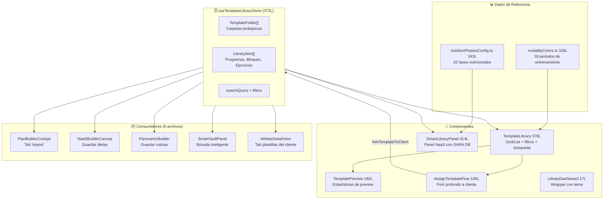
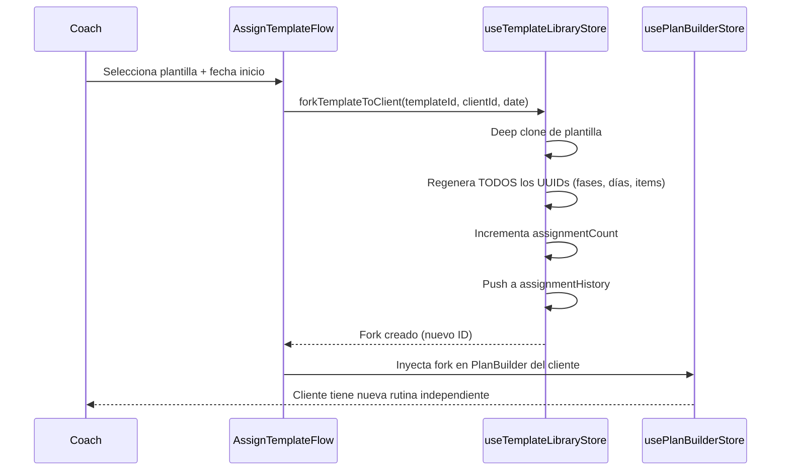

# Relevamiento: Biblioteca de Plantillas (Template Library) — Julio 2026

> Sistema jerárquico de plantillas reutilizables para entrenamientos y nutrición.  
> **6 componentes** · **1 store** · **2 configs de datos** · **373 líneas de store** · **23 puntos de integración**

---

## Arquitectura del Módulo



---

## Inventario de Archivos

### Store (1)

| Archivo | Líneas | Persistencia | Responsabilidad |
|---------|:------:|:------------:|-----------------|
| [useTemplateLibraryStore.ts](file:///D:/Musica%20Descargada/Bienestar%20APP/web/src/stores/useTemplateLibraryStore.ts) | 373 | ✅ `template-library-storage` | CRUD de carpetas y plantillas, fork profundo con UUID regeneration, búsqueda |

### Componentes (9)

| Componente | Líneas | Descripción |
|-----------|:------:|-------------|
| [TemplateLibrary.tsx](file:///D:/Musica%20Descargada/Bienestar%20APP/web/src/components/library/TemplateLibrary.tsx) | 579 | UI principal: 4 categorías unificadas (Entrenamientos, Nutrición, Recetarios, Documentos), grid/list, carpetas temáticas con iconos y búsqueda |
| [LibraryWelcomeWizardModal.tsx](file:///D:/Musica%20Descargada/Bienestar%20APP/web/src/components/library/LibraryWelcomeWizardModal.tsx) | 220 | Wizard pedagógico de bienvenida en 3 pasos: Organización $\rightarrow$ Smart Fork $\rightarrow$ Colaboración P2P |
| [ShareTemplateModal.tsx](file:///D:/Musica%20Descargada/Bienestar%20APP/web/src/components/library/ShareTemplateModal.tsx) | 160 | Compartición P2P con generación de código alfanumérico de 6 caracteres y botón WhatsApp |
| [ImportTemplateModal.tsx](file:///D:/Musica%20Descargada/Bienestar%20APP/web/src/components/library/ImportTemplateModal.tsx) | 180 | Importación instantánea vía código de 6 caracteres o enlace con preview interactivo |
| [UploadDocumentModal.tsx](file:///D:/Musica%20Descargada/Bienestar%20APP/web/src/components/library/UploadDocumentModal.tsx) | 190 | Creación y subida de guías/documentos (PDF, Word, enlaces Google Drive/Notion) con notas para el cliente |
| [SmartLibraryPanel.tsx](file:///D:/Musica%20Descargada/Bienestar%20APP/web/src/components/builders/DietBuilder/SmartLibraryPanel.tsx) | 314 | Panel lateral NaaS: tabs SARA DB + Plantillas + Platos, drag & drop con @dnd-kit |
| [TemplatePreview.tsx](file:///D:/Musica%20Descargada/Bienestar%20APP/web/src/components/library/TemplatePreview.tsx) | 182 | Preview con estadísticas: total fases, días/sesiones, ingestas/ejercicios |
| [AssignTemplateFlow.tsx](file:///D:/Musica%20Descargada/Bienestar%20APP/web/src/components/library/AssignTemplateFlow.tsx) | 165 | Flujo de asignación: selección de fecha + fork profundo + inyección en PlanBuilder |
| [LibraryDashboard.tsx](file:///D:/Musica%20Descargada/Bienestar%20APP/web/src/components/LibraryDashboard.tsx) | 17 | Wrapper que conmuta tema clínico/oscuro |

### Datos de Referencia (2)

| Archivo | Líneas | Contenido |
|---------|:------:|-----------|
| [modalityColors.ts](file:///D:/Musica%20Descargada/Bienestar%20APP/web/src/data/modalityColors.ts) | 326 | `PERIOD_PALETTE`: 18 periodos de entrenamiento con colores HEX, emojis, descripciones, campos requeridos |
| [nutritionPhasesConfig.ts](file:///D:/Musica%20Descargada/Bienestar%20APP/web/src/data/nutritionPhasesConfig.ts) | 343 | `NUTRITION_PERIOD_PALETTE`: 20 fases nutricionales con categorías, colores y campos específicos |

---

## Modelo de Datos

### Jerarquía de Plantillas

```
TemplateFolder
  └── LibraryItem (level: PROGRAM | BLOCK | EXERCISE)
        ├── name, description, tags[], taxonomyId
        ├── cycleType (STRENGTH, HYPERTROPHY, etc.)
        ├── nutritionPhase (NORMO, HIPOCALORICO, etc.)
        ├── phases: MesocyclePhase[]
        │     └── days: WorkoutDay[]
        │           └── items: (exercises | meals)
        ├── assignmentCount: number
        └── assignmentHistory: { clientId, date, forkId }[]
```

### Tipos Core

```typescript
type MesocyclePhase = {
  id: string;
  name: string;
  days: WorkoutDay[];
};

type LibraryItemLevel = 'PROGRAM' | 'BLOCK' | 'EXERCISE';

interface LibraryItem {
  id: string;
  name: string;
  level: LibraryItemLevel;
  description: string;
  tags: string[];
  taxonomyId?: string;
  cycleType?: string;
  nutritionPhase?: string;
  phases: MesocyclePhase[];
  assignmentCount: number;
  assignmentHistory: Array<{clientId: string; date: string; forkId: string}>;
  createdAt: string;
  updatedAt: string;
}
```

### Acciones del Store

| Acción | Descripción |
|--------|-------------|
| `createFolder(name)` | Crea carpeta nueva |
| `renameFolder(id, name)` | Renombra carpeta |
| `deleteFolder(id)` | Elimina carpeta y contenido |
| `createTemplate(item)` | Crea plantilla nueva |
| `updateTemplate(id, changes)` | Actualiza plantilla |
| `deleteTemplate(id)` | Elimina plantilla |
| `duplicateTemplate(id)` | Clona plantilla con nuevo UUID |
| `moveTemplate(id, folderId)` | Mueve plantilla entre carpetas |
| `forkTemplateToClient(id, clientId, date)` | **Deep clone** con regeneración de UUIDs + registro en assignmentHistory |
| `setSearchQuery(query)` | Búsqueda en tiempo real |
| `getFilteredTemplates()` | Selector memoizado con filtros |

---

## Flujo de Fork (Asignación a Cliente)



> [!IMPORTANT]
> El fork es **deep clone**: modificar la plantilla original NO afecta las copias asignadas a clientes, y viceversa.

---

## Puntos de Integración (9 consumidores)

| Consumidor | Cómo usa la biblioteca |
|-----------|----------------------|
| `PlanBuilderCockpit` | Tab "import" para cargar plantillas existentes |
| `NaaSBuilderCanvas` | Guarda dietas completadas como plantillas nutricionales |
| `PanoramicBuilder` | Almacena rutinas creadas panorámicamente |
| `SmartVaultPanel` | Lista carpetas y plantillas en la bóveda inteligente |
| `AthleteDetailView` | Tab de plantillas asignadas al cliente |
| `WorkoutBuilderCanvas` | Consume modalityColors para periodos |
| `NutritionPeriodSelectorModal` | Consume nutritionPhasesConfig para fases |
| `PeriodSelectorModal` | Selector de periodo de entrenamiento |
| `SmartExerciseLibrary` | Biblioteca de ejercicios integrada |

---

## Estado Actual vs Gaps

### ✅ Implementado

| Feature | Estado |
|---------|--------|
| CRUD completo de carpetas y plantillas | ✅ |
| 3 niveles: PROGRAM, BLOCK, EXERCISE | ✅ |
| Búsqueda en tiempo real por texto y tags | ✅ |
| Vista grid y list | ✅ |
| Preview con estadísticas calculadas | ✅ |
| Fork profundo con UUID regeneration | ✅ |
| Historial de asignaciones (assignmentHistory) | ✅ |
| 18 periodos de entrenamiento con paleta de colores | ✅ |
| 20 fases nutricionales con configuración | ✅ |
| Drag & drop de alimentos SARA al builder | ✅ |
| Persistencia en localStorage | ✅ |

### ❌ Gaps

| # | Gap | Prioridad | Descripción |
|---|-----|-----------|-------------|
| 1 | **Sin versionado de plantillas** | P1 | No hay historial de cambios. Si el coach modifica una plantilla, pierde la versión anterior |
| 2 | **Sin compartir entre coaches** | P1 | Las plantillas viven en localStorage del browser del coach. Otro coach del mismo gym no las ve |
| 3 | **Sin métricas de efectividad** | P2 | No se trackea qué plantillas generan mejores resultados en clientes |
| 4 | **Sin importación/exportación** | P2 | No se puede exportar a JSON ni importar plantillas de otro coach/gym |
| 5 | **TemplateLibrary.tsx monolítica** | P2 | 579 líneas con grid, list, filtros, carpetas y modales en un solo archivo |

---

*Última actualización: 26 de Julio 2026*
