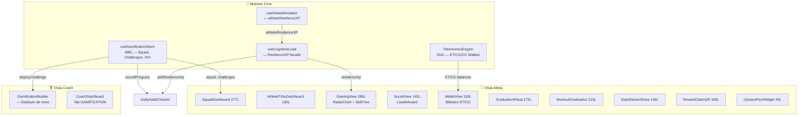

# Relevamiento: Módulo de Gamificación — Julio 2026

> Squads, Challenges, Tokenomics, XP de Resiliencia, Skill Trees y economía B2B2C.  
> **12 componentes** · **3 motores core** · **498 líneas de store** · **310 líneas de Tokenomics**

---

## Arquitectura del Módulo



---

## Inventario de Archivos

### Motores Core (3)

| Archivo | Líneas | Persistencia | Responsabilidad |
|---------|:------:|:------------:|-----------------|
| [useGamificationStore.ts](file:///D:/Musica%20Descargada/Bienestar%20APP/web/src/stores/useGamificationStore.ts) | 498 | ✅ `bienestar-gamification-v1` | Squad, Challenges (STREAK/VOLUME/CONSISTENCY), HVI checkins, simulación estocástica |
| [TokenomicsEngine.ts](file:///D:/Musica%20Descargada/Bienestar%20APP/web/src/lib/TokenomicsEngine.ts) | 310 | In-memory (singleton) | Economía multi-token (ET/CG/CC), anti-inflación, cooldowns 72h, pricing dinámico |
| [useCognitiveLoad](file:///D:/Musica%20Descargada/Bienestar%20APP/web/src/hooks/useCognitiveLoad.tsx) | ~80 | Via useGlobalSimulator | Fachada de ResilienceXP, Calm Mode toggle |

### Componentes Atleta (10)

| Componente | Líneas | Descripción |
|-----------|:------:|-------------|
| [SquadDashboard.tsx](file:///D:/Musica%20Descargada/Bienestar%20APP/web/src/components/athlete/SquadDashboard.tsx) | 277 | Dashboard de escuadrón: KudoPopover, FeedCard, competencia amistosa |
| [GamingView.tsx](file:///D:/Musica%20Descargada/Bienestar%20APP/web/src/components/athlete/GamingView.tsx) | 280 | Centro de gamificación: RadarChart SVG (fatiga SNC/upper/lower/core), SkillTree |
| [WorkoutGraduation.tsx](file:///D:/Musica%20Descargada/Bienestar%20APP/web/src/components/athlete/WorkoutGraduation.tsx) | 219 | Celebración en 3 pasos: Labor Illusion → Cristalización → Radar |
| [AthleteTribuDashboard.tsx](file:///D:/Musica%20Descargada/Bienestar%20APP/web/src/components/athlete/AthleteTribuDashboard.tsx) | 190 | Muro social de tribu con kudos y pactos de Ulises |
| [GraduationRitual.tsx](file:///D:/Musica%20Descargada/Bienestar%20APP/web/src/components/athlete/GraduationRitual.tsx) | 172 | Ritual de graduación: Libro de logros → Prueba de trabajo → Confetti |
| [StatsStickerShare.tsx](file:///D:/Musica%20Descargada/Bienestar%20APP/web/src/components/athlete/StatsStickerShare.tsx) | 146 | Generador de stickers vía `html-to-image` para Instagram Stories |
| [SocialView.tsx](file:///D:/Musica%20Descargada/Bienestar%20APP/web/src/components/athlete/SocialView.tsx) | 142 | Muro social con LeaderboardRow y reacciones |
| [WalletView.tsx](file:///D:/Musica%20Descargada/Bienestar%20APP/web/src/components/athlete/WalletView.tsx) | 110 | Billetera ET/CG con saldos y transacciones |
| [RewardClaimQR.tsx](file:///D:/Musica%20Descargada/Bienestar%20APP/web/src/components/athlete/RewardClaimQR.tsx) | 100 | QR efímero anti-screenshot (bucle 60fps) para canje físico |
| [UlyssesPactWidget.tsx](file:///D:/Musica%20Descargada/Bienestar%20APP/web/src/components/athlete/UlyssesPactWidget.tsx) | 45 | Compromiso preestablecido con formato moneda ARS |

### Componentes Coach (2)

| Componente | Líneas | Descripción |
|-----------|:------:|-------------|
| [GamificationBuilder.tsx](file:///D:/Musica%20Descargada/Bienestar%20APP/web/src/components/coach/GamificationBuilder.tsx) | ~200 | Creador y deployer de retos para coaches |
| [GamificationHub.tsx](file:///D:/Musica%20Descargada/Bienestar%20APP/web/src/components/GamificationHub.tsx) | ~150 | Hub central de gamificación (vista general) |

---

## Modelo de Datos

### Tipos Core

```typescript
type ChallengeType  = 'STREAK' | 'VOLUME' | 'CONSISTENCY';
type ChallengeState = 'DRAFT' | 'ACTIVE' | 'COMPLETED' | 'FAILED' | 'PIVOTED';
type ProgressSource = 'HABIT_CHECKIN' | 'WORKOUT_COMPLETE' | 'MANUAL';
type CurrencyType   = 'ET' | 'CG' | 'CC';  // Esfuerzo Token, Cristal Gym, Crédito Coach
```

### Squad (Escuadrón)

| Campo | Tipo | Descripción |
|-------|------|-------------|
| `name` | `string` | Nombre del squad |
| `members` | `SquadMember[]` | 1 real + 3 simulados estocásticamente |
| `collectiveStreak` | `number` | Racha grupal |
| `kudos` | `KudoEvent[]` | Historial de kudos entre miembros |
| `feed` | `FeedMessage[]` | Muro de actividad del grupo |

### Tokenomics (Economía B2B2C)

| Token | Nombre | Cómo se gana | Cómo se gasta |
|:-----:|--------|--------------|---------------|
| **ET** | Esfuerzo Token | Completar entrenamientos, hábitos, rachas | Canjear en rewards del gym |
| **CG** | Cristal Gym | Graduaciones, rituales, logros especiales | Items premium, descuentos |
| **CC** | Crédito Coach | Sistema B2B (asignado por gym owner) | Sesiones extra, contenido premium |

**Mecanismos anti-inflación:**
- Cooldown de 72h entre redenciones físicas
- Pricing dinámico por Tiers según utilización del gym
- Daily cap en el liquidity pool
- Reset automático del pool

---

## Integraciones Cross-Module

| Desde | Hacia | Mecanismo | Datos |
|-------|-------|-----------|-------|
| `DailyHabitCheckin` | `useGamificationStore` | `recordProgress()`, `markMyCheckinToday()`, `tickSimulation()` | Eventos de progreso de hábitos |
| `DailyHabitCard` | `useCognitiveLoad` | `addResilienceXp(xpReward)` | XP por completar hábitos |
| `ActiveWorkoutSession` | Gamification Overlay | Data-Reveal Overlay | Métricas durante entrenamiento |
| `CoachDashboard` | `GamificationBuilder` | Tab GAMIFICATION | Deploy de challenges |
| `A2UIRenderer` | Calm Mode | Inhibe gamificación | Respeta perfil cognitivo |
| `LanguageContext` | Traducciones | i18n | Textos gamificados multi-idioma |

---

## Estado Actual vs Gaps

### ✅ Implementado

| Feature | Estado |
|---------|--------|
| Squad con 1 real + 3 simulados estocásticos | ✅ |
| Challenges STREAK/VOLUME/CONSISTENCY | ✅ |
| XP de Resiliencia con niveles | ✅ |
| RadarChart SVG de fatiga (SNC, upper, lower, core) | ✅ |
| SkillTree con progresión | ✅ |
| Wallet multi-token (ET/CG/CC) | ✅ |
| QR efímero anti-screenshot (60fps) | ✅ |
| Stickers compartibles (html-to-image) | ✅ |
| Pacto de Ulises (commitment device) | ✅ |
| Graduación en 3 pasos | ✅ |
| Calm Mode (inhibe gamificación) | ✅ |
| HVI (Habit Velocity Index) telemetría | ✅ |

### ❌ Gaps

| # | Gap | Prioridad | Descripción |
|---|-----|-----------|-------------|
| 1 | **Squad de 4 son 3 bots** | P1 | Solo 1 miembro real, 3 son simulados con `simulateMemberCheckin`. Sin matchmaking real entre atletas. |
| 2 | **Tokenomics sin backend** | P1 | `TokenomicsEngine` es singleton in-memory. No persiste saldos en servidor. Si cierra el browser, pierde tokens. |
| 3 | **Rewards sin catálogo real del gym** | P2 | No hay integración con el sistema de inventario/servicios del gimnasio para canjear tokens por beneficios reales. |
| 4 | **Sin leaderboard real** | P2 | `SocialView` usa datos mockeados, no hay ranking entre usuarios reales del mismo gym. |

---

*Última actualización: 26 de Julio 2026*
