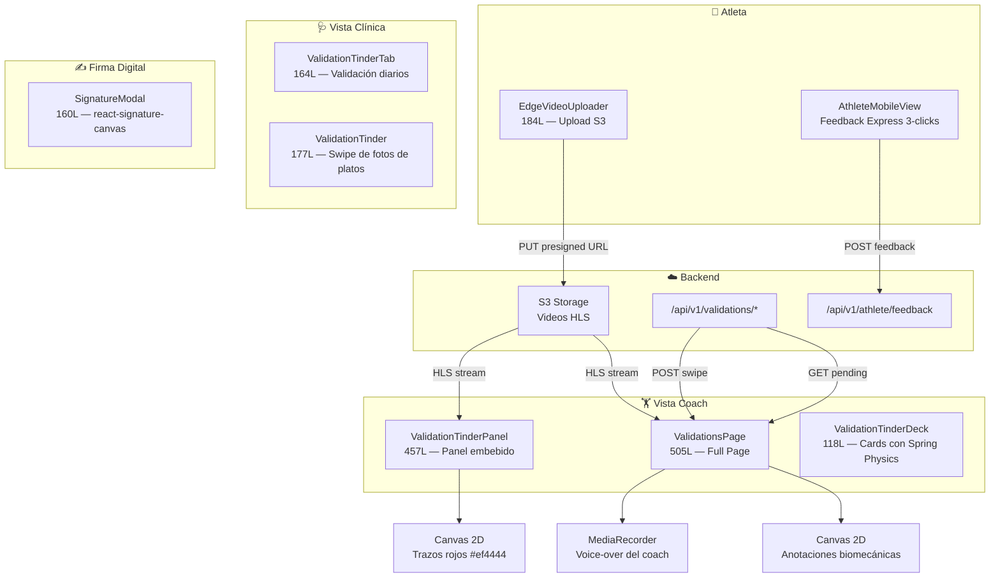
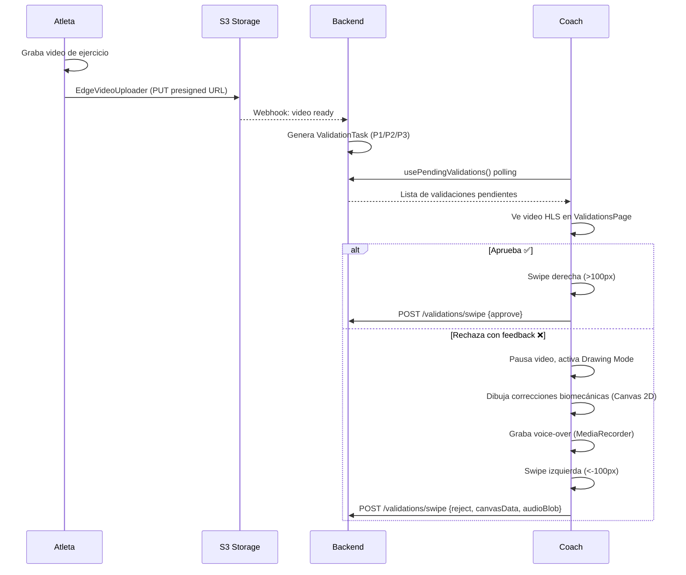
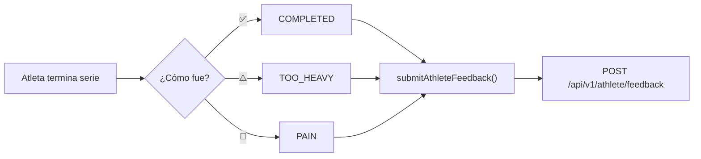

# Relevamiento: Validaciones y Video Feedback — Julio 2026

> Cola de validación biomecánica, anotaciones sobre video, voice-over, firma digital y feedback express del atleta.  
> **8 componentes** · **1 store** · **1 hook React Query** · **1 API** · **~1,870 líneas**

---

## Arquitectura del Módulo



---

## Inventario de Archivos

### Store y Hooks (3)

| Archivo | Líneas | Responsabilidad |
|---------|:------:|-----------------|
| [useValidationsStore.ts](file:///D:/Musica%20Descargada/Bienestar%20APP/web/src/stores/coach/useValidationsStore.ts) | 87 | Cola de validación: `queue: ValidationTask[]`, approve/reject con canvas+audio |
| [useRosterStore.ts](file:///D:/Musica%20Descargada/Bienestar%20APP/web/src/stores/coach/useRosterStore.ts) | 46 | Lista de clientes con riskLevel (GREEN/ORANGE/RED), ACWR, adherencia |
| [useValidations.ts](file:///D:/Musica%20Descargada/Bienestar%20APP/web/src/hooks/queries/useValidations.ts) | 142 | Hook React Query: `usePendingValidations` + `useValidateSwipe` con fallback a mocks |

### Componentes Coach (3)

| Componente | Líneas | Descripción |
|-----------|:------:|-------------|
| [ValidationsPage.tsx](file:///D:/Musica%20Descargada/Bienestar%20APP/web/src/pages/ValidationsPage.tsx) | 505 | Página completa: HLS player + Canvas 2D + MediaRecorder + filtros + swipe |
| [ValidationTinderPanel.tsx](file:///D:/Musica%20Descargada/Bienestar%20APP/web/src/components/dashboard/ValidationTinderPanel.tsx) | 457 | Panel embebido estilo Tinder: video + dibujo biomecánico + approve/reject |
| [ValidationTinderDeck.tsx](file:///D:/Musica%20Descargada/Bienestar%20APP/web/src/components/dashboard/ValidationTinderDeck.tsx) | 118 | Deck de cartas con Spring Physics (Framer Motion), estelas de color según dirección |

### Componentes Clínicos (2)

| Componente | Líneas | Descripción |
|-----------|:------:|-------------|
| [ValidationTinderTab.tsx](file:///D:/Musica%20Descargada/Bienestar%20APP/web/src/components/clinical/ValidationTinderTab.tsx) | 164 | Validación de diarios de comidas/fotos y transgresiones con audio |
| [ValidationTinder.tsx](file:///D:/Musica%20Descargada/Bienestar%20APP/web/src/components/nutritionist/ValidationTinder.tsx) | 177 | Swipe de fotos de platos con vibración háptica (`navigator.vibrate`) |

### Componentes Compartidos (3)

| Componente | Líneas | Descripción |
|-----------|:------:|-------------|
| [EdgeVideoUploader.tsx](file:///D:/Musica%20Descargada/Bienestar%20APP/web/src/components/video/EdgeVideoUploader.tsx) | 184 | Upload a S3 con URL presigned, validación MP4/WebM/MOV, max 50MB, progreso real |
| [SignatureModal.tsx](file:///D:/Musica%20Descargada/Bienestar%20APP/web/src/components/onboarding/SignatureModal.tsx) | 160 | Firma digital (react-signature-canvas), exporta PNG DataURL, lock de rutina |
| [athleteApi.ts](file:///D:/Musica%20Descargada/Bienestar%20APP/web/src/api/athleteApi.ts) | 92 | API B2C: `submitAthleteFeedback(COMPLETED/TOO_HEAVY/PAIN)` |

---

## Modelo de Datos

### ValidationTask (Store)

```typescript
interface ValidationTask {
  id: string;
  client_id: string;
  client_name: string;
  video_url: string;
  priority: 'P1' | 'P2' | 'P3';
  exercise_name: string;
  weight_kg: number;
  message: string;
}
```

### ValidationItem (API/React Query)

```typescript
interface ValidationItem {
  id: string;
  type: string;
  athlete_name: string;
  exercise_name: string;
  video_url: string;
  metrics_target: any;
  submitted_at: string;
  metadata: any;
}
```

### FeedbackPayload (Atleta → Coach)

```typescript
interface FeedbackPayload {
  feedback_type: 'COMPLETED' | 'TOO_HEAVY' | 'PAIN';
  notes?: string;
  entity_id?: string;
}
```

---

## Flujos de Usuario

### Flujo 1: Atleta sube video → Coach valida



### Flujo 2: Feedback express del atleta (3 clicks)



---

## Features de Canvas y Anotación

| Feature | Implementación | Archivos |
|---------|---------------|----------|
| **Dibujo sobre video** | Canvas 2D superpuesto sobre `<video>` pausado | ValidationsPage, ValidationTinderPanel |
| **Color de trazo** | Rojo fijo `#ef4444` (biomecánica) | ValidationTinderPanel |
| **Voice-over** | `MediaRecorder` API, graba mientras dibuja | ValidationsPage |
| **Firma digital** | `react-signature-canvas`, exporta PNG DataURL | SignatureModal |
| **Anti-screenshot QR** | Bucle 60fps que regenera el QR | RewardClaimQR |

---

## Estado Actual vs Gaps

### ✅ Implementado

| Feature | Estado |
|---------|--------|
| Cola de validación con prioridades P1/P2/P3 | ✅ |
| Video player HLS con canvas overlay | ✅ |
| Dibujo biomecánico sobre video pausado | ✅ |
| Voice-over con MediaRecorder | ✅ |
| Swipe Tinder (approve/reject con spring physics) | ✅ |
| Upload video a S3 con URL presigned | ✅ |
| Feedback express 3-clicks (COMPLETED/TOO_HEAVY/PAIN) | ✅ |
| Firma digital con react-signature-canvas | ✅ |
| Validación clínica de fotos de platos (nutricionista) | ✅ |
| Vibración háptica en swipe | ✅ |
| Fallback a mocks cuando backend no disponible | ✅ |

### ❌ Gaps

| # | Gap | Prioridad | Descripción |
|---|-----|-----------|-------------|
| 1 | **Cola usa datos mock** | P1 | `useValidationsStore` inicializa con datos hardcodeados. Sin flujo real de video → cola |
| 2 | **Sin notificación al atleta del resultado** | P1 | El coach aprueba/rechaza pero el atleta no recibe el feedback (canvas + audio) de vuelta |
| 3 | **Sin persistencia de anotaciones** | P2 | Los trazos del canvas y el audio blob no se envían al backend, solo se pasan al store local |
| 4 | **ValidationsPage monolítica** | P2 | 505 líneas con HLS player, canvas, audio recorder, filtros y swipe en un solo componente |

---

*Última actualización: 26 de Julio 2026*
