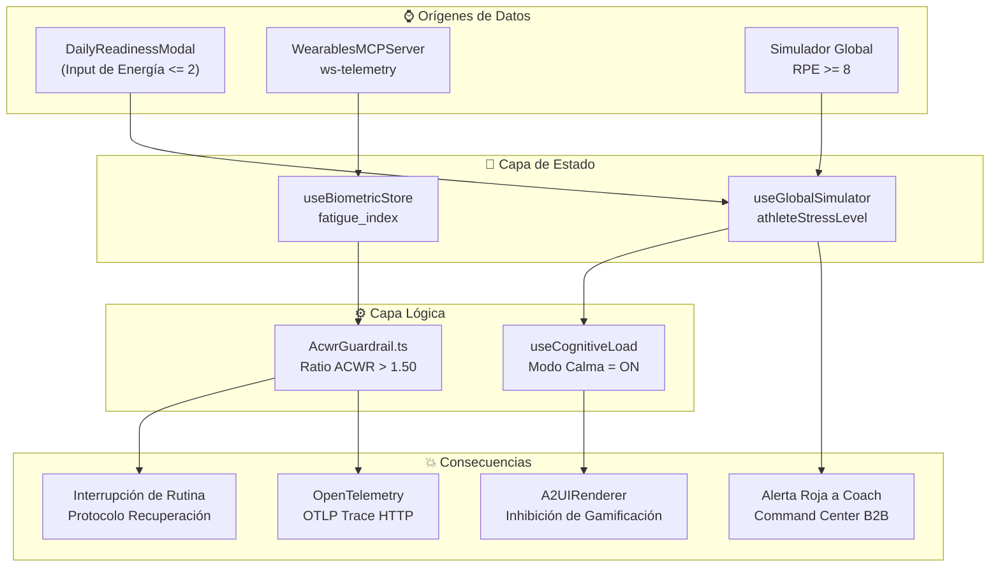

# Relevamiento: Telemetría, ACWR y Carga Cognitiva — Julio 2026

> Arquitectura híbrida de observabilidad, control biomecánico (ACWR) y adaptación psicológica (Airbag Cognitivo).  
> **1 validador Zod** · **2 hooks de resiliencia** · **2 stores globales** · **Infraestructura OpenTelemetry W3C**

---

## Arquitectura de Telemetría y Guardrails

---

## Inventario de Archivos Core

### Guardrails y Dominio Biomecánico (1)

| Archivo | Líneas | Responsabilidad |
|---------|:------:|-----------------|
| `AcwrGuardrail.ts` | 39 | Validador Zod estricto. Si `acuteLoad / chronicLoad > 1.50`, lanza excepción `ACWR_VIOLATION` y registra evento GenAI |

### Telemetría e Infraestructura (3)

| Archivo | Líneas | Responsabilidad |
|---------|:------:|-----------------|
| `OpenTelemetryInterceptor.ts` | 89 | Configuración OpenTelemetry Web SDK. W3C TraceContext, BatchSpanProcessor, auto-instrumentación Fetch/DOM |
| `telemetry.ts` | 58 | Logger semántico estructurado para eventos GenAI (`logger.genAiEvent`) |
| `naasTelemetry.ts` | 59 | Emisor asíncrono fire-and-forget para telemetría de UI de nutrición |

### Stores Reactivos (2)

| Archivo | Líneas | Responsabilidad |
|---------|:------:|-----------------|
| `useGlobalSimulator.ts`| 120 | Controla simulación de estrés (`optimal|fatigued|danger`). Alertas B2B cruzadas si atleta sube RPE |
| `useBiometricStore.ts` | 46 | Almacena métricas biométricas (`fatigue_index`, `recovery_rate_bpm`, `o2_sat`) que llegan por WebSocket |

### Carga Cognitiva y UI (2)

| Archivo | Líneas | Responsabilidad |
|---------|:------:|-----------------|
| `useCognitiveLoad.tsx` | 91 | Sincroniza estado de estrés global para emitir banderas booleanas como `calmMode` y `gamingLocked` |
| `DailyReadinessModal.tsx`| 129 | Modal de check-in (Airbag Cognitivo). Si energía <= 2, activa Modo Calma y reajusta rutina automáticamente |

---

## Ejes Temáticos del Módulo

### 1. Zero-Trust Biomecánico (ACWR)
El sistema audita de forma dura que los algoritmos de IA no sobreentrenen al usuario.
- Lógica en `AcwrGuardrail.ts`.
- Umbral máximo: **1.50** (hardcoded).
- Si se cruza la línea roja, interrumpe el flujo y redirecciona al atleta a recuperación.

### 2. Airbag Cognitivo (Modo Calma)
En base a la carga alostática del usuario (RPE altos, Checkins bajos de energía en `DailyReadinessModal`), el `useCognitiveLoad` activa `calmMode: true`.
- Esto silencia la UI (desactiva gamificación en `A2UIRenderer.tsx`).
- Apaga gráficos estresantes y simplifica colores hacia tonos índigo calmados.

### 3. OpenTelemetry (Observabilidad)
- Integrado mediante `@opentelemetry/sdk-trace-web`.
- Propagación de trazas W3C (header `traceparent`).
- Exporta en batches de a 10 a un colector OTLP por HTTP 4318.
- Usado para medir latencia de evaluación (`JudgeWorker.ts`) y resolución autónoma (`AutonomousIssueResolver.ts`).

---

## Estado Actual vs Deuda Técnica

### ✅ Puntos Fuertes Implementados

| Feature | Estado |
|---------|--------|
| Guardrail duro biomecánico (ACWR max 1.50) | ✅ |
| Sincronización de fatiga Atleta -> Alerta Entrenador en tiempo real | ✅ |
| Modo Calma (reducción de fricción cognitiva) auto-activado | ✅ |
| OTel W3C Context Propagation a endpoints de API locales | ✅ |

### ⚠️ Deuda Técnica (Tech Debt)

| ID | Issue | Severidad | Descripción |
|----|-------|-----------|-------------|
| DT-TEL01 | **ACWR Umbral Fijo** | Media | El umbral 1.50 está hardcodeado en `AcwrGuardrail.ts`. Debería ser paramétrico según nivel y deporte del atleta. |
| DT-TEL02 | **Telemetría no conectada a backend real** | Alta | `OpenTelemetryInterceptor` está implementado, pero los endpoints apuntan a localhost, los WebSockets biométricos consumen de `mock-telemetry`. |
| DT-TEL03 | **Console Logger Semántico** | Baja | `telemetry.ts` (GenAI Event logger) actualmente solo escupe logs a consola. Necesita despacharse a OTel o DataDog. |

---

*Última actualización: 26 de Julio 2026*
