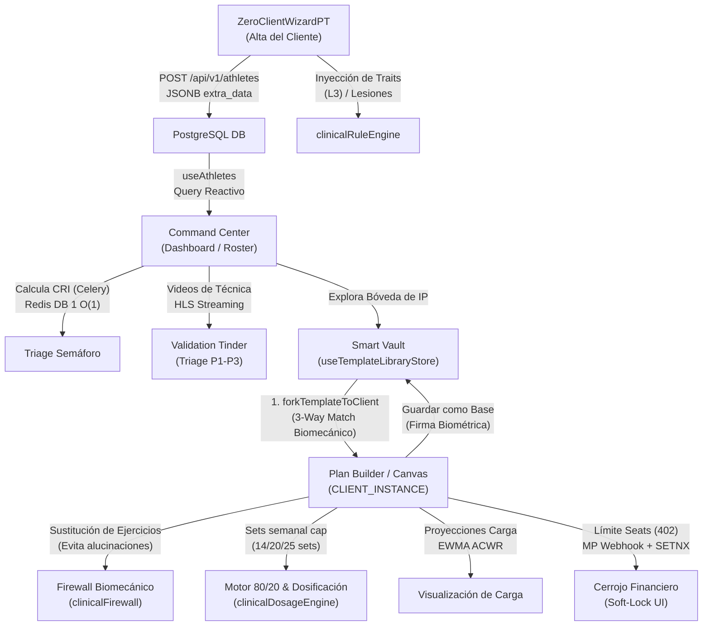

# 📊 Relevamiento Profundo: El Viaje del Entrenador (End-to-End)
## Estrategias, Criterios de Éxito, Escenarios Críticos y Diseño de Experiencia (UX)

Este documento detalla la arquitectura, estrategias, criterios de éxito y flujos de experiencia de usuario (UX) del **Viaje del Entrenador** (Trainer Journey) en Bienestar APP. Abarca desde la adquisición y el alta del cliente hasta la asignación biomecánica y el análisis de retención, configurando a la plataforma como un **Exoesqueleto Biomecánico y Financiero** que previene el *burnout* del entrenador mientras potencia la salud del atleta.

---

## 🗺️ Mapa General del Viaje del Entrenador

---

## 1. Fase de Alta del Cliente (ZeroClientWizardPT)

El onboarding del atleta representa la **Puerta de Entrada de Datos Clínicos y Deportivos**. Para asegurar un embudo de alta ágil, rápido y estructurado, se implementa una estrategia de recopilación de datos libre de entradas manuales complejas ("Zero-Typing").

### A. Estrategia UX: Cero Texto Libre y Fricción Cognitiva
Escribir texto libre sobre síntomas, dolores u objetivos en pantallas móviles es propenso a errores y requiere un parseo costoso de procesamiento de lenguaje natural (LLM) que introduce latencia, costo operativo (OpEx) y riesgo de alucinación clínica.
*   **PillButtons & Sliders:** Todos los datos se capturan mediante toques rápidos.
*   **Matriz de Dolor Estructurada:** El dolor o lesión no se redacta; se selecciona en la `InjuryMatrix` especificando la zona corporal (ej. `Hombro`, `Lumbar`), la articulación y la intensidad en una escala del 1 al 5.
*   **PedagogicalSlider:** El volumen, la frecuencia y el nivel de experiencia del atleta se regulan mediante controles deslizantes con etiquetas descriptivas claras e indicadores numéricos (1 a 5) para eliminar la ambigüedad conceptual.

### B. El Mecanismo de "Labor Illusion"
Cuando el entrenador hace clic en "Compilar Matriz", la aplicación emite una pantalla de procesamiento con micro-copy especializado:
*   *"Analizando biomecánica y restricciones..."*
*   *"Aplicando filtros de seguridad articular (McGill)..."*
*   *"Calculando volumen óptimo de recuperación (ACWR)..."*
*   *"Generando blueprint del microciclo en el Cockpit 360..."*

> [!TIP]
> **Efecto de Valor Percibido:** Introducir una latencia artificial controlada (~1200ms) durante cálculos complejos genera una alta percepción de rigor científico y valor técnico en la mente del entrenador B2B, incrementando la confianza en las rutinas generadas automáticamente.

### C. Escenarios Críticos & Preguntas de Negocio

| Escenario Posible | Comportamiento del Sistema | Estrategia de Mitigación |
|---|---|---|
| **Intento de registrar email existente en el Roster** | El backend responde con un error `HTTP 409 Conflict`. | La UI en [ZeroClientWizardPT.tsx](file:///d:/Musica%20Descargada/Bienestar%20APP/web/src/components/onboarding/ZeroClientWizardPT.tsx) captura el error y resalta el input de email, sugiriendo asociar al atleta existente o usar una dirección diferente. |
| **Cierre accidental de la pestaña durante el alta** | Pérdida de progreso en el formulario de 7 pasos. | Sincronización continua de [useOnboardingPTStore.ts](file:///d:/Musica%20Descargada/Bienestar%20APP/web/src/store/useOnboardingPTStore.ts) con almacenamiento local persistente. Al reabrir, se restaura el wizard en el paso exacto. |
| **Registros sin conexión a internet en el Gym** | Fallo en la comunicación REST con el servidor. | Almacenamiento en la cola local de IndexedDB (`outbox`). Tras recuperar la red, se dispara un *flush* de fondo con llaves de idempotencia UUID (`crypto.randomUUID()`) para evitar duplicados. |

#### ❓ Preguntas Clave para Diseño
1. *¿Debemos permitir que el entrenador asocie biomarcadores directamente desde dispositivos *wearables* (Garmin/Apple Watch) en este paso inicial, o dejamos esa sincronización exclusivamente para el post-onboarding del atleta B2C?*
2. *¿Es necesario un paso de "Consentimiento de Firma Médica y Privacidad" explícito en la pantalla de firma digital (`SignatureModal`) para cubrir responsabilidades biomecánicas legales del gimnasio?*

---

## 2. El Dashboard del Entrenador (Command Center)

Una vez que el atleta es dado de alta, el sistema debe garantizar que el entrenador posea un control omnisciente de su roster con un **tiempo de decisión menor a 5 segundos** (Time-to-Triage).

### A. Sincronización Reactiva e Integración O(1)
*   **React Query & Caché:** El roster no requiere peticiones pesadas por cada carga de pantalla. Utiliza `useAthletes` para obtener la lista desde `/api/v1/patients`, manteniendo un estado consistente mediante *stale-while-revalidate*.
*   **Señales de Alerta Semafórica:** Las tarjetas de atleta exponen visualmente badges con códigos de color basados en:
    *   **ACWR (Acute:Chronic Workload Ratio):** Verde (Sweet Spot 0.8-1.3), Amarillo (Transición/Descarga), Rojo (Danger Zone >1.5 / Riesgo de lesión).
    *   **CRI (Churn Risk Index):** Basado en inactividad y desvíos biomecánicos. Los atletas críticos se sitúan arriba.

### B. Validation Tinder (Triage de Ejecución Biomecánica) **[COMPLETADO - FASE 10]**
El atleta B2C sube videos de sus levantamientos pesados para verificar la técnica. El entrenador los procesa en un Modo Enfoque Oscuro a pantalla completa con una UI inmersiva de deslizamiento lateral (swipe) basada en Framer Motion, *Sliding Window* para prevenir Memory Leaks, y *Outbox Batching* para protección del backend:
*   **P1 (Máxima Urgencia):** Videos de atletas con dolor lumbar/lesiones (Bordes Rojos). El Swipe Izquierdo (Rechazo) dispara un Toast no bloqueante "Motor Adaptativo: Recalculando fatiga".
*   **P2 (Moderado):** Desviaciones menores de técnica (Bordes Amarillos).
*   **P3 (Bajo/Mantener):** Ejecucciones correctas (Bordes Verdes). Permite "Aprobación 1-Click".
Al vaciar la cola, una coreografía de "Roster Asegurado" (800ms) reconforta al usuario antes del crossfade optimista hacia el Command Center.

### C. Escenarios Críticos & Preguntas de Negocio

| Escenario Posible | Comportamiento del Sistema | Estrategia de Mitigación |
|---|---|---|
| **Saturación por exceso de videos pendientes (Fatiga de Alertas)** | El entrenador ve docenas de videos y se siente abrumado. | El sistema agrupa por importancia y provee un botón de "Aprobación Masiva de Seguros" (P3) tras validar que no hay desvíos de RPE ni quejas biométricas en los logs. |
| **Pérdida de conexión en streaming de video** | El video de técnica se congela o muestra pantalla en negro. | Uso de streaming adaptativo en HLS (HTTP Live Streaming) segmentado en fragmentos pequeños con *pre-fetching* dinámico de la siguiente tarjeta del deck. |

#### ❓ Preguntas Clave para Diseño
1. *¿Deberíamos automatizar el envío de notificaciones push o mensajes directos a través del canal centralizado (Inbox) del atleta cuando el entrenador realiza un swipe en la cola de validaciones?*
2. *¿Es conveniente limitar el número máximo de videos activos permitidos en el deck por atleta para evitar que un solo cliente sature el Command Center del entrenador?*

---

## 3. Adjudicación de Rutina, Bóveda de IP y Estrategias del Plan Builder

El [PanoramicBuilder.tsx](file:///d:/Musica%20Descargada/Bienestar%20APP/web/src/components/onboarding/PanoramicBuilder.tsx) y el [PlanBuilderCockpit.tsx](file:///d:/Musica%20Descargada/Bienestar%20APP/web/src/components/onboarding/PlanBuilderCockpit.tsx) consolidan el núcleo de prescripción biomecánica y periodización de la plataforma, ahora potenciados por el aislamiento arquitectónico de entidades.

### A. La Bóveda de IP y Asignación Biomecánica (3-Way Match) **[NUEVO - FASES A y B]**
El flujo de asignación se apoya en una dicotomía visual y de datos estricta:
1. **La Bóveda de IP (`SmartVaultPanel`):** Entorno de color frío donde el entrenador almacena sus `TEMPLATES` maestros en un árbol de carpetas de 2 niveles. Estas plantillas son inmutables y de solo lectura (`TemplatePreview`).
2. **Asignación Express (3 Clics):** Al seleccionar un template, el sistema ejecuta `forkTemplateToClient()`, realizando un *clonado profundo (`structuredClone`)* y *regeneración de UUIDs*.
3. **El Entorno Activo (`CLIENT_INSTANCE`):** La UI pasa a una paleta cálida. El atleta recibe una copia desvinculada que puede modificarse libremente en el `PlanBuilder` sin alterar la propiedad intelectual original del coach. Si el coach diseña algo excepcional aquí, puede usar **"Guardar como Base"** firmando biométricamente para inyectar una copia estabilizada de vuelta en la Bóveda de IP.

### B. Auto-Template Engine & Firewall Biomecánico
*   **Selección de Arquetipo:** El motor sugiere qué plantilla de la Bóveda utilizar basándose en los días por semana y los objetivos definidos en el onboarding (ej. `strength_4` para fuerza 4 días/semana).
*   **Filtro Determinista Contra Lesiones:**
    El sistema aplica el [clinicalFirewall.ts](file:///d:/Musica%20Descargada/Bienestar%20APP/web/src/utils/clinicalFirewall.ts) que evalúa cada ejercicio:
    *   Si el usuario posee lesión en hombros, reemplaza automáticamente ejercicios de *Empuje Vertical* por variantes de plano horizontal.
    *   Si el usuario posee dolor lumbar activo, detecta si el ejercicio tiene `Carga_Axial === 'SÍ'` (ej. sentadilla con barra libre) y lo sustituye por ejercicios de bajo impacto lumbar (ej. prensa de piernas inclinada).
    *   *Garantía Anti-Alucinaciones:* No se utiliza IA para esta toma de decisiones clínica; las reglas operan bajo heurísticas lógicas rígidas y deterministas en el cliente.

### C. Motor 80/20 y Hard Caps Clínicos
*   **Dosificación por Nivel:**
    El [clinicalDosageEngine.ts](file:///d:/Musica%20Descargada/Bienestar%20APP/web/src/utils/clinicalDosageEngine.ts) establece topes automáticos de volumen para evitar sobreentrenamiento (Schoenfeld & Helms Guidelines):
    *   `BEGINNER`: Máximo 14 series semanales por grupo muscular. RPE base de 7.
    *   `INTERMEDIATE`: Máximo 20 series semanales por grupo muscular. RPE base de 8.
    *   `ADVANCED`: Máximo 25 series semanales por grupo muscular. RPE base de 8.5.
*   **Fricción Positiva:**
    Si el entrenador intenta arrastrar un ejercicio y supera estos límites semanales o de RPE:
    *   El sistema no bloquea la acción para no violar la autoridad del entrenador ("El Coach manda").
    *   Muestra una advertencia visual de color rosa/rojo en los márgenes informando el desvío.
    *   Registra en segundo plano el desvío a través de la métrica `emitMRVSoftCapOverride` para auditoría y control de calidad de la plataforma.

### C. Estrategia UX: Estructura en Cascada y Smart Blocks
*   **Layout Vertical Responsivo:** Sustitución de los carruseles de desplazamiento horizontal por columnas verticales en cascada para facilitar la legibilidad de rutinas complejas y evitar el truncamiento de textos largos de nombres de ejercicios.
*   **Smart Blocks (Cero Escritura):**
    El entrenador puede arrastrar bloques enteros pre-configurados (ej. `Bloque McGill Big 3` o `Core Shield`) de la paleta. Estos bloques pre-poblan automáticamente todas las variables (series, repeticiones, indicaciones y tempos isométricos) sin requerir entrada de teclado.
*   **ACWR EWMA Integrado:**
    El canvas calcula la proyección del ratio de carga crónica/aguda en base a la rutina construida y la expone en el Cockpit, sirviendo como guía preventiva de lesiones en tiempo real.

### D. Escenarios Críticos & Preguntas de Negocio

| Escenario Posible | Comportamiento del Sistema | Estrategia de Mitigación |
|---|---|---|
| **Conflicto estructural por cambio de ejercicio (Drift)** | El entrenador modifica el plan global mientras el atleta está entrenando sin internet. | Uso de `state_hash` y protocolo de reconciliación en la reconexión. Si hay conflicto, se abre la vista dividida (`BioMechanicalSplitView`) para que el coach decida qué versión prevalece. |
| **Límite de atletas alcanzado en el plan (Soft-Lock)** | El entrenador intenta asignar una rutina pero su suscripción B2B no permite más atletas activos. | Se genera un código HTTP 402 en la mutación, interceptado localmente para desplegar `GlassmorphicSoftLock.tsx`. Permite actualizar la cuenta de forma fluida mediante MercadoPago sin perder la rutina diseñada. |

#### ❓ Preguntas Clave para Diseño
1. *¿Deberíamos inyectar un paso de aprobación previo para el atleta cuando el entrenador cambia radicalmente el volumen o añade nuevos ejercicios durante la mitad de un mesociclo?*
2. *¿Es viable permitir que el entrenador comparta sus "Smart Blocks" personalizados en una biblioteca compartida del gimnasio para otros entrenadores del mismo tenant?*

---

## 4. Criterios de Aceptación y KPIs del Viaje del Entrenador

Para asegurar el éxito de la implementación de este flujo, se establecen métricas de rendimiento de experiencia (UX) y confiabilidad técnica (SRE).

### A. KPIs de Experiencia de Usuario (UX KPIs)
*   **Time-to-Triage (TTT) < 5s:** Tiempo transcurrido desde que el entrenador abre el Command Center hasta que identifica visualmente a los atletas en riesgo alto (rojo) o inactivos.
*   **Time-to-Insight (TTI) < 10s:** Tiempo que le toma al entrenador ingresar a la ficha detallada del atleta, revisar su tendencia de fatiga central (ACWR) y comprender la causa de su alerta de riesgo.
*   **Time-to-Approve (TTA) < 1.2s:** Tiempo promedio de resolución por video en la cola de validaciones de técnica (Validation Tinder).
*   **System Usability Scale (SUS) > 85:** Calificación de usabilidad percibida por entrenadores durante las pruebas de UAT mensuales.

### B. KPIs Técnicos y de Confiabilidad (SRE/Database KPIs)
*   **Data Loss Rate = 0%:** Ningún esfuerzo, serie o rutina diseñada localmente por el entrenador debe perderse por cortes de red (uso estricto de IndexedDB y persistencia local de estado).
*   **Cross-Tenant Isolation = 100%:** Aislamiento criptográfico y relacional absoluto de datos de clientes entre diferentes tenants (gimnasios/entrenadores independientes) mediante RLS (Row Level Security) a nivel base de datos.
*   **API Response Time (95th percentile) < 150ms:** Latencia de red para endpoints de persistencia de rutinas y carga de rosters, garantizando una UI ágil sin waterfalls molestos.
*   **Fast-Fail Database Pool Timeout = 2s:** En momentos de alta concurrencia, las conexiones fallidas o saturadas son rechazadas a los 2 segundos con HTTP 503 para evitar cuellos de botella prolongados en la base de datos central.
