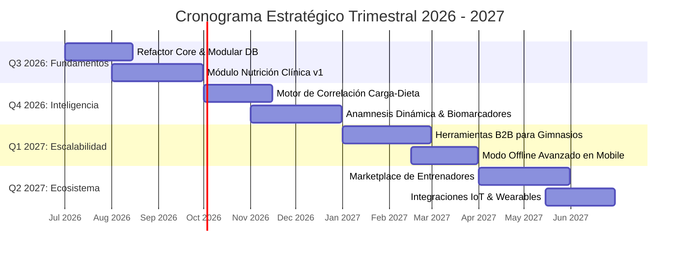

# 🗺️ Roadmap de Desarrollo — Bienestar APP

Bienvenido al centro de planificación estratégica y ejecución táctica de **Bienestar APP**. En esta carpeta se consolida la visión del producto a corto, mediano y largo plazo, traduciendo los objetivos de negocio y las necesidades de entrenadores y atletas en hitos técnicos concretos.

---

## 📐 Metodología del Roadmap

En Bienestar APP combinamos una visión estratégica de **Planificación Trimestral (Quarterly OKRs)** con un esquema de **Ejecución Táctica en Sprints de 2 semanas**.

* **Planificación Trimestral (Q1-Q4)**: Define los grandes bloques de valor (*Epics* / Hitos), las migraciones estructurales de base de datos y la expansión hacia nuevas disciplinas deportivas y nutricionales.
* **Sprints de 2 Semanas**: Permiten iterar de forma ágil, respondiendo al *feedback* directo de usuarios beta, ajustando prioridades sin perder el rumbo estratégico.

---

## 📂 Contenido del Directorio

En este directorio vas a encontrar la siguiente estructura de archivos:

| Archivo / Carpeta | Descripción | Estado / Frecuencia |
| :--- | :--- | :--- |
| **[`roadmap-general.md`](./roadmap-general.md)** | Visión estratégica a 12 meses estructurada por trimestres, detallando metas de producto, arquitectura e hitos comerciales. | Actualizado por Q |
| **[`sprint-backlog.md`](./sprint-backlog.md)** | Detalle táctico de las User Stories del Sprint actual y la planificación estimada para los próximos 2 sprints. | Actualizado cada sprint |
| **[`migraciones/`](./migraciones)** | Carpeta con los planes de migración de base de datos (PostgreSQL, esquemas de tablas, scripts de alteración y rollback). | Por release de schema |
| **[`onboarding-equipo.md`](./onboarding-equipo.md)** | Guía paso a paso para la incorporación (*onboarding*) de desarrolladores frontend, backend y mobile al proyecto. | Mantenimiento continuo |

---

## ⚖️ Sistema de Priorización: Framework WSJF

Para evitar sesgos y decidir de forma objetiva qué *features* o deudas técnicas encarar en cada sprint o trimestre, utilizamos el marco de priorización **WSJF** (*Weighted Shortest Job First*) de SAFe.

El principio fundamental del WSJF es simple: **dar máxima prioridad a los trabajos de alto valor y corta duración** para minimizar el costo de la demora (*Cost of Delay*).

### 1. Fórmula del WSJF

$$ \text{WSJF} = \frac{\text{Cost of Delay (CoD)}}{\text{Job Size (Tamaño del Trabajo)}} $$

Donde el **Cost of Delay (CoD)** se calcula como la suma de 3 componentes esenciales:

$$ \text{CoD} = \text{User-Business Value} + \text{Time Criticality} + \text{Risk Reduction / Opportunity Enablement} $$

---

### 2. Componentes de Evaluación (Escala Fibonacci 1 a 21)

Cada componente se puntúa de forma relativa utilizando la secuencia de Fibonacci ($1, 2, 3, 5, 8, 13, 21$):

1. **User-Business Value (Valor para Usuario / Negocio)**: ¿Cuánto impacta directamente a entrenadores, nutricionistas o atletas? ¿Genera ingresos o retención?
2. **Time Criticality (Criticidad Temporal)**: ¿Existe una fecha límite externa, compromiso comercial o riesgo de pérdida de usuarios si nos demoramos?
3. **Risk Reduction / Opportunity Enablement (Reducción de Riesgo / Habilitación de Oportunidades)**: ¿Previene fallas críticas en producción o habilita construir futuras *features* clave?
4. **Job Size (Tamaño / Esfuerzo del Trabajo)**: Estimación del esfuerzo de desarrollo, testing y despliegue.

---

### 3. Ejemplo Práctico de Cálculo WSJF

A continuación se presenta un ejemplo de matriz de priorización aplicada a iniciativas típicas de Bienestar APP:

| Iniciativa / Feature | User Value (1-21) | Time Crit. (1-21) | Risk/Opp. (1-21) | CoD Total | Job Size (1-21) | Puntuación WSJF | Prioridad |
| :--- | :---: | :---: | :---: | :---: | :---: | :---: | :---: |
| **Optimización de consultas SQL en Calendario** | 5 | 8 | 13 | **26** | **2** | **13.0** | 🥇 **1º** |
| **Módulo de Nutrición Clínica (Anamnesis)** | 13 | 8 | 5 | **26** | **5** | **5.2** | 🥈 **2º** |
| **Integración con Apple Health / Google Fit** | 8 | 3 | 5 | **16** | **8** | **2.0** | 🥉 **3º** |
| **Rediseño estético del perfil de usuario** | 3 | 1 | 1 | **5** | **5** | **1.0** | 4º |

> [!TIP]
> Como muestra el ejemplo, aunque el *Módulo de Nutrición Clínica* aporta mucho valor, la *Optimización de consultas SQL* tiene un WSJF mayor ($13.0$ vs $5.2$) porque su tamaño es muy pequeño y elimina un riesgo técnico inmediato. Por lo tanto, se ejecuta primero.

---

> [!NOTE]
> Todo cambio en las prioridades del `sprint-backlog.md` que altere el orden de desarrollo debe ser discutido en la sesión de *Sprint Planning* y respaldado por una re-evaluación en la matriz WSJF.
