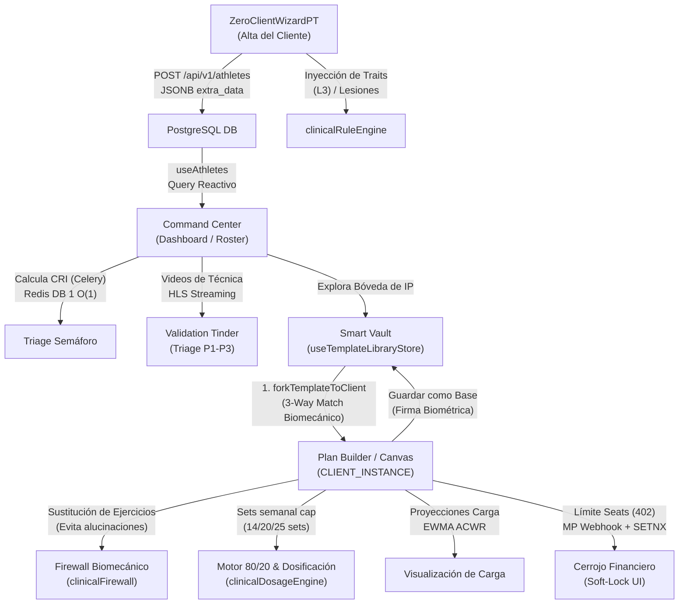

# 🧠 Estrategia Completa: El Viaje del Entrenador (End-to-End)
## Diagnóstico Sistémico, Plan de Adopción (ADKAR), Sustentación Matemática de Carga (ACWR) y UX de Prescripción

Este documento establece la estrategia maestro de producto, ingeniería y experiencia de usuario (UX) para el **Viaje del Entrenador** en Bienestar APP. Resuelve los dilemas de adopción socio-técnica y detalla las decisiones operativas clave necesarias para blindar la conversión y evitar el desgaste (*burnout*) del profesional de la salud física.

---

## 🗺️ Mapa General del Viaje del Entrenador

---

## 1. Diagnóstico Sistémico y Anti-Patrones

### A. Arquetipo de "Límites del Crecimiento" (Limits to Growth) e Intervención
El sistema de visualización reactiva $O(1)$ escala técnicamente sin degradación. Sin embargo, la capacidad de atención humana del entrenador es finita. Un exceso de videos de técnica enviados por atletas a la sección *Validation Tinder* puede saturar su Command Center, disparando la "fatiga de alertas" y degradando la calidad del servicio.

*   **Acción Correctiva (Límite al Crecimiento):**
    *   **Hard Cap en Cola:** Límite estricto de **3 videos activos por atleta** en espera de revisión. El backend rechaza subidas adicionales con un mensaje que fomenta la asimilación del feedback previo: *"Tu coach aún está evaluando tus levantamientos anteriores. Espera su devolución para subir nuevos videos."*
    *   **Agrupamiento por Prioridad:** El motor ordena de forma automática la cola priorizando los videos clasificados como `P1` (riesgo clínico o dolor agudo). Los videos seguros (`P3`) se consolidan al final de la cola y cuentan con un botón de **"Aprobación Rápida con 1-Click"** que envía feedback pre-poblado al atleta.

### B. Erradicación del Anti-Patrón: "Magia Negra Técnica"
*   **Decisión Determinista:** El [clinicalFirewall.ts](file:///d:/Musica%20Descargada/Bienestar%20APP/web/src/utils/clinicalFirewall.ts) realiza sustituciones automáticas basadas en lógica booleana rígida (ej: si hay antecedente lumbar, se bloquea la carga axial; si hay lesión de hombro, se bloquea el empuje vertical) en lugar de consultar a un modelo de lenguaje (LLM).
*   **Beneficio Clínico:** Evita alucinaciones en prescripciones críticas que comprometan la salud física del atleta, elimina el costo variable de tokens (OpEx) y garantiza tiempos de respuesta instantáneos en el navegador.

---

## 2. Plan Holístico de Ejecución y Rigor Económico

### A. Estrategia (Alineación): "Labor Illusion"
*   **Propósito UX:** La latencia controlada de **~1200ms** con carga por pasos en la compilación inicial del plan no es un cuello de botella; es una herramienta psicológica. Comunica visualmente que el sistema realiza cálculos biomecánicos pesados en base a la matriz del cliente, generando una alta percepción de rigurosidad científica y disminuyendo las tasas de modificación manual posterior por cuestionamiento de la rutina.

### B. Valor (Priorización): Cost of Delay & WSJF
*   Utilizando el marco WSJF (Weighted Shortest Job First), la prioridad número uno del desarrollo fue el **Triage de Riesgos Biomecánicos** (Triage Semáforo y Validation Tinder), el cual **[SE HA COMPLETADO EN FASE 10]** con un entorno de Dark Mode inmersivo, Swipe UI y mitigación de DDoS.
*   **Valor de Negocio:** El impacto económico de retener a un atleta evitando que se lesione o abandone el gimnasio por dolor supera el beneficio de implementar herramientas de cobro adicionales en etapas tempranas. La meta de mantener el **Time-to-Triage (TTT) < 5s** es el KPI no negociable de retención.

### C. Proceso (Finanzas y Gobernanza Ágil)
*   **Fast-Fail Database Pool Timeout (2s):** Previene caídas en cascada del servidor en momentos de alto tráfico (ej: salida de clases masivas). Expulsa de inmediato las llamadas excedentes devolviendo un error `HTTP 503` antes de agotar los recursos de base de datos.
*   **IndexedDB (Data Loss Rate = 0%):** La cola local resguarda cada set e indicación ingresada por el entrenador y atleta. Las caídas de red en el sótano de un gimnasio no impactan el trabajo del usuario.

### D. Producto (Dual-Track Agile)
*   **Validación del Motor 80/20:** Conectamos telemetría para evaluar si la imposición de Hard Caps de volumen semanal (14, 20 y 25 series según nivel BEGINNER, INTERMEDIATE o ADVANCED) disminuye efectivamente el índice de riesgo de abandono (CRI) del roster de atletas en un ciclo de 90 días.

---

## 3. Plan Humano, Adopción e Influencia

*   **Fricción Positiva ("El Coach manda"):** El sistema advierte al entrenador si supera el MRV (Volumen Máximo Recuperable) o inyecta RPEs inseguros, pero no bloquea la acción. Esto respeta la jerarquía y el ego profesional del coach, facilitando la adopción y disminuyendo la resistencia al cambio tecnológico.
*   **ADKAR para Gestión de Cambio:**
    *   *Awareness (Conciencia) & Desire (Deseo):* Se posiciona el CommandCenter no como una herramienta de reporte, sino como un **"radar de prestigio"** que agrupa y organiza el feedback de los atletas para optimizar su tiempo libre.
    *   *Ability (Habilidad):* Los **Smart Blocks** actúan como la palanca principal; el entrenador puede prescribir protocolos completos como el *McGill Big 3* arrastrando un solo elemento, reduciendo la escritura a cero.

---

## 4. Respuestas Estratégicas a Preguntas de Diseño

1.  **Sincronización de Wearables:** Post-Onboarding exclusivo para atletas (B2C). Añadir integraciones OAuth y permisos de Garmin/Apple durante el alta rompe el embudo de conversión y fatiga al usuario.
2.  **Consentimiento y Firma Médica:** Integrado mediante un [SignatureModal.tsx](file:///d:/Musica%20Descargada/Bienestar%20APP/web/src/components/onboarding/SignatureModal.tsx) premium (fondos oscuros, tipografía sans-serif limpia, espaciado amplio). Psicológicamente eleva el estatus del programa, convirtiéndolo en un servicio de élite.
3.  **Notificaciones en Triage:** Ráfaga consolidada asíncrona. El sistema compila todas las aprobaciones y feedbacks realizados por el entrenador durante su sesión en el Validation Tinder y envía un único resumen diario o mensaje unificado en el Inbox del atleta.
4.  **Aprobación por Cambios de Plan:** Tarjeta dinámica de cambio. Cuando el atleta abre la app tras un cambio del entrenador, se le presenta una vista explicativa: *"Tu coach ha optimizado tu volumen de hoy basado en tu fatiga del SNC"*, evitando bloquear el flujo con aprobaciones manuales rígidas.
5.  **Smart Blocks Compartidos (Multi-tenant Library):** Fomenta la estandarización de entrenamientos en gimnasios corporativos y aumenta el costo de salida (Lock-in) del software B2B.

---

## 5. Optimización Neuroestética y Ergonomía Visual

*   **Jerarquía Tipográfica:** Columnas en cascada en el [PanoramicBuilder.tsx](file:///d:/Musica%20Descargada/Bienestar%20APP/web/src/components/onboarding/PanoramicBuilder.tsx). Tipografía sans-serif geométrica pesada para los números (series, reps) y peso ligero para las etiquetas descriptoras, acelerando la lectura de la prescripción.
*   **Fricción Cromática:** El indicador de desvío del cap clínico `emitMRVSoftCapOverride` en los márgenes de la tarjeta utiliza un gradiente ciruela profundo a rosa coral. Evita el rojo plano de alarma para reducir la sensación de frustración y pánico en el entrenador.

---

## 6. Sustentación Matemática de la Carga (ACWR EWMA)

Para proyectar el impacto de añadir o modificar un Smart Block en la sesión en tiempo real, el gráfico de carga del Plan Builder utiliza la ecuación de **Promedio Móvil Ponderado Exponencialmente (EWMA)**:

$$EWMA_t = \lambda \cdot Y_t + (1 - \lambda) \cdot EWMA_{t-1}$$

Donde:
*   \(Y_t\): Carga de la sesión del día actual, calculada mediante:
    $$\text{Carga} = \text{Volumen Total} \times \text{RPE de la sesión}$$
*   \(\lambda\): Constante de decaimiento del peso de los días históricos, calculada para la carga aguda (7 días, \(\lambda_a \approx 0.25\)) y la carga crónica (28 días, \(\lambda_c \approx 0.07\)).
*   \(EWMA_{t-1}\): Carga acumulada ponderada del día anterior.

**Impacto en Interfaz:** La curva de carga se representa en la cabecera del planificador como una línea suavizada (Spline) que cambia dinámicamente de color según el ratio resultante:

$$\text{ACWR} = \frac{EWMA_{\text{aguda}}}{EWMA_{\text{crónica}}}$$

*   **Verde (\(\text{ACWR } \in [0.8, 1.3]\)):** Sweet Spot (Carga óptima de adaptación).
*   **Amarillo (\(\text{ACWR } \in (1.3, 1.5)\)):** Zona de transición o descarga planificada.
*   **Rojo (\(\text{ACWR } \ge 1.5\)):** Danger Zone (Riesgo crítico de lesión por sobrecarga).

---

## 7. Matriz de KPIs de Conversión de Producto

| Dimensión | KPI Específico | Indicador de Éxito de Producto |
|---|---|---|
| **Psicología de Retención** | Tasa de Adherencia Temprana (D1 a D7) | Incremento del 25% en la finalización de los primeros 3 entrenamientos en el grupo expuesto a Labor Illusion. |
| **Garantía Operativa** | Tasa de Modificación Manual de Rutina | Reducción de cambios manuales del usuario en el Día 1; la percepción de rigurosidad técnica mitiga el cuestionamiento del atleta. |
| **Salud Financiera** | Conversión en el GlassmorphicSoftLock | % de entrenadores que realizan el upgrade mediante MercadoPago en menos de 3 minutos tras alcanzar el límite de seats. |
